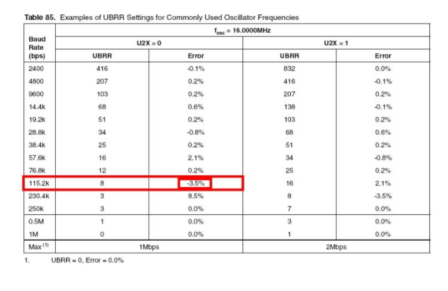
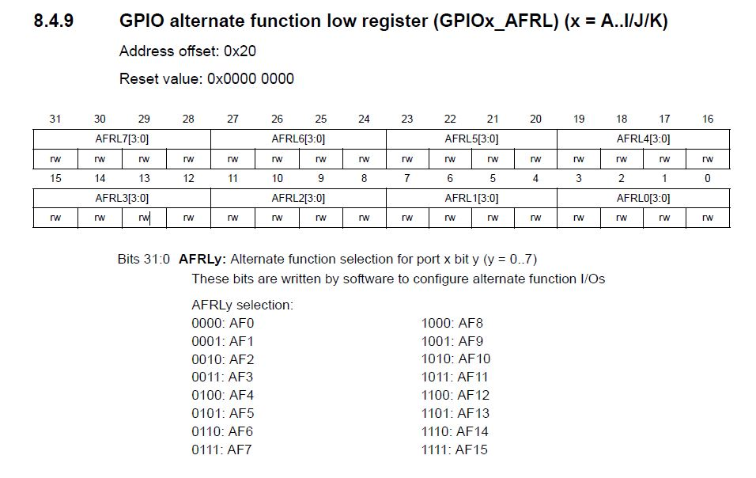
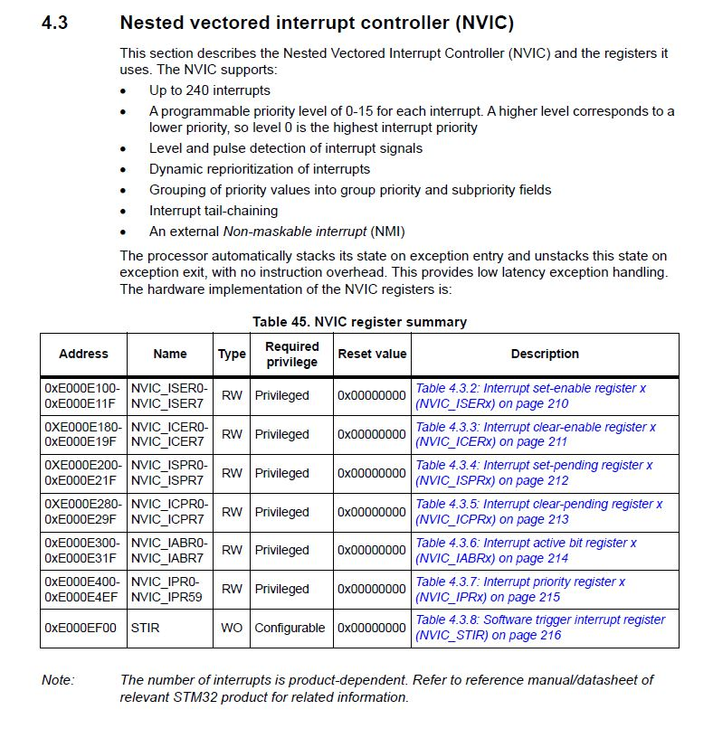
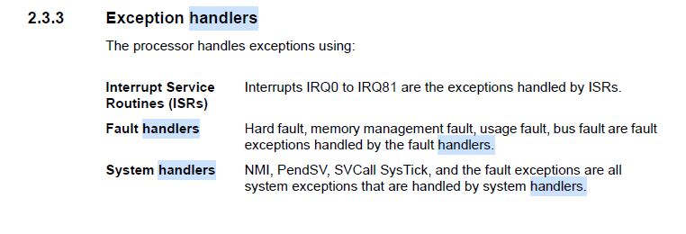

# Embedded System Design Lab Homework Week 10


## 1. UART란?

- **UART의 정의**

  - **UART**(범용 비동기화 송수신기: Universal asynchronous receiver/transmitter)는 병렬 데이터의 형태를 직렬 방식으로 전환하여 데이터를 전송하는 컴퓨터 하드웨어의 일종이다. 

  - UART는 일반적으로 EIA RS-232, RS-422, RS-485와 같은 통신 표준과 함께 사용한다. 

    UART의 U는 범용을 가리키는데 이는 자료 형태나 전송 속도를 직접 구성할 수 있고 실제 전기 신호 수준과 방식(이를테면 차분 신호)이 일반적으로 UART 바깥의 특정한 드라이버 회로를 통해 관리를 받는다는 뜻이다.

  - 통신 데이터는 메모리 또는 레지스터에 들어 있어 이것을 차례대로 읽어 직렬화 하여 통신한다. 최대 8비트가 기본 단위이다.

    UART는 일반적으로 컴퓨터나 주변 기기의 일종으로 병렬 데이터를 직렬화 하여 통신하는 개별 집적 회로이다. 

  - 비동기 통신이므로 동기 신호가 전달되지 않는다. 따라서 수신 쪽에서 동기신호를 찾아내어 데이터의 시작과 끝을 

    시간적으로 알아 처리할 수 있도록 약속되어 있다. 디지털 회로는 자체의 클럭 신호를 사용하여 정해진 

    속도로 수신 데이터로 부터 비트 구간을 구분하고 그 비트의 논리 상태를 결정하여 데이터 통신을 한다.

- **통신 방식**

  **직렬(Serial) 통신** : 1개의 입출력 핀을 통해 8개 비트를 한 번에 전송하는 방법

  **병렬(Parallel) 통신** : n비트의 데이터를 전송하기 위해 n개의 입출력 핀을 사용하는 방법

  

  UART 통신방식은 직렬통신이다. 

  

  Tx(송신), Rx(수신)을 같이하고 있다. 

  시리얼통신을 하기위해서 Tx와 Rx에서 약속을 정해야하는데 이를 **프로토콜(Protocol)** 이라고 한다.

  MCU에서는 0과 1의 값만을 처리할 수 있으므로 0은 GND, 1은 VCC로 데이터를 전송하고, 받는 쪽에서는 GND와 VCC를 다시 0과 1의 이진값으로 변환하여 사용한다.

  송신과 수신이 원할하게 되려면 데이터를 보내는 속도를 미리 정하고 있어야한다. (비동기 방식)

- **데이터 프레임**

  

  

  

  

  

8비트(1바이트)의 데이터를 전송하고 LSB부터 먼저 전송된다. 

Baud Rate을 미리 설정하고 데이터를 주고받는다. 그렇게 함으로서 


양방향으로 통신이 가능하게 된다.

- **UART 통신시 주의할 점**

  

  

  위의 표는 ATmega128의 데이터시트이다. 자주 사용하는 클럭(보드 크리스탈의 클럭)과 BAUD RATE에 관한 에러율을 보여주고있다.

   

  14.7456MHz에서는 230.4k 이하의 bps는 전부 에러율이 0이다.

  

  하지만 16MHz의 클럭을 사용시 115.2k bps에서 에러율이 -3.5%가 발생함을 보인다.

  에러율이 -(마이너스)라는 건, 115200bps보다 늦은 속도로 송/수신을 한다는 뜻이고

  에러율이 +인 경우는 115200bps보다 빠른 속도로 송/수신을 한다는 뜻이다.

  16MHz의 클럭에서 115.2kbps로 통신을 하면 늦은 속도로 송수신을  하기때문에 에러가 발생한다.

  결국 MCU에서 UART통신을 사용할 시 크리스탈 클럭과 Baud Rate에 대한 에러율을 참고하고 송/수신이 깨지지않는지 

  H/W 엔지니어가 설계시 파악하고 있어야한다.

---

### 2. MCU의 UART 송/수신 과정

- MCU가 UART레지스터를 이용하여 송/수신하는 과정을 알아보자. 

  

  - 수신

    USART_DR레지스터를 이용하여 데이터를 주고받는다.

    USART_DR에 데이터가 수신되면 RXNE(Read Data Register Not Empty) 비트가 1이된다.(set)

    MCU가 이 레지스터를 읽으면(read) RXNE비트가 0이된다.(clear)

    위 그림에서 스택메모리로 데이터를 가져오고있다. 이순간 RXNE비트는 0이된다.

  - 송신

    스택메모리에 있는 값을 USART_DR에 write한다. 아직 송신하지 않았으므로 TC(Transmission Complete)비트와 TXE(Transmit Data Register Empty)가 0이다.

    송신하는 순간 데이터가 전송되며 TC와 TXE비트가 1이된다. 이 비트를 체크함으로서 송신이 제대로됬는지 확인할수 있다.

  USART_SR(Status Register)를 이용하여 TC,TXE,RXNE 비트를 확인함으로서 송/수신함을 보인다.

  USART는 인터럽트로 처리된다.

---

### 3. UART 레지스터 설정

### 3.1 GPIO 설정

- **RCC AHB1 peripheral clock enable register**

GPIO를 이용하기위해 우선 RCC 클럭을 인가해주어야 한다.


RCC_AHB1ENR 레지스터에서 클락을 인가해줄수 있으며 , GPIOA에 해당하는 비트는 0번비트이다.


1을 마스킹 해줌으로서 enable을 해줄 수 있다.

```c
RCC_AHB1ENR     |= 1<<0;
```

- **GPIO port mode register**


Specification 문서에서 Alternate Fuction Mapping을 보면

USART TX와 RX를 AF7(Alternate Fuction 7)에서 제공해주고 있고 PortA의 2번핀과 3번핀에 대응되고 있다.


GPIO 포트 모드 레지스터에 접근하여 2번핀과 3번핀이 Alternate function mode로 사용한다고 정의를 해주어야 하므로 (10입력)

5번 비트와 7번비트에 1을 넘으로써 설정해줄수 있다.

```c
    GPIOA_MODER     |= (1<<5) | (1<<7); // use alternate mode PA2, PA3
```

- **GPIO alternate function low register**



GPIO AFRL 레지스터에서 AF7을 사용한다고 알려주어야 하므로(0111), 십진수 7을 8번비트, 12비트에 넣음으로서 PA2와 PA3가 알 수 있다.

```c
GPIOA_AFRL      |= (7<<8) | (7<<12); // use Alternate function 7
```

---

### 3.2 USART 설정

- **RCC APB1 peripheral clock enable register**

UART 통신을 위해 USART2 모듈을 선택했고 클럭을 인가해야 한다. 


RCC_APB1ENR 레지스터에서 USART에 클락을 enable 할 수 있다. USART2를 사용하기 때문에 17번 비트에 신호를 넣어주면된다.


비트1을 마스킹 함으로서 clock을 enable 할 수 있다.

- **USART Control register 1**

  

  USART를 제어하기위해 CR 레지스터를 이용해야한다. 

  

  12번 비트에 0을 넣음으로서 8비트의 데이터를 받을 수 있다. 1을 넣으면 9비트의 데이터를 받는다.

  주의사항을 참고하면 데이터 전송중에는 절대 수정되어서는 안된다. 

  ```c
  USART2_CR1      |= (0<<12); // set word length for 8 data bits
  ```

  

  Tx와 Rx를 사용하기위해 enable 해야한다. 1을 인가함으로서 사용할수 있다.

  ```c
  USART2_CR1      |= (1<<3) | (1<<2); // tx enable, rx enable 
  ```

  

  앞서언급한 RXNE 플래그를 enable해야한다.  인터럽트 모드로 사용하기 위함이다.

  ```c
  USART2_CR1      |= (1<<5); // RXNE interrupt enable by using interrupt mode not polling
  ```

  

  USART를 사용하기위해 enable한다. 1을 넣음으로서 enable한다.

  ```c
  USART2_CR1      |= (1<<13); // USART enable 
  ```

- **USART Control register 2**

  

  

  

  1 stop bit를 세팅하기위해 CR2 레지스터에 12번 13번비트를 접근하여 00을 넣어주면 된다. 

  ```c
  USART2_CR2      |= (0<<13) | (0<<12);
  ```

- **Baud rate register**

  

  UART 통신의 Baud rate를 설정하기 위하여 BRR 레지스터에서 값을 넣어주면된다. 

  

  Baud rate는 위와같이 계산될수 있으며 설정한 MCU클럭에 의존한다.

  42MHz의 클럭을 사용한다.

  ```c
  USART2_BRR      |= (unsigned int)(42000000/115200);
  ```

  

  

  

  

  

  앞서 데이터전송의 에러율을 얘기했는데, 42MHz의 클럭을 사용시 발생할수 있는 에러율을 표로 제공해주고 있다.

  에러 발생시 해당 표를 참고하여 설계하면된다.

---

### 3.3 NVIC 설정

- **NVIC**




NVIC에 관한 설명사항을 알수 있다. 240개 까지 인터럽트 사용이 가능하며 우선순위를 정할수 있다고 명시되어 있다.

- **Interrupt set-enable register**


NVIC_ISER 레지스터에 값을 넣음으로서 USART2를 인터럽트로 사용할수 있다.

```c
NVIC_ISER1      |= 1<<6 ; // why using 6?? because ISER1 0~31, ISER1 start to 32 so can use 6
```

ISER1에 6번시프트 하여 1을 넣은 이유는 


NVIC는 각 기능마다 우선순위를 매겨 관리하고 있는데 여기 Position 부분에 숫자가 있는것을 볼 수 있다.

앞서 GPIO에서 인터럽트를 사용할떄 NVIC_ISER0을 만들어 주었고 여기는 0에서31 포지션까지의 기능들이 들어간다.

NVIC_ISER1을 만들었기 때문에 여기서부터는 32번부터 시작하는것이다. 우리가 사용할 USART2는 38번이므로 

32번부터 6번 떨어져있기때문에 6번 시프트하여 넣으면 된다.

지금까지의 모든 USART 세팅관련 코드를 함수로 만들어 보면

```c
void set_usart2() {
    // USART PA2, PA3
    RCC_AHB1ENR     |= 1<<0;
    GPIOA_MODER     |= (1<<5) | (1<<7); // use alternate mode PA2, PA3
    GPIOA_AFRL      |= (7<<8) | (7<<12); // use Alternate function 7

    // set USART2
    RCC_APB1ENR     |= (1<<17); // usart2 clk enable
    USART2_CR1      |= (0<<12); // set word length for 8 data bits
    USART2_CR2      |= (0<<13) | (0<<12);

    USART2_BRR      |= (unsigned int)(42000000/115200);

    USART2_CR1      |= (1<<3) | (1<<2); // tx enable, rx enable 
    USART2_CR1      |= (1<<5); // RXNE interrupt enable by using interrupt mode not polling
    USART2_CR1      |= (1<<13); // USART enable 

    // USART interrupt enable
    NVIC_ISER1      |= 1<<6 ; // why using 6?? because ISER1 0~31, ISER1 start to 32 so can use 6


}
```

위와 같이 함수로 정의될수 있다.

---

## 4. UART 개발환경 세팅

- **startup.s**

  ```assembly
  /**
    ******************************************************************************
    * @file      startup_stm32.s
    * @author    Ac6
    * @version   V1.0.0
    * @date      12-June-2014
    ******************************************************************************
    */
  
    .syntax unified
    .cpu cortex-m4
    .thumb
  
  .global	g_pfnVectors
  
  /* start address for the initialization values of the .data section.
  defined in linker script */
  .word	_sidata
  /* start address for the .data section. defined in linker script */
  .word	_sdata
  /* end address for the .data section. defined in linker script */
  .word	_edata
  /* start address for the .bss section. defined in linker script */
  .word	_sbss
  /* end address for the .bss section. defined in linker script */
  .word	_ebss
  
  .equ  BootRAM,        0xF1E0F85F
  /**
   * @brief  This is the code that gets called when the processor first
   *          starts execution following a reset event. Only the absolutely
   *          necessary set is performed, after which the application
   *          supplied main() routine is called.
   * @param  None
   * @retval : None
  */
  
      .section	.text.Reset_Handler
  	.weak	Reset_Handler
  	.type	Reset_Handler, %function
  Reset_Handler:
  
  /* Copy the data segment initializers from flash to SRAM */
    movs	r1, #0
    b	LoopCopyDataInit
  
  CopyDataInit:
  	ldr	r3, =_sidata
  	ldr	r3, [r3, r1]
  	str	r3, [r0, r1]
  	adds	r1, r1, #4
  
  LoopCopyDataInit:
  	ldr	r0, =_sdata
  	ldr	r3, =_edata
  	adds	r2, r0, r1
  	cmp	r2, r3
  	bcc	CopyDataInit
  	ldr	r2, =_sbss
  	b	LoopFillZerobss
  
  /* Zero fill the bss segment. */
  FillZerobss:
  	movs r3, #0
   	str  r3, [r2]
  	adds r2, r2, #4
  
  LoopFillZerobss:
  	ldr	r3, = _ebss
  	cmp	r2, r3
  	bcc	FillZerobss
  
  /* Call the application's entry point.*/
  	bl	main
  
  .size	Reset_Handler, .-Reset_Handler
  
  /**
   * @brief  This is the code that gets called when the processor receives an
   *         unexpected interrupt.  This simply enters an infinite loop, preserving
   *         the system state for examination by a debugger.
   *
   * @param  None
   * @retval : None
  */
  
  /******************************************************************************
  *
  * The minimal vector table for a Cortex-M.  Note that the proper constructs
  * must be placed on this to ensure that it ends up at physical address
  * 0x0000.0000.
  *
  ******************************************************************************/
   	.section	.isr_vector,"a",%progbits
  	.type	g_pfnVectors, %object
  	.size	g_pfnVectors, .-g_pfnVectors
  
  	.weak	SysTick_Handler
  
  g_pfnVectors:
  	.word	_estack
  	.word	Reset_Handler
  	.word	0 // NMI_Handler
  	.word	0 // HardFault_Handler
  	.word	0 // MemManage_Handler
  	.word	0 // BusFault_Handler
  	.word	0 // UsageFault_Handler
  	.word	0
  	.word	0
  	.word	0
  	.word	0
  	.word	0 // SVC_Handler
  	.word	0 // DebugMon_Handler
  	.word	0
  	.word	0 // PendSV_Handler
  	.word	SysTick_Handler
  	.word	0
  	.word	0
  	.word	0
  	.word	0
  	.word	0
  	.word	0
  	.word	EXTI0_IRQHandler
  	.word	0
  	.word	0
  	.word	0
  	.word	0
  	.word	0
  	.word	0
  	.word	0
  	.word	0
  	.word	0
  	.word	0
  	.word	0
  	.word	0
  	.word	0
  	.word	0
  	.word	0
  	.word	0
  	.word	0
  	.word	0
  	.word	0
  	.word	0
  	.word	0
  	.word	0
  	.word	0
  	.word	0
  	.word	0
  	.word	0
  	.word	0
  	.word	0
  	.word	0
  	.word	0
  	.word	0
  	.word	USART2_IRQHandler
  	.word	0
  	.word	0
  	.word	0
  	.word	0
  	.word	0
  	.word	0
  	.word	0
  	.word	0
  	.word	0
  	.word	0
  	.word	0
  	.word	0
  	.word	0
  	.word	0
  	.word	0
  	.word	0
  	.word	0
  	.word	0
  	.word	0
  	.word	0
  	.word	0
  	.word	0
  	.word	0
  	.word	0
  	.word	0
  	.word	0
  	.word	0
  	.word	0
  	.word	0
  	.word	0
  	.word	0
  	.word	0
  	.word	0
  	.word	0
  	.word	0
  	.word	0
  	.word	0
  	.word	0
  	.word	0
  	.word	0
  	.word	0
  	.word	0
  	.word	0
  
  
  /************************ (C) COPYRIGHT Ac6 *****END OF FILE****/
  
  ```

  UART를 인터럽트를 사용하기위해서 main.c에 인터럽트 관련 함수를 만들고자하면 우선적으로 startup.s에 해당 함수부분을 알려주어야한다.

  

  

  15번째에 SysTick_Handler가 있고 그다음 16번째부터 IRQ0가 시작된다.

  위에서 EXTI 포지션 번호를보면 EXTI0_IRQHandler가 6번이고 startup에서 IRQ6로 매치되었다.

  USART2_IRQHandler는 포지션 번호가 38번이고 IRQ38번자리에 매치가 된것이다.

  이때 핸들러 이름은 main에서 정의한 함수 이름 그대로 쓰면된다. 

  

- **STM32FDiscovery.h**

  ```c
  /*#define rRCC_CR     (unsigned int*)0x40023800
  #define rRCC_PLLCFGR    (unsigned int*)0x40023804
  #define rRCC_PLLCFGR    (unsigned int*)0x40023808
  #define XXX    (unsigned int*)0x4002380C
  #define rRCC_CIR    (unsigned int*)0x4002380D
  
  *(rRCC_PLLCFGR) = 10;*/
  
  
  
  typedef volatile struct{
       unsigned int rRCC_CR;
       unsigned int rRCC_PLLCFGR;
       unsigned int rRCC_CFGR;
       unsigned int rRCC_CIR;
       unsigned int rRCC_AHB1RSTR;
       unsigned int reserved1;
       unsigned int reserved2;
       unsigned int reserved3;
       unsigned int reserved4;
       unsigned int reserved5;
       unsigned int reserved6;
       unsigned int reserved7;
       unsigned int rRCC_AHB1ENR;
       unsigned int reserved8;
       unsigned int reserved9;
       unsigned int reserved10;
       unsigned int rRCC_APB1ENR;
  }tREG_RCC;
  
  typedef volatile struct{
  	unsigned int rMODER;
  	unsigned int rOTYPER;
  	unsigned int rOSPEEDR;
  	unsigned int rPUPDR;
  	unsigned int rIDR;
  	unsigned int rODR;
  	unsigned int reserved1;
  	unsigned int reserved2;
  	unsigned int rAFRL;
  	unsigned int rAFRH;
  }REG_GPIO;
  
  typedef volatile struct{
  	unsigned int rSR;
  	unsigned int rDR;
  	unsigned int rBRR;
  	unsigned int rCR1;
  	unsigned int rCR2;
  	unsigned int rCR3;
  	unsigned int reserved;
  }REG_USART;
  
  typedef volatile struct{
  	unsigned int rCR1;
  	unsigned int rCR2;
  	unsigned int reserved1;
  	unsigned int rDIER;
  	unsigned int rSR;
  	unsigned int rEGR;
  	unsigned int rCCMR1;
  	unsigned int rCCMR2;
  	unsigned int rCCER;
  	unsigned int rCNT;
  	unsigned int rPSC;
  	unsigned int rARR;
  	unsigned int reserved2;
  	unsigned int rCCR1;
  	unsigned int rCCR2;
  	unsigned int rCCR3;
  	unsigned int rCCR4;
  	unsigned int reserved3;
  	unsigned int rDCR;
  	unsigned int rDMAR;
  }TIM2to5;
  
  typedef volatile struct{
      unsigned int rMEMRMP;
      unsigned int rPMC;
      unsigned int rEXTICR1;
      unsigned int rEXTICR2;
      unsigned int rEXTICR3;
      unsigned int rEXTICR4;
      unsigned int rCMPCR;
  }REG_SYSCFG;
  
  typedef volatile struct{
      unsigned int rIMR;
      unsigned int rEMR;
      unsigned int rRTSR;
      unsigned int rFTSR;
      unsigned int rSWIER;
      unsigned int rPR;
  }REG_EXTI;
  
  
  
  
  
  
  
  // RCC register //
  #define RCC_BASE 0x40023800
  #define RCC ((tREG_RCC*)RCC_BASE)
  
  #define RCC_CR          (RCC->rRCC_CR)
  #define RCC_PLLCFGR     (RCC->rRCC_PLLCFGR)
  #define RCC_CFGR        (RCC->rRCC_CFGR)
  #define RCC_CIR         (RCC->rRCC_CIR)
  #define RCC_AHB1RSTR    (RCC->rRCC_AHB1RSTR)
  #define RCC_AHB1ENR     (RCC->rRCC_AHB1ENR)
  #define RCC_APB1ENR     (RCC->rRCC_APB1ENR)
  
  
  // GPIO A //
  #define GPIOA_BASE 0x40020000
  #define GPIOA ((REG_GPIO*)GPIOA_BASE)
  
  #define GPIOA_MODER		(GPIOA->rMODER) 
  #define GPIOA_OTYPER  	(GPIOA->rOTYPER)
  #define GPIOA_OSPEEDR 	(GPIOA->rOSPEEDR) 
  #define GPIOA_PUPDR  	(GPIOA->rPUPDR)
  #define GPIOA_IDR    	(GPIOA->rIDR)  
  #define GPIOA_ODR		(GPIOA->rODR) 
  #define GPIOA_AFRL		(GPIOA->rAFRL) 
  #define GPIOA_AFRH		(GPIOA->rAFRH)  
  
  // GPIO D //
  #define GPIOD_BASE 0x40020C00
  #define GPIOD ((REG_GPIO*)GPIOD_BASE)
  
  #define GPIOD_MODER		(GPIOD->rMODER) 
  #define GPIOD_OTYPER  	(GPIOD->rOTYPER)
  #define GPIOD_OSPEEDR 	(GPIOD->rOSPEEDR) 
  #define GPIOD_PUPDR  	(GPIOD->rPUPDR)
  #define GPIOD_ODR		(GPIOD->rODR) 
  #define GPIOD_AFRL		(GPIOD->rAFRL) 
  #define GPIOD_AFRH		(GPIOD->rAFRH)  
  
  // USART 2 //
  #define USART2_BASE 0x40004400
  #define USART2 ((REG_USART*)USART2_BASE)
  
  #define USART2_SR		(USART2->rSR)
  #define USART2_DR		(USART2->rDR)
  #define USART2_BRR		(USART2->rBRR)
  #define USART2_CR1		(USART2->rCR1)
  #define USART2_CR2		(USART2->rCR2)
  #define USART2_CR3		(USART2->rCR3)
  
  
  // Timer 2 //
  #define TIM2_BASE 0x40000000
  #define TIM2 ((TIM2to5*)TIM2_BASE)
  
  #define TIM2_CR1		(TIM2->rCR1)
  #define TIM2_DIER		(TIM2->rDIER)
  #define TIM2_SR			(TIM2->rSR)
  #define TIM2_EGR		(TIM2->rEGR)
  #define TIM2_CNT		(TIM2->rCNT)
  #define TIM2_PSC		(TIM2->rPSC)
  #define TIM2_ARR		(TIM2->rARR)
  
  // SYSCFG register //
  #define SYSCFG_BASE 0x40013800
  #define SYSCFG ((REG_SYSCFG*)SYSCFG_BASE)
  
  #define SYSCFG_MEMRMP   (SYSCFG->rMEMRMP)
  #define SYSCFG_PMC      (SYSCFG->rPMC)
  #define SYSCFG_EXTICR1  (SYSCFG->rEXTICR1)
  #define SYSCFG_EXTICR2  (SYSCFG->rEXTICR2)
  #define SYSCFG_EXTICR1  (SYSCFG->rEXTICR3)
  #define SYSCFG_EXTICR1  (SYSCFG->rEXTICR4)
  #define SYSCFG_CMPCR    (SYSCFG->rCMPCR)
  
  // EXTI register //
  #define EXTI_BASE 0x40013C00
  #define EXTI    ((REG_EXTI*)EXTI_BASE)
  
  #define EXTI_IMR        (EXTI->rIMR)
  #define EXTI_EMR        (EXTI->rEMR)
  #define EXTI_RTSR       (EXTI->rRTSR)
  #define EXTI_FTSR       (EXTI->rFTSR)
  #define EXTI_SWIER      (EXTI->rSWIER)
  #define EXTI_PR         (EXTI->rPR)
  
  
  #define FLASH_ACR *(volatile unsigned *)0x40023C00
  #define NVIC_ISER0 *(volatile unsigned *)0xE000E100
  #define NVIC_ISER1 *(volatile unsigned *)0xE000E104
  
  ```

  새롭게 추가된 USART2와 NVIC_ISERx에 대해서 알아보자.

  

  STM32F의 전체 메모리 맵이다.

  

  여기서 APB1 버스를 살펴보면 `0x40004400`이 USART2의 메모리 주소가 할당되어 있음을 보인다. 그래서 이 주소를 지정해주면된다.

  

  NVIC_ISERx는 `0xE000E100`부터 시작된다. 여기서 순차적으로 각 레지스터가 4바이트씩 오프셋됨을 보인다.

---

## 5. UART IRQ_Handler 설정

UART IRQ_Handler는 인터럽트 발생시 처리할 일을 만들어 놓은것이다.

- **Status Register**

  

  USART의 상태를 확인하는 레지스터이다.

  

  5번 비트의 RXNE를 읽어서 데이터가 수신됬는지 확인 가능하다. 

  

  6번비트의 TC를 읽어서 송신이 제대로 됬는지 확인이 가능하다.

  

  마찬가지로 7번비트의 TXE를 읽이서 송신확인이 가능하다.

- 사용자의 데이터를 받아서 사용자(터미널)에게 그대로 전송하는 코드

  ```c
  void USART2_IRQHandler() {
      if( USART2_SR & (1<<5) ) {
          rec = USART2_DR; // when reading DR, SR is clear
  
          USART2_DR = rec;
          while ( !(USART2_SR & (1<<7)) ); // 잘보내졌는지 확인
          while ( !(USART2_SR & (1<<6)) );
          
  
          GPIOD_ODR ^= 1<<12;
  
          USART2_CR1 |= (1<<5); // set USART Interrupt
  
      }
  
  }
  ```

  ```c
  unsigned char rec;
  ```

  캐릭터형 rec변수를 만들어 데이터를 읽는다. UART의 송수신 과정은 앞서 설명한대로 플래그의 상태를 읽음으로서 처리된다.

  GPIOD의 12번에 해당 하는 LED가 토글된다. 

  마지막에 종료될때 다시 인터럽트를 설정해주면된다. 

- main.c

  ```c
  #include "STM32FDiscovery.h"
  
  unsigned char rec;
  unsigned int count = 0;
  
  unsigned int uart_data[423]= {
  32, 32, 32, 32, 32, 32, 32, 32, 32, 32, 
  32, 95, 95, 95, 95, 95, 32, 32, 32, 32, 
  32, 32, 95, 95, 95, 95, 95, 32, 95, 95, 
  95, 32, 32, 32, 32, 32, 32, 32, 32, 95, 
  95, 95, 95, 95, 32, 32, 32, 95, 32, 32, 
  32, 32, 32, 32, 32, 32, 32, 32, 32, 32, 
  32, 32, 32, 95, 95, 95, 95, 32, 32, 10, 
  32, 32, 32, 32, 32, 47, 92, 32, 32, 32, 
  124, 95, 32, 32, 32, 95, 124, 32, 32, 32, 
  32, 47, 32, 95, 95, 95, 95, 124, 95, 95, 
  32, 92, 32, 32, 32, 32, 32, 32, 47, 32,
  95, 95, 95, 95, 124, 32, 124, 32, 124, 32, 
  32, 32, 32, 32, 32, 32, 32, 47, 92, 32,
  32, 32, 124, 32, 32, 95, 32, 92, 32, 10, 
  32, 32, 32, 32, 47, 32, 32, 92, 32, 32,
  32, 32, 124, 32, 124, 95, 95, 95, 95, 95,
  124, 32, 40, 95, 95, 95, 32, 32, 32, 32,
  41, 32, 124, 95, 95, 95, 32, 124, 32, 124, 
  32, 32, 32, 32, 32, 32, 124, 32, 124, 32, 
  32, 32, 32, 32, 32, 32, 47, 32, 32, 92, 
  32, 32, 124, 32, 124, 95, 41, 32, 124, 10, 
  32, 32, 32, 47, 32, 47, 92, 32, 92, 32, 
  32, 32, 124, 32, 124, 95, 95, 95, 95, 95,
  95, 92, 95, 95, 95, 32, 92, 32, 32, 47, 
  32, 47, 47, 32, 95, 32, 92, 124, 32, 124, 
  32, 32, 32, 32, 32, 32, 124, 32, 124, 32, 
  32, 32, 32, 32, 32, 47, 32, 47, 92, 32, 
  92, 32, 124, 32, 32, 95, 32, 60, 32, 10, 
  32, 32, 47, 32, 95, 95, 95, 95, 32, 92, 
  32, 95, 124, 32, 124, 95, 32, 32, 32, 32, 
  32, 95, 95, 95, 95, 41, 32, 124, 47, 32, 
  47, 124, 32, 40, 95, 41, 32, 124, 32, 124, 
  95, 95, 95, 95, 32, 32, 124, 32, 124, 95, 
  95, 95, 95, 32, 47, 32, 95, 95, 95, 95, 
  32, 92, 124, 32, 124, 95, 41, 32, 124, 10, 
  32, 47, 95, 47, 32, 32, 32, 32, 92, 95, 
  92, 95, 95, 95, 95, 95, 124, 32, 32, 32, 
  124, 95, 95, 95, 95, 95, 47, 124, 95, 95, 
  95, 95, 92, 95, 95, 95, 47, 32, 92, 95, 
  95, 95, 95, 95, 124, 32, 124, 95, 95, 95, 
  95, 95, 95, 47, 95, 47, 32, 32, 32, 32, 
  92, 95, 92, 95, 95, 95, 95, 47, 32, 10,
  10, 10, 10};
  
  void clk(void)
  {
  	RCC_CR = 0;
  	RCC_PLLCFGR = 0;
  	RCC_CFGR = 0;
  		
  	RCC_CR |= (1<<16); // HSE set
  	while( (RCC_CR & ( 1<<17) ) == 0 ); // wait until HSE ready
  	
  	RCC_PLLCFGR |= 8;//0x00000008; // set PLLM
  	RCC_PLLCFGR |= (336<<6);//|= (336<<6); // 		set PLLN
  	RCC_PLLCFGR |= (0<<16); // set PLLP
  	RCC_PLLCFGR |= (7<<24);//0x07000000; // set PLLQ
  
  	RCC_PLLCFGR |= (1<<22); // set PLL src HSE
  	
  
  	RCC_CR |= (1<<24); // PLL ON
  	while( (RCC_CR & (1<<25)) == 0); // wait until PLL ready
  	
  	FLASH_ACR |= 5;
  	RCC_CFGR |= 2; // set PLL to system clock
  	
  		
  	while( (RCC_CFGR & (12) ) != 8); // wait until PLL ready
  	
  	RCC_CFGR |= (1<<12) | (1<<10); // set APB1 div 4
  	RCC_CFGR |= (1<<15); // set APB2 div2	
  }
  
  void set_usart2() {
      // USART PA2, PA3
      RCC_AHB1ENR     |= 1<<0;
      GPIOA_MODER     |= (1<<5) | (1<<7); // use alternate mode PA2, PA3
      GPIOA_AFRL      |= (7<<8) | (7<<12); // use Alternate function 7
  
      // set USART2
      RCC_APB1ENR     |= (1<<17); // usart2 clk enable
      USART2_CR1      |= (0<<12); // set word length for 8 data bits
      USART2_CR2      |= (0<<13) | (0<<12);
  
      USART2_BRR      |= (unsigned int)(42000000/115200);
  
      USART2_CR1      |= (1<<3) | (1<<2); // tx enable, rx enable 
      USART2_CR1      |= (1<<5); // RXNE interrupt enable by using interrupt mode not polling
      USART2_CR1      |= (1<<13); // USART enable 
  
      // USART interrupt enable
      NVIC_ISER1      |= 1<<6 ; // why using 6?? because ISER1 0~31, ISER1 start to 32 so can use 6
  
  
  }
  
  void USART2_IRQHandler() {
      if( USART2_SR & (1<<5) ) {
          rec = USART2_DR; // when reading DR, SR is clear
  
          USART2_DR = rec;
          while ( !(USART2_SR & (1<<7)) ); // 잘보내졌는지 확인
          while ( !(USART2_SR & (1<<6)) );
          
  
          GPIOD_ODR ^= 1<<12;
  
          USART2_CR1 |= (1<<5); // set USART Interrupt
  
      }
  
  }
  void EXTI0_IRQHandler() {
  
      GPIOD_ODR ^= 1 << 13;
      GPIOD_ODR ^= 1 << 14;
      GPIOD_ODR ^= 1 << 15;
  
      EXTI_PR |= 1<<0;    // clear pending bit for EXTI0
  }
  
  
  int main (void)
  {
  	
  	clk();
  	
  	RCC_CFGR |= 0x04600000;
  
      /* PORT A */
  	RCC_AHB1ENR  |= 1<<0; //RCC clock enable register	
      GPIOA_MODER  |= 0<<0; // input mode
      GPIOA_OTYPER |= 0<<0; // output push-pull
      GPIOA_PUPDR  |= 0<<0; // no pull-up, pull-down
  
      /* button intr set */
      SYSCFG_EXTICR1 |= 0<<0; //EXTI0 connect to PA0
      EXTI_IMR       |= 1<<0; //Mask EXTI0
      EXTI_RTSR      |= 1<<0; //risign edge trigger enable
      EXTI_FTSR      |= 0<<0; //falling edge trigger disable
      NVIC_ISER0     |= 1<<6; // enable EXTI0 interrupt
  	
  	/* PORT D */
  	RCC_AHB1ENR  |= 1<<3;		// PORTD enable
  	GPIOD_MODER  |= 1<<24;		// PORTD 12 general output mode
  	GPIOD_MODER  |= 1<<26;		// PORTD 13 general output mode
  	GPIOD_MODER  |= 1<<28;		// PORTD 14 general output mode
  	GPIOD_MODER  |= 1<<30;		// PORTD 15 general output mode
  	GPIOD_OTYPER |= 0x00000000;
  	GPIOD_PUPDR	 |= 0x00000000;
  	
  	GPIOD_ODR |= 1<<12;
      set_usart2();
  
      while( count < 423){
          USART2_DR = uart_data[count++];
          while ( !(USART2_SR & (1<<7)) ); // 잘보내졌는지 확인
          while ( !(USART2_SR & (1<<6)) );
      }
  
  
  	while(1) {
  //        if( GPIOA_IDR & 0x00000001 ) {
  //            GPIOD_ODR ^= 1 << 13;
  //           GPIOD_ODR ^= 1 << 14;
  //            GPIOD_ODR ^= 1 << 15;
  //        }
  	}
  }
  ```

  수업중 실습했던 코드이다.

  사용자에게 받은 데이터를 그대로 사용자(터미널)에게 전달하는 인터럽트가 있다. (LED 토글포함)

  또한 사용자가 Reset핸들러(리셋버튼 누름) 호출시(따로 함수를 만들지 않았지만 리셋버튼은 우선순위가 높다.) 

  `unsigned int uart_data[423]` 에 미리 정의된 아스키코드 문자가 그대로 사용자가 송신된다.

---

## 6. 구현 Mission, 시리얼 터미널로 LED 제어하는 쉘 만들기

- 초기세팅

  ```c
  #include "STM32FDiscovery.h"
  
  int count1 = 0;
  int count2 = 0;
  volatile int i = 0;
  int count3 = 0;
  int index1 = 0;
  int index2 = 0;
  int process_data = 0;
  char buffer[30] = "";
  char data;
  char *help_text = "help";
  char *enter = "\n<< ";
  char *error = "Invalid input. Please check the command by entering 'help' or 'HELP'.\n>> ";
  char *LED1 = "THE GREEN LED IS ON.\n>> ";
  char *LED2 = "THE ORANGE LED IS ON.\n>> ";
  char *LED3 = "THE RED LED IS ON.\n>> ";
  char *LED4 = "THE BLUE LED IS ON.\n>> ";
  char *LED5 = "THE GREEN LED IS OFF.\n>> ";
  char *LED6 = "THE ORANGE LED IS OFF.\n>> ";
  char *LED7 = "THE RED LED IS OFF.\n>> ";
  char *LED8 = "THE BLUE LED IS OFF.\n>> ";
  char *LED9 = "ALL LEDS ARE ON.\n>> ";
  char *LED10 = "ALL LEDS ARE OFF.\n>> ";
  char *LED11 = "ALL LEDS ARE TOGGLE.\n>> ";  
  
  unsigned int uart_data[114]= { 
  47 ,42 ,42 ,42, 42, 42, 42, 42, 42, 42, 
  42 ,42 ,42 ,42, 42, 42, 42, 42, 42, 42, 
  42 ,42 ,42 ,42, 42, 42, 42, 42, 42, 42, 
  42 ,42 ,42 ,42, 47, 10, 47, 42, 32, 76, 
  69 ,68 ,32 ,99, 111, 110, 116, 114, 111, 
  108 ,32 ,83 ,104, 101, 108, 108, 32, 102, 
  111 ,114, 32, 83, 84, 77, 51, 50, 70, 52, 
  32 ,42 ,47 ,10 ,47 ,42 ,42 ,42 ,42 ,42 ,
  42 ,42 ,42 ,42 ,42 ,42 ,42 ,42 ,42 ,42 ,
  42 ,42 ,42 ,42 ,42 ,42 ,42 ,42 ,42 ,42 ,
  42 ,42 ,42 ,42 ,42 ,42 ,42 ,42 ,47, 10, 62, 62, 32}; // reset interrupt messages
  
  char help[400] = "* Command List\n - LEDON\n   + argument [1, 2, 3, 4]\n - LEDOFF\n   + argument [1, 2, 3, 4]\n - LEDON ALL\n   + no argumnet\n - LEDOFF ALL\n   + no argumnet\n - LED TOGGLE\n   + no argument\n>> "; // help messages
  
  ```

  초기 전역변수 설정값이다. 

  리셋버튼으로 인터럽트 발생시 미리 정의된 아스키 코드문자가 출력되도록 했다.

  help 입력시 관련 매뉴얼이 나온다. 

  정의되지 않은 명령어 입력시 에러메세지가 발송된다.

  

- UART 인터럽트 설정

  ```c
  void USART2_IRQHandler() {
          data = USART2_receive();
      
          USART2_DR = data;
          while ( !(USART2_SR & (1<<7)) ); // checkng transmission
          while ( !(USART2_SR & (1<<6)) );
  
          buffer[index1] = data;
          index1++;
  
          if(data == '\r'){
              USART2_print_string(enter);
              for(i=0; i<4; i++){
                  if( (buffer[i] == 'h')|| (buffer[i] == 'H')){
                      count3++;
                  }
                  else if( (buffer[i] == 'e')|| (buffer[i] == 'E')){
                      count3++;
                  }
                  else if( (buffer[i] == 'l')|| (buffer[i] == 'L')){
                      count3++;
                  }
                  else if( (buffer[i] == 'p')|| (buffer[i] == 'P')){
                      count3++;
                  }
                  else{
                      count3 =0;
                  }
              }
              if(count3 == 4){
                  USART2_print_string(help);
                  
              }
              
              if( (buffer[0] == 'L') && (buffer[1] == 'E') && (buffer[2] == 'D') && (buffer[3] == 'O') && (buffer[4] == 'N') && (buffer[5] == ' ') ){        // LED ON
                  if(buffer[6] == '1'){
                      GPIOD_ODR |= 1<<12;
                      USART2_print_string(LED1);
                  }
                  else if(buffer[6] == '2'){
                      GPIOD_ODR |= 1<<13;
                      USART2_print_string(LED2);
                  }
                  else if(buffer[6] == '3'){
                      GPIOD_ODR |= 1<<14;
                      USART2_print_string(LED3);
                  }
                  else if(buffer[6] == '4'){
                      GPIOD_ODR |= 1<<15;
                      USART2_print_string(LED4);
                  }
                  count2++;
                  
              }
              if( (buffer[0] == 'L') && (buffer[1] == 'E') && (buffer[2] == 'D') && (buffer[3] == 'O') && (buffer[4] == 'F') && (buffer[5] == 'F') && (buffer[6] == ' ')){        // LED OFF
                  if(buffer[7] == '1'){
                      GPIOD_ODR &= ~(1<<12);
                      USART2_print_string(LED5);
                  }
                  else if(buffer[7] == '2'){
                      GPIOD_ODR &= ~(1<<13);
                      USART2_print_string(LED6);
                  }
                  else if(buffer[7] == '3'){
                      GPIOD_ODR &= ~(1<<14);
                      USART2_print_string(LED7);
                  }
                  else if(buffer[7] == '4'){
                      GPIOD_ODR &= ~(1<<15);
                      USART2_print_string(LED8);
                  }
                  count2 ++;
                  
              }
              if( (buffer[0] == 'L') && (buffer[1] == 'E') && (buffer[2] == 'D') && (buffer[3] == 'O') && (buffer[4] == 'N') && (buffer[5] == ' ') && (buffer[6] == 'A') && (buffer[7] == 'L') && (buffer[8] == 'L')){        // LEDON ALL
                  GPIOD_ODR |= 1<<12;
                  GPIOD_ODR |= 1<<13;
                  GPIOD_ODR |= 1<<14;
                  GPIOD_ODR |= 1<<15;
                  USART2_print_string(LED9);
                  count2 ++;
                  
              }
              if( (buffer[0] == 'L') && (buffer[1] == 'E') && (buffer[2] == 'D') && (buffer[3] == 'O') && (buffer[4] == 'F') && (buffer[5] == 'F') && (buffer[6] == ' ') && (buffer[7] == 'A') && (buffer[8] == 'L') && (buffer[9] == 'L') ){        // LEDOFF ALL
                  GPIOD_ODR &= ~(1<<12);
                  GPIOD_ODR &= ~(1<<13);
                  GPIOD_ODR &= ~(1<<14);
                  GPIOD_ODR &= ~(1<<15);
                  USART2_print_string(LED10);
                  count2++;
                  
              }
              if( (buffer[0] == 'L') && (buffer[1] == 'E') && (buffer[2] == 'D') && (buffer[3] == ' ') && (buffer[4] == 'T') && (buffer[5] == 'O') && (buffer[6] == 'G') && (buffer[7] == 'G') && (buffer[8] == 'L') && (buffer[9] == 'E') ){        // LED TOGGLE
                  GPIOD_ODR ^= 1 << 12;
                  GPIOD_ODR ^= 1 << 13;
                  GPIOD_ODR ^= 1 << 14;
                  GPIOD_ODR ^= 1 << 15;
                  USART2_print_string(LED11);
                  count2++;
              }
              if( ! ( (count3 == 4) || (count2 > 0) )){
              USART2_print_string(error); // error message for invalid input 
              }
         
             
              count2 = 0;
              count3 = 0;
              index1 = 0;
              buffer[index1] = '\0'; // buffer reset
              process_data = 1;
              if(process_data == 1){
                  process_data =0;
              }
          }
  
  
          USART2_CR1 |= (1<<5); // set USART Interrupt
  
  
  }
  ```
  
  버퍼로 데이터를 저장하여 사용자가 입력한 명령어를 해석한다.
  
  사용자가 텍스트 입력시 
  
  1. LEDON x
  
  2. LEDOFF x
  3. LEDON ALL
  4. LEDOFF ALL
  5. LED TOGGLE
  6. help / HELP
  7. invalid value
  
  총 7가지의 경우의수를 계산하여 알고리즘을 정의했다. 
  
- 송수신 함수 정의

  ```c
  char USART2_receive(void){
      while(!(USART2_SR & (1<<5))); // checking being ready for reception
          return USART2_DR;
  }
  
  void USART2_transmit(char data){
      USART2_DR = data;
      while ( !(USART2_SR & (1<<7)) ); // checking transmission
      while ( !(USART2_SR & (1<<6)) ); // checking transmission
  }
  
  void USART2_print_string(char *str){ // transmit string
      for(int i=0; str[i]; i++)
          USART2_transmit(str[i]);
  }
  ```

  송수신 과정을 용이하게 하기 위해 함수로 정의를 했다.

- 실행 결과

  

  help를 입력해서 명령어 매뉴얼을 알수 있다.

  LEDON/OFF argumnet를 전달하여 해당 LED가 정상 ON/OFF됨을 확인했다.

  

  LEDON/OFF ALL 명령어와 LED TOGGLE 명령어를 사용하여 작동한 결과다.

  정상적으로 출력된다.

  

  정의되지 않은 명령어 입력시 오류메세지가 전송되도록 구현했다. 

  사용자에게 help 또는 HELP입력을 요구하고있다.


- main.c 전체 코드

  ```c
  #include "STM32FDiscovery.h"
  
  int count1 = 0;
  int count2 = 0;
  volatile int i = 0;
  int count3 = 0;
  int index1 = 0;
  int index2 = 0;
  int process_data = 0;
  char buffer[30] = "";
  char data;
  char *help_text = "help";
  char *enter = "\n<< ";
  char *error = "Invalid input. Please check the command by entering 'help' or 'HELP'.\n>> ";
  char *LED1 = "THE GREEN LED IS ON.\n>> ";
  char *LED2 = "THE ORANGE LED IS ON.\n>> ";
  char *LED3 = "THE RED LED IS ON.\n>> ";
  char *LED4 = "THE BLUE LED IS ON.\n>> ";
  char *LED5 = "THE GREEN LED IS OFF.\n>> ";
  char *LED6 = "THE ORANGE LED IS OFF.\n>> ";
  char *LED7 = "THE RED LED IS OFF.\n>> ";
  char *LED8 = "THE BLUE LED IS OFF.\n>> ";
  char *LED9 = "ALL LEDS ARE ON.\n>> ";
  char *LED10 = "ALL LEDS ARE OFF.\n>> ";
  char *LED11 = "ALL LEDS ARE TOGGLE.\n>> ";  
  
  unsigned int uart_data[114]= { 
  47 ,42 ,42 ,42, 42, 42, 42, 42, 42, 42, 
  42 ,42 ,42 ,42, 42, 42, 42, 42, 42, 42, 
  42 ,42 ,42 ,42, 42, 42, 42, 42, 42, 42, 
  42 ,42 ,42 ,42, 47, 10, 47, 42, 32, 76, 
  69 ,68 ,32 ,99, 111, 110, 116, 114, 111, 
  108 ,32 ,83 ,104, 101, 108, 108, 32, 102, 
  111 ,114, 32, 83, 84, 77, 51, 50, 70, 52, 
  32 ,42 ,47 ,10 ,47 ,42 ,42 ,42 ,42 ,42 ,
  42 ,42 ,42 ,42 ,42 ,42 ,42 ,42 ,42 ,42 ,
  42 ,42 ,42 ,42 ,42 ,42 ,42 ,42 ,42 ,42 ,
  42 ,42 ,42 ,42 ,42 ,42 ,42 ,42 ,47, 10, 62, 62, 32}; // reset interrupt messages
  
  char help[400] = "* Command List\n - LEDON\n   + argument [1, 2, 3, 4]\n - LEDOFF\n   + argument [1, 2, 3, 4]\n - LEDON ALL\n   + no argumnet\n - LEDOFF ALL\n   + no argumnet\n - LED TOGGLE\n   + no argument\n>> "; // help messages
  
  void clk(void)
  {
  	RCC_CR = 0;
  	RCC_PLLCFGR = 0;
  	RCC_CFGR = 0;
  		
  	RCC_CR |= (1<<16); // HSE set
  	while( (RCC_CR & ( 1<<17) ) == 0 ); // wait until HSE ready
  	
  	RCC_PLLCFGR |= 8;//0x00000008; // set PLLM
  	RCC_PLLCFGR |= (336<<6);//|= (336<<6); // 		set PLLN
  	RCC_PLLCFGR |= (0<<16); // set PLLP
  	RCC_PLLCFGR |= (7<<24);//0x07000000; // set PLLQ
  
  	RCC_PLLCFGR |= (1<<22); // set PLL src HSE
  	
  
  	RCC_CR |= (1<<24); // PLL ON
  	while( (RCC_CR & (1<<25)) == 0); // wait until PLL ready
  	
  	FLASH_ACR |= 5;
  	RCC_CFGR |= 2; // set PLL to system clock
  	
  		
  	while( (RCC_CFGR & (12) ) != 8); // wait until PLL ready
  	
  	RCC_CFGR |= (1<<12) | (1<<10); // set APB1 div 4
  	RCC_CFGR |= (1<<15); // set APB2 div2	
  }
  
  void set_usart2() {
      // USART PA2, PA3
      RCC_AHB1ENR     |= 1<<0;
      GPIOA_MODER     |= (1<<5) | (1<<7); // use alternate mode PA2, PA3
      GPIOA_AFRL      |= (7<<8) | (7<<12); // use Alternate function 7
  
      // set USART2
      RCC_APB1ENR     |= (1<<17); // usart2 clk enable
      USART2_CR1      |= (0<<12);
      USART2_CR2      |= (0<<13) | (0<<12);
  
      USART2_BRR      |= (unsigned int)(42000000/115200);
  
      USART2_CR1      |= (1<<3) | (1<<2); // tx enable, rx enable 
      USART2_CR1      |= (1<<5); // RXNE interrupt enable by using interrupt mode not polling
      USART2_CR1      |= (1<<13); // USART enable 
  
      // USART interrupt enable
      NVIC_ISER1      |= 1<<6 ; // why using 6?? because ISER1 0~31, ISER1 start to 32 so can use 6
  
  
  }
  
  char USART2_receive(void){
      while(!(USART2_SR & (1<<5))); // checking being ready for reception
          return USART2_DR;
  }
  
  void USART2_transmit(char data){
      USART2_DR = data;
      while ( !(USART2_SR & (1<<7)) ); // checking transmission
      while ( !(USART2_SR & (1<<6)) ); // checking transmission
  }
  
  void USART2_print_string(char *str){ // transmit string
      for(int i=0; str[i]; i++)
          USART2_transmit(str[i]);
  }
  
  void USART2_IRQHandler() {
          data = USART2_receive();
      
          USART2_DR = data;
          while ( !(USART2_SR & (1<<7)) ); // checkng transmission
          while ( !(USART2_SR & (1<<6)) );
  
          buffer[index1] = data;
          index1++;
  
          if(data == '\r'){
              USART2_print_string(enter);
              for(i=0; i<4; i++){
                  if( (buffer[i] == 'h')|| (buffer[i] == 'H')){
                      count3++;
                  }
                  else if( (buffer[i] == 'e')|| (buffer[i] == 'E')){
                      count3++;
                  }
                  else if( (buffer[i] == 'l')|| (buffer[i] == 'L')){
                      count3++;
                  }
                  else if( (buffer[i] == 'p')|| (buffer[i] == 'P')){
                      count3++;
                  }
                  else{
                      count3 =0;
                  }
              }
              if(count3 == 4){
                  USART2_print_string(help);
                  
              }
              
              if( (buffer[0] == 'L') && (buffer[1] == 'E') && (buffer[2] == 'D') && (buffer[3] == 'O') && (buffer[4] == 'N') && (buffer[5] == ' ') ){        // LED ON
                  if(buffer[6] == '1'){
                      GPIOD_ODR |= 1<<12;
                      USART2_print_string(LED1);
                  }
                  else if(buffer[6] == '2'){
                      GPIOD_ODR |= 1<<13;
                      USART2_print_string(LED2);
                  }
                  else if(buffer[6] == '3'){
                      GPIOD_ODR |= 1<<14;
                      USART2_print_string(LED3);
                  }
                  else if(buffer[6] == '4'){
                      GPIOD_ODR |= 1<<15;
                      USART2_print_string(LED4);
                  }
                  count2++;
                  
              }
              if( (buffer[0] == 'L') && (buffer[1] == 'E') && (buffer[2] == 'D') && (buffer[3] == 'O') && (buffer[4] == 'F') && (buffer[5] == 'F') && (buffer[6] == ' ')){        // LED OFF
                  if(buffer[7] == '1'){
                      GPIOD_ODR &= ~(1<<12);
                      USART2_print_string(LED5);
                  }
                  else if(buffer[7] == '2'){
                      GPIOD_ODR &= ~(1<<13);
                      USART2_print_string(LED6);
                  }
                  else if(buffer[7] == '3'){
                      GPIOD_ODR &= ~(1<<14);
                      USART2_print_string(LED7);
                  }
                  else if(buffer[7] == '4'){
                      GPIOD_ODR &= ~(1<<15);
                      USART2_print_string(LED8);
                  }
                  count2 ++;
                  
              }
              if( (buffer[0] == 'L') && (buffer[1] == 'E') && (buffer[2] == 'D') && (buffer[3] == 'O') && (buffer[4] == 'N') && (buffer[5] == ' ') && (buffer[6] == 'A') && (buffer[7] == 'L') && (buffer[8] == 'L')){        // LEDON ALL
                  GPIOD_ODR |= 1<<12;
                  GPIOD_ODR |= 1<<13;
                  GPIOD_ODR |= 1<<14;
                  GPIOD_ODR |= 1<<15;
                  USART2_print_string(LED9);
                  count2 ++;
                  
              }
              if( (buffer[0] == 'L') && (buffer[1] == 'E') && (buffer[2] == 'D') && (buffer[3] == 'O') && (buffer[4] == 'F') && (buffer[5] == 'F') && (buffer[6] == ' ') && (buffer[7] == 'A') && (buffer[8] == 'L') && (buffer[9] == 'L') ){        // LEDOFF ALL
                  GPIOD_ODR &= ~(1<<12);
                  GPIOD_ODR &= ~(1<<13);
                  GPIOD_ODR &= ~(1<<14);
                  GPIOD_ODR &= ~(1<<15);
                  USART2_print_string(LED10);
                  count2++;
                  
              }
              if( (buffer[0] == 'L') && (buffer[1] == 'E') && (buffer[2] == 'D') && (buffer[3] == ' ') && (buffer[4] == 'T') && (buffer[5] == 'O') && (buffer[6] == 'G') && (buffer[7] == 'G') && (buffer[8] == 'L') && (buffer[9] == 'E') ){        // LED TOGGLE
                  GPIOD_ODR ^= 1 << 12;
                  GPIOD_ODR ^= 1 << 13;
                  GPIOD_ODR ^= 1 << 14;
                  GPIOD_ODR ^= 1 << 15;
                  USART2_print_string(LED11);
                  count2++;
              }
              if( ! ( (count3 == 4) || (count2 > 0) )){
              USART2_print_string(error); // error message for invalid input 
              }
         
             
              count2 = 0;
              count3 = 0;
              index1 = 0;
              buffer[index1] = '\0'; // buffer reset
              process_data = 1;
              if(process_data == 1){
                  process_data =0;
              }
          }
  
  
          USART2_CR1 |= (1<<5); // set USART Interrupt
  
  
  }
  void EXTI0_IRQHandler() {
  
      GPIOD_ODR ^= 1 << 12;
      GPIOD_ODR ^= 1 << 13;
      GPIOD_ODR ^= 1 << 14;
      GPIOD_ODR ^= 1 << 15;
  
      EXTI_PR |= 1<<0;    // clear pending bit for EXTI0
  }
  
      
  
  
  
  
  int main (void)
  {
  	
  	clk();
  	
  	RCC_CFGR |= 0x04600000;
  
      /* PORT A */
  	RCC_AHB1ENR  |= 1<<0; //RCC clock enable register	
      GPIOA_MODER  |= 0<<0; // input mode
      GPIOA_OTYPER |= 0<<0; // output push-pull
      GPIOA_PUPDR  |= 0<<0; // no pull-up, pull-down
  
      /* button intr set */
      SYSCFG_EXTICR1 |= 0<<0; //EXTI0 connect to PA0
      EXTI_IMR       |= 1<<0; //Mask EXTI0
      EXTI_RTSR      |= 1<<0; //risign edge trigger enable
      EXTI_FTSR      |= 0<<0; //falling edge trigger disable
      NVIC_ISER0     |= 1<<6; // enable EXTI0 interrupt
  	
  	/* PORT D */
  	RCC_AHB1ENR  |= 1<<3;		// PORTD enable
  	GPIOD_MODER  |= 1<<24;		// PORTD 12 general output mode
  	GPIOD_MODER  |= 1<<26;		// PORTD 13 general output mode
  	GPIOD_MODER  |= 1<<28;		// PORTD 14 general output mode
  	GPIOD_MODER  |= 1<<30;		// PORTD 15 general output mode
  	GPIOD_OTYPER |= 0x00000000;
  	GPIOD_PUPDR	 |= 0x00000000;
  	
      set_usart2();
  
      while( count1 < 114){
          USART2_DR = uart_data[count1++];
          while ( !(USART2_SR & (1<<7)) ); // checking transmission
          while ( !(USART2_SR & (1<<6)) );
      }
  
  
  	while(1) {
  //        if( GPIOA_IDR & 0x00000001 ) {
  //            GPIOD_ODR ^= 1 << 13;
  //           GPIOD_ODR ^= 1 << 14;
  //            GPIOD_ODR ^= 1 << 15;
  //        }
  	}
  }
  
  ```
  
   이번 과제를 수행하면서 이틀밤을 지세웠는데,  에러의 모든 경우의수를 찾기위하여 시간을 많이 투자했다. 
  
  gdb로 디버깅하면서 과제를 해보고싶다. 실제적으로 에러가 잘 보이지 않아 힘들었다. 
  
  어떤 명령어는 실행되고 어떤 명령어는 실행이 안되고, 모든 경우의수를 조합해서 에러지점을 찾아 해결했다. 
  
  MCU의 전체적인 개발과정을 익힐수 있어 도움됬다.

