# Embedded System Design Lab Homework Week 11

# 2015118566_김승열

## 1. ADC란?

ADC란 Analog to Digital Converter로 아날로그 신호를 MCU에서 인식할 수 있도록 디지털 신호로 변환하는 과정으로 사용된다.

아날로그 전압 신호는 시간 축과 전압 축에 대해 연속적인 값을 가진다.

디지털 전압 신호는 이산화된 시간축에 이산화 된 값을 가진다. 즉, 0과1로 표현한다. 


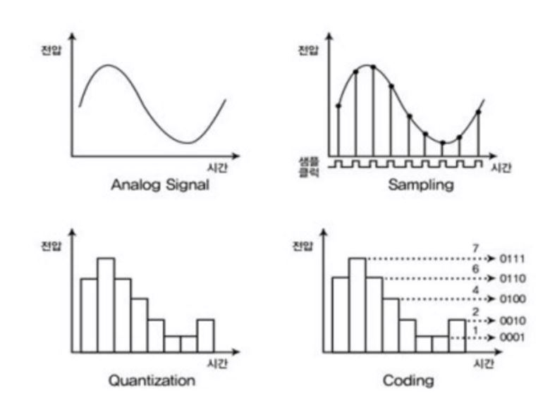


1. **아날로그 신호 입력.**

2. **샘플링(표본화)** - 시간 축 방향으로 연속된 아날로그 신호를 어떤 시간 간격으로 나누고, 나눈 시간 간격의 값을 추출(표본)해서 추출한 표본으로 샘플을 만드는 것.

3. **양자화** - 샘플링한 시간 간격의 값들을 반올림하는 과정 (즉, 10진수 값으로 변환)

   정확히 말하면 샘플링한 값은 예를들어 3.2155315....V 로 굉장히 온전한 아날로그 값에 가까운 값을 나타낸다.

   이를 디지털로 바꾸기 위해서 반올림을 한다. 그렇다면 어떻게 반올림을 할까??

   그건 ADC에 있는 비트의 수로 결정이 된다. (ADC가 10bit면 10bit까지만 값이 나오고 그 이후엔 반올림되어 사라진다.)

   10bit는 2의 10승으로 1024까지 수를 나타낼 수 없기 때문에 이후에는 반올림시키게 된다.

4. **복호화** - 양자화된 디지털 진폭 값들을 이용하여 디지털 신호 값(2진수)으로 변환

   복호화 과정에서는 OPAMP(비교기)를 이용하여 이를 디지털 값으로 나타나게 된다.

   

> 여기서 취급할 수 있는(사용할 수 있는) 신호는 샘플링 주파수의 1/2까지다.
>
> 이 말이 무엇이냐면,
>
> CD의 경우, 샘플링 주파수가 44.1KHz이다. 그러면 이론적으로 22Khz까지 실제 데이터로 사용이 가능하다. 
>
> (즉 원래의 아날로그 값으로)
>
> 근데 안전을 위해서 실제론 20Khz까지만 실제 데이터가 된다.

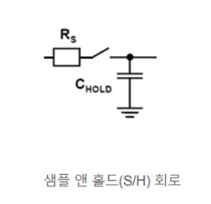

이러한 복호화 과정을 하기 전에, ADC의 기본 원리는 다음과 같다.

아날로그 전압이 ADC로 입력되면 짧은 시간동안 입력된 전압을 S/H(샘플 앤 홀드)에 충전한다.

샘플 앤 홀드를 사용하는 이유는 아날로그 신호를 디지털 신호로 변환 중에 샘플링 값에 변동이 있으면 안된다.

그래서 다음 샘플이 얻어질 때까지 샘플 값을 유지하는 것이 샘플 앤 홀드이다.

샘플 앤 홀드의 기본은 저항과 스위치 그리고 캐패시터를 이용한다. 여기서 스위치가 매우 짧은 시간(샘플링 주파수의 역수(fs) - LPF) 

동안 닫혔다가 열리고 그 시간동안 입력전압 Vin의 값은 캐패시터에 충전된다.

이렇게 캐패시터에 충전된 전압값이 OPAMP 비교기로 전달되게 된다.

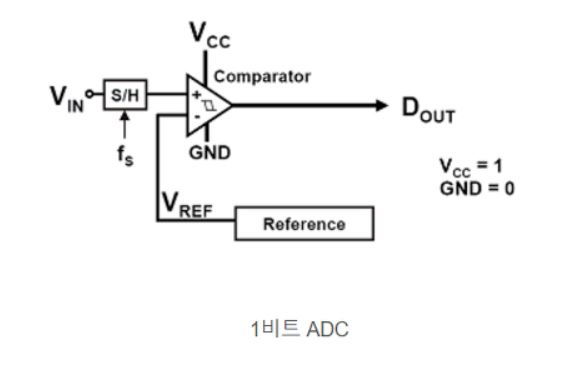

샘플 앤 홀드를 이용하여 전달받은 전압을 이용하여 OPAMP 비교기에서 Vref 값과 비교한다.

\- Vref > Vin = 0 

\- Vref < Vin = 1

위 두 경우로 값이 표현된다.

여기서 4bit ADC는 위 그림의 1bit ADC가 4개 연속으로 연결되어 있다. (아래 그림은 4bit ADC이다)

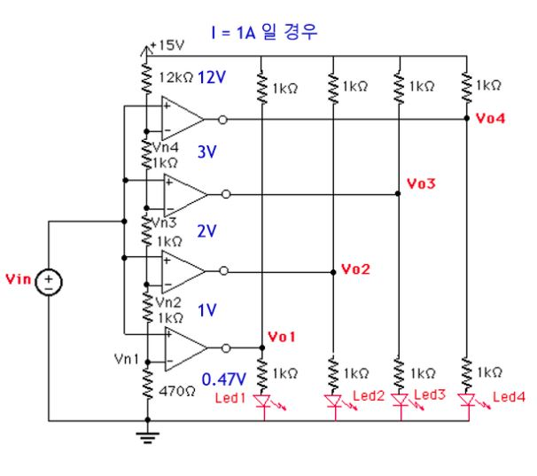

ADC가 V = 15V , I = 1A로 동작하는경우, OPAMP의 - 부분의 각 저항은 각각의 전압이 인가된다.

15V가 OPAMP의 - 의 부착되어 있는 저항으로 인해 전압 값이 순서대로 낮아지게 된다.

낮아진 전압을 각 OPAMP 비교기의 Vref로 인가하게 된다.

그리고 Vin이 오는 값을 비교해서 이를 bit로 표현하여 출력한다.

만약, Vin이 2.5V가 인가되었다고 하자.

그리고 OPAMP 비교기의 동작을 다시 표현하면 아래와 같다.

\- Vref > Vin = 0 

\- Vref < Vin = 1

그러면 이를 이용해서 계산한다면,

2.5V이 Vref보다 높으면 1 낮으면 0이 되므로 0.47V, 1V, 2V는 1이 되고 3V는 2.5V보다 크니깐 0이 출력될 것이다. (0111)


ADC의 성능은 크게 2개의 파라미터로 표현된다. 

1. 시간 축의 분해능을 나타내는 샘플링 주파수.

2. 전압 축의 분해능을 나타내는 비트 수.

빠른 샘플링 주파수는 입력전압의 빠른 변화에도 충실히 그 전압 값을 디지털로 표현할 수 있게 해준다.

또한 높은 ADC의 비트 수는 전압 공간의 분해능이 좋아져 보다 정밀한 디지털 값으로 전압을 표현할 수 있다.

여기서 비트의 수가 높아지면 전압공간의 분해능이 좋아진다는 말은 위에 양자화에서 나타낼 수 있는 전압의 값이 더 세밀하게 된다

는 의미. 그래서 반올림하는 위치가 더 늘어난다는 의미가 된다.

여기서 분해능이란 "얼마나 더 많이 분해할 수 있는가(정밀하게 나눌 수 있는가)" 이다.

따라서 고 성능 ADC는 AD의 변환시간이 짧고 비트 수가 높은 ADC를 말한다. (가격도 더 비싸다.)

통상적으로 많이 사용되는 ADC는 10bit 이상의 변환 시간은 수백 마이크로초 이하 이다.

---

## 2. ADC레지스터

- **RCC AHB1 peripheral clock register**

  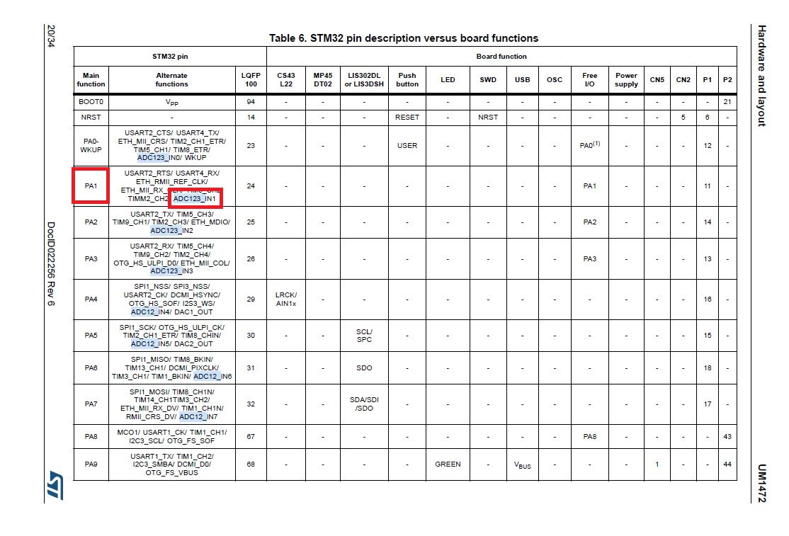

  ADC123_IN1의 ADC기능을 사용하므로 PA1핀과 연결되어 있음을 확인했다.

  GPIO에서의 Clock Enable을 위해 레지스터를 설정해주자.

  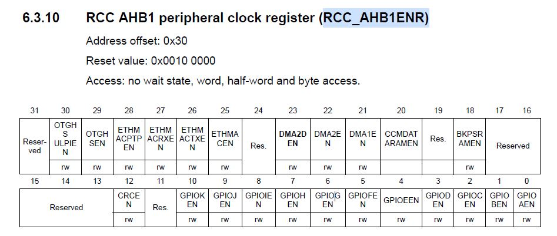

  RCC_AHB1ENR에서 0번비트를 1로 세팅함으로서 enable할 수 있다.

  ```c
  RCC_AHB1ENR |= 0x00000001;  // RCC clock enable
  ```

- **GPIO port mode register (GPIOx_MODER)**

  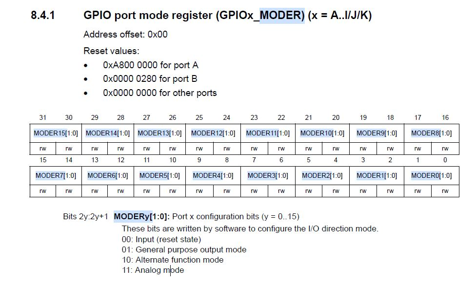

  GPIO에서 Analog mode로 사용해야하기 떄문에

  PA1에 아날로그모드 11을 넣어주어야한다. 2번자리에 숫자 3을 넣음으로서 11을 넣을수 있다.

  ```c
  GPIOA_MODER |= 3<<2;        // PA1 analog mode
  ```

- **RCC APB2 peripheral clock enable register**

  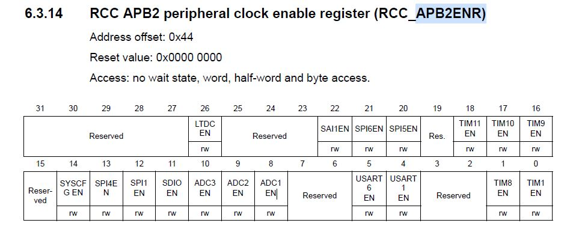

  ADC1에 clock을 enable하기 위해서 8번 비트자리에 1을 넣음으로 set을 해줄 수 있다.

  ```c
  RCC_APB2ENR |= 1<<8;        // ADC1 clock enable
  ```

- **RCC clock configuration register (RCC_CFGR)**

  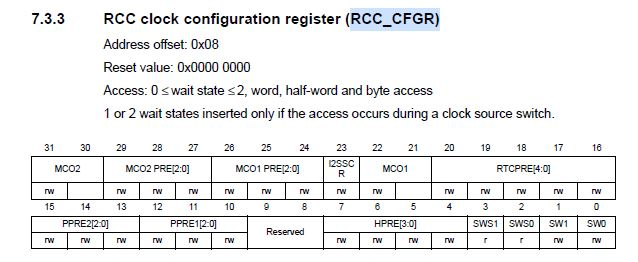

  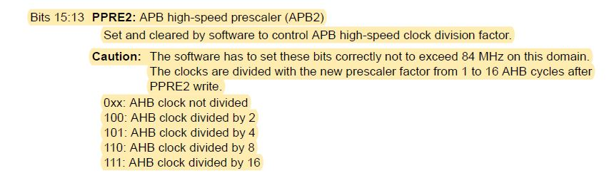

  우리는 지금 보드의 오실레이터 클락이 168MHz이고 4분주하여 42MHz로 쓰고싶다. 

  그러기 위해서는 RCC_CFGR레지스터에 4분주하겠다고 세팅을 해줘야한다.

  13번과 15번비트에 1,1을 넣음으로서 101이라는 3비트가 들어가고 이것이 4분주하겠다는 세팅이다. 

  ```c
  RCC_CFGR    |= 1<<15 | 1<<13;   // set APB2 div4 = 42 MHz
  ```

- **ADC control register 2 (ADC_CR2)**

  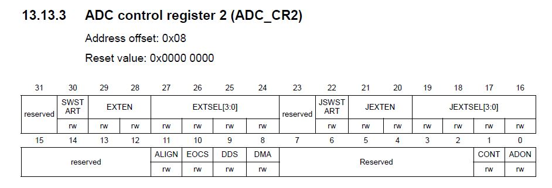

  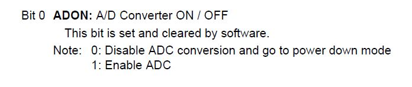

  ADC_CR2레지스터에 접근하여 ADC enable을 해주어야한다.

  0번비트에 1을 세팅함으로서 설정이 가능하다.

  ```c
  ADC1_CR2    |= 1<<0;        // ADC1 enable
  ```

- **ADC sample time register 2 (ADC_SMPR2)**

  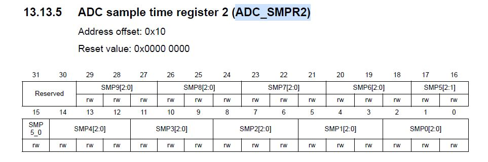

  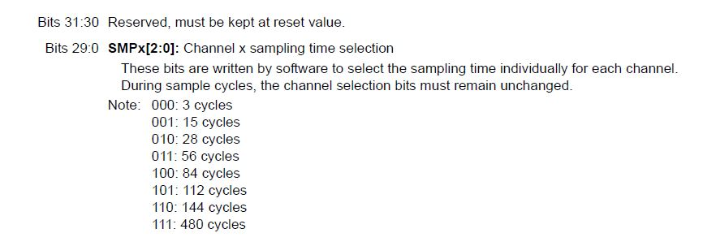

  Channel1의 샘플 사이클을 56 사이클로 설정하기위하여 0번 비트 자리에 3을 넣음으로서 011을 넣을수 있다.

  ```c
  ADC1_SMPR2  |= 3<<0;        // channel 1 sampling cycle 56 cycle
  ```

- **ADC control register 1 (ADC_CR1)**

  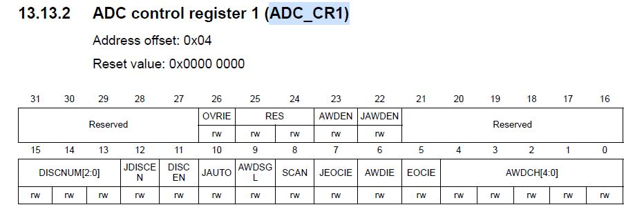

  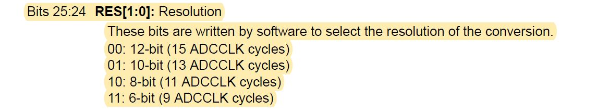

  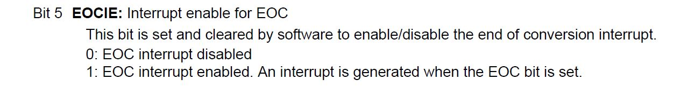

  8비트의 해상도를 가진 ADC모드를 사용하기위해서 24번 비트자리에 2를 넣음으로서 10으로 세팅가능하고

  EOC(End of Conversion)을 enable하기 위해서 5번비트자리에 1을 넣는다.

  ```c
      ADC1_CR1    |= 2<<24 | 1<<5;   // 8-bit resolution
                                      // end-of-conversion interrupt enable
  ```

- **ADC common control register (ADC_CCR)**

  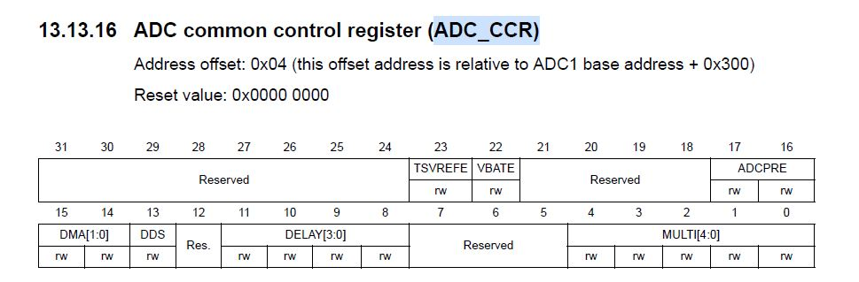

  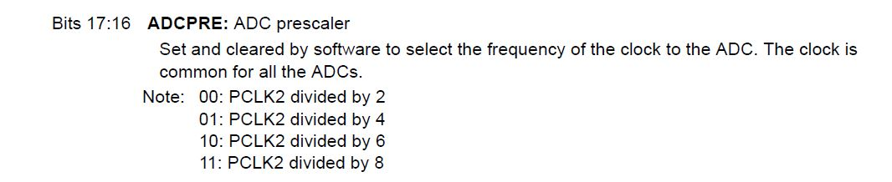

  PCLK2를 4로 나누기 위해서 16번 비트자리에 1을 넣음으로서 세팅이 가능하다.

  ```c
  ADC1_CCR    |= 1<<16; 
  ```

- **ADC regular sequence register 1 (ADC_SQR1)**

  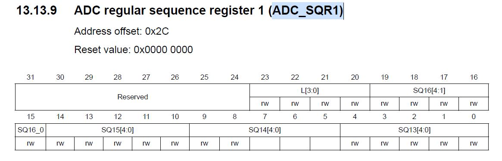

  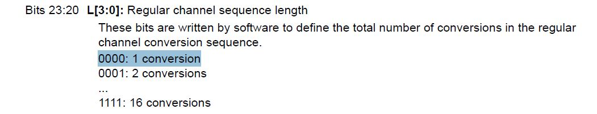

  channel 1을 1 conversion으로 사용하기 위해서 20번 비트자리에 0을 넣음으로서 세팅가능하다.

  ```c
  ADC1_SQR1   |= 0<<20;       // channel 1 : 1 conversion
  ```

- **ADC regular sequence register 3 (ADC_SQR3)**

  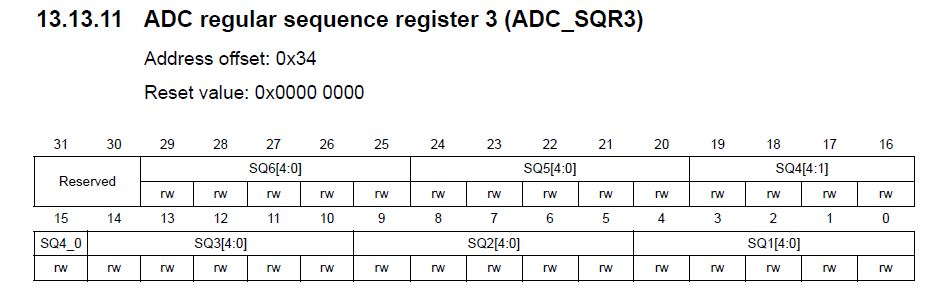

  

  Channel 1을 1st conversion과 연결하기 위해 0번비트에 1을 넣음으로서 세팅 가능하다.

  ```c
  ADC1_SQR3   |= 1<<0;        // 1st conversion : channel 1
  ```

- NVIC설정

  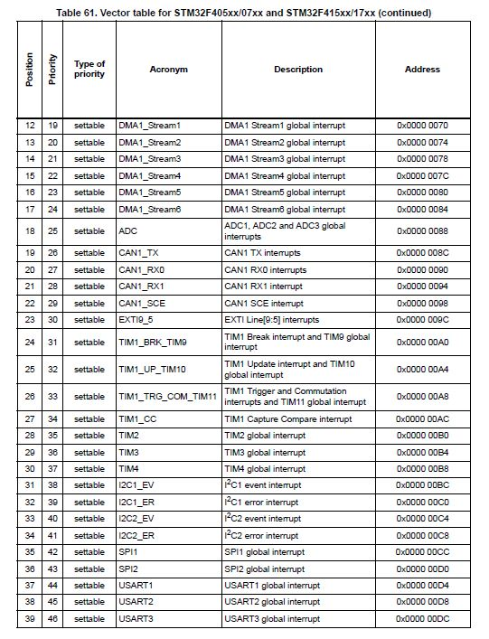

  최종적으로 NVIC에 enable하기 위해 ADC는 18의 Position을 가짐을 알수있다. 

  지난시간과 마찬가지로 ISER레지스터에 접근하여 enable 가능하다.

  ```c
  NVIC_ISER0  |= 1<<18;       // enable interrupt
  ```

- set함수

  위의 모든 설정사항들을 함수로 만들어 표현하면 다음과 같다.

  ```c
  // ADC1, channel1 , PA1
  void set_adc1(){
      RCC_AHB1ENR |= 0x00000001;  // RCC clock enable
      GPIOA_MODER |= 3<<2;        // PA1 analog mode
      RCC_APB2ENR |= 1<<8;        // ADC1 clock enable
      RCC_CFGR    |= 1<<15 | 1<<13;   // set APB2 div4 = 42 MHz
  
      ADC1_CR2    |= 1<<0;        // ADC1 enable
  
      ADC1_SMPR2  |= 3<<0;        // channel 1 sampling cycle 56 cycle
      ADC1_CR1    |= 2<<24 | 1<<5;   // 8-bit resolution
                                      // end-of-conversion interrupt enable
      ADC1_CCR    |= 1<<16;       // PCLK2 div 4
      ADC1_SQR1   |= 0<<20;       // channel 1 : 1 conversion
      ADC1_SQR3   |= 1<<0;        // 1st conversion : channel 1
  
      NVIC_ISER0  |= 1<<18;       // enable interrupt
  }
  ```

- **ADC_SR**

  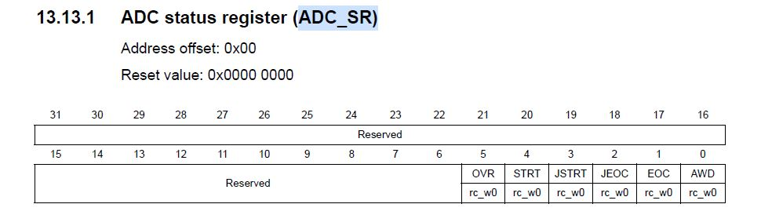

  Status Reguster를 살펴보면

  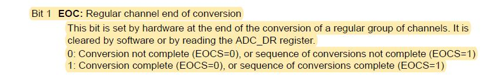

  1번 비트자리에 1이 있으면 conversion이 완료되었다고 알 수 있다. 

- **ADC_DR**

  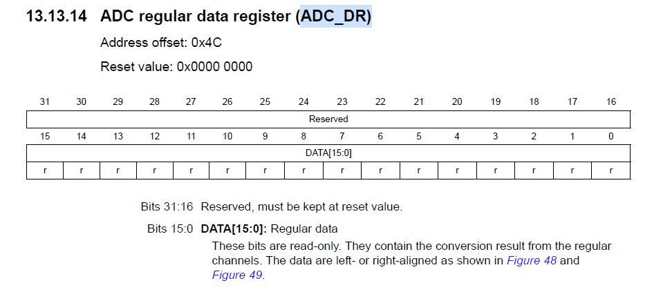

  UART와 마찬가지로 DR 레지스터가 있으며 16개의 비트를 가진다. 

  SR에 데이터가 변환됨을 완료되엇다고 판단될떄 DR에서 값을 가져오면된다. 

- **ADC1_IRQHandler**

  ```c
  void ADC1_IRQHandler(){
      if( ADC1_SR & 1<<1 ){
          adc_val = ADC1_DR & 0xFF; // masking for getting 8-bit
  
          len = sprintf(buf, "%3d\n", adc_val);
          sendStr(buf, len);
      }
      ADC1_CR2    |= 1<<30;
  }ㅊ
  ```

  ADC가 동작할 IRQ핸들러 함수를 만들면 위와 같다. 

  SR에서 변환이 완료되면 DR에서 정확히 8비트로 마스킹을 한후 adc_val이라는 변수에 담는다.(정수형)

  이때 sprintf 라이브러리를 사용해서 buf라는 문자열 배열에 정수를 문자로 바꿀수 있다. 

  반환되는값은 길이이다. 

  sendStr함수를 이용해 정수에서 문자로 변환된 ADC값을 UART로 전송을 시작한다. 

  CR2에 레지스터를보면

  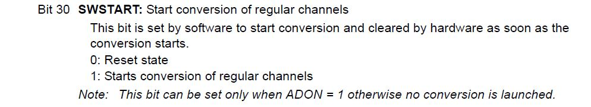

  30번 비트에 1을 넣음으로서 conversion이 시작된다. ADC 인터럽트는 한번 발생하고 멈추기 떄문에 다시 세팅을 해놓아야 된다.

- sendStr

  ```c
  void sendStr(char buf[], int max){
      int cnt = 0;
      while( cnt < max ){
          USART2_DR = buf[cnt++];
          while ( !(USART2_SR & (1<<7)) ); // checking transmission
          while ( !(USART2_SR & (1<<6)) );
      }
  ```

  buf라는 문자열에 USART_DR에 데이터를 전송하는 함수이다.

- main.c

  ````
  #include "STM32FDiscovery.h"
  #include <stdio.h>
  
  unsigned char rec, adc_val;
  unsigned int count = 0;
  
  unsigned int uart_data[423]= {
  32, 32, 32, 32, 32, 32, 32, 32, 32, 32, 
  32, 95, 95, 95, 95, 95, 32, 32, 32, 32, 
  32, 32, 95, 95, 95, 95, 95, 32, 95, 95, 
  95, 32, 32, 32, 32, 32, 32, 32, 32, 95, 
  95, 95, 95, 95, 32, 32, 32, 95, 32, 32, 
  32, 32, 32, 32, 32, 32, 32, 32, 32, 32, 
  32, 32, 32, 95, 95, 95, 95, 32, 32, 10, 
  32, 32, 32, 32, 32, 47, 92, 32, 32, 32, 
  124, 95, 32, 32, 32, 95, 124, 32, 32, 32, 
  32, 47, 32, 95, 95, 95, 95, 124, 95, 95, 
  32, 92, 32, 32, 32, 32, 32, 32, 47, 32,
  95, 95, 95, 95, 124, 32, 124, 32, 124, 32, 
  32, 32, 32, 32, 32, 32, 32, 47, 92, 32,
  32, 32, 124, 32, 32, 95, 32, 92, 32, 10, 
  32, 32, 32, 32, 47, 32, 32, 92, 32, 32,
  32, 32, 124, 32, 124, 95, 95, 95, 95, 95,
  124, 32, 40, 95, 95, 95, 32, 32, 32, 32,
  41, 32, 124, 95, 95, 95, 32, 124, 32, 124, 
  32, 32, 32, 32, 32, 32, 124, 32, 124, 32, 
  32, 32, 32, 32, 32, 32, 47, 32, 32, 92, 
  32, 32, 124, 32, 124, 95, 41, 32, 124, 10, 
  32, 32, 32, 47, 32, 47, 92, 32, 92, 32, 
  32, 32, 124, 32, 124, 95, 95, 95, 95, 95,
  95, 92, 95, 95, 95, 32, 92, 32, 32, 47, 
  32, 47, 47, 32, 95, 32, 92, 124, 32, 124, 
  32, 32, 32, 32, 32, 32, 124, 32, 124, 32, 
  32, 32, 32, 32, 32, 47, 32, 47, 92, 32, 
  92, 32, 124, 32, 32, 95, 32, 60, 32, 10, 
  32, 32, 47, 32, 95, 95, 95, 95, 32, 92, 
  32, 95, 124, 32, 124, 95, 32, 32, 32, 32, 
  32, 95, 95, 95, 95, 41, 32, 124, 47, 32, 
  47, 124, 32, 40, 95, 41, 32, 124, 32, 124, 
  95, 95, 95, 95, 32, 32, 124, 32, 124, 95, 
  95, 95, 95, 32, 47, 32, 95, 95, 95, 95, 
  32, 92, 124, 32, 124, 95, 41, 32, 124, 10, 
  32, 47, 95, 47, 32, 32, 32, 32, 92, 95, 
  92, 95, 95, 95, 95, 95, 124, 32, 32, 32, 
  124, 95, 95, 95, 95, 95, 47, 124, 95, 95, 
  95, 95, 92, 95, 95, 95, 47, 32, 92, 95, 
  95, 95, 95, 95, 124, 32, 124, 95, 95, 95, 
  95, 95, 95, 47, 95, 47, 32, 32, 32, 32, 
  92, 95, 92, 95, 95, 95, 95, 47, 32, 10,
  10, 10, 10};
  
  char buf[5];
  int len;
  void sendStr(char buf[], int max);
  
  void clk(void)
  {
  	RCC_CR = 0;
  	RCC_PLLCFGR = 0;
  	RCC_CFGR = 0;
  		
  	RCC_CR |= (1<<16); // HSE set
  	while( (RCC_CR & ( 1<<17) ) == 0 ); // wait until HSE ready
  	
  	RCC_PLLCFGR |= 8;//0x00000008; // set PLLM
  	RCC_PLLCFGR |= (336<<6);//|= (336<<6); // 		set PLLN
  	RCC_PLLCFGR |= (0<<16); // set PLLP
  	RCC_PLLCFGR |= (7<<24);//0x07000000; // set PLLQ
  
  	RCC_PLLCFGR |= (1<<22); // set PLL src HSE
  	
  
  	RCC_CR |= (1<<24); // PLL ON
  	while( (RCC_CR & (1<<25)) == 0); // wait until PLL ready
  	
  	FLASH_ACR |= 5;
  	RCC_CFGR |= 2; // set PLL to system clock
  	
  		
  	while( (RCC_CFGR & (12) ) != 8); // wait until PLL ready
  	
  	RCC_CFGR |= (1<<12) | (1<<10); // set APB1 div 4
  	RCC_CFGR |= (1<<15); // set APB2 div2	
  }
  
  void set_usart2() {
      // USART PA2, PA3
      RCC_AHB1ENR     |= 1<<0;
      GPIOA_MODER     |= (1<<5) | (1<<7); // use alternate mode PA2, PA3
      GPIOA_AFRL      |= (7<<8) | (7<<12); // use Alternate function 7
  
      // set USART2
      RCC_APB1ENR     |= (1<<17); // usart2 clk enable
      USART2_CR1      |= (0<<12);
      USART2_CR2      |= (0<<13) | (0<<12);
  
      USART2_BRR      |= (unsigned int)(42000000/115200);
  
      USART2_CR1      |= (1<<3) | (1<<2); // tx enable, rx enable 
      USART2_CR1      |= (1<<5); // RXNE interrupt enable by using interrupt mode not polling
      USART2_CR1      |= (1<<13); // USART enable 
  
      // USART interrupt enable
      NVIC_ISER1      |= 1<<6 ; // why using 6?? because ISER1 0~31, ISER1 start to 32 so can use 6
  
  }
  
  // ADC1, channel1 , PA1
  void set_adc1(){
      RCC_AHB1ENR |= 0x00000001;  // RCC clock enable
      GPIOA_MODER |= 3<<2;        // PA1 analog mode
      RCC_APB2ENR |= 1<<8;        // ADC1 clock enable
      RCC_CFGR    |= 1<<15 | 1<<13;   // set APB2 div4 = 42 MHz
  
      ADC1_CR2    |= 1<<0;        // ADC1 enable
  
      ADC1_SMPR2  |= 3<<0;        // channel 1 sampling cycle 56 cycle
      ADC1_CR1    |= 2<<24 | 1<<5;   // 8-bit resolution
                                      // end-of-conversion interrupt enable
      ADC1_CCR    |= 1<<16;       // PCLK2 div 4
      ADC1_SQR1   |= 0<<20;       // channel 1 : 1 conversion
      ADC1_SQR3   |= 1<<0;        // 1st conversion : channel 1
  
      NVIC_ISER0  |= 1<<18;       // enable interrupt
  }
  
  
  
  void USART2_IRQHandler() {
      if( USART2_SR & (1<<5) ) {
          rec = USART2_DR; // when reading DR, SR is clear
  
          USART2_DR = rec;
          while ( !(USART2_SR & (1<<7)) ); // checking transmission
          while ( !(USART2_SR & (1<<6)) );
          
  
          GPIOD_ODR ^= 1<<12;
  
          USART2_CR1 |= (1<<5); // set USART Interrupt
  
      }
  
  }
  void EXTI0_IRQHandler() {
  
      GPIOD_ODR ^= 1 << 13;
      GPIOD_ODR ^= 1 << 14;
      GPIOD_ODR ^= 1 << 15;
  
      EXTI_PR |= 1<<0;    // clear pending bit for EXTI0
  }
  
  void ADC1_IRQHandler(){
      if( ADC1_SR & 1<<1 ){
          adc_val = ADC1_DR & 0xFF; // masking for getting 8-bit
  
          len = sprintf(buf, "%3d\n", adc_val);
          sendStr(buf, len);
      }
      ADC1_CR2    |= 1<<30;
  }
  
  
  
  int main (void)
  {
  	
  	clk();
  	
  	RCC_CFGR |= 0x04600000;
  
      /* PORT A */
  	RCC_AHB1ENR  |= 1<<0; //RCC clock enable register	
      GPIOA_MODER  |= 0<<0; // input mode
      GPIOA_OTYPER |= 0<<0; // output push-pull
      GPIOA_PUPDR  |= 0<<0; // no pull-up, pull-down
  
      /* button intr set */
      SYSCFG_EXTICR1 |= 0<<0; //EXTI0 connect to PA0
      EXTI_IMR       |= 1<<0; //Mask EXTI0
      EXTI_RTSR      |= 1<<0; //risign edge trigger enable
      EXTI_FTSR      |= 0<<0; //falling edge trigger disable
      NVIC_ISER0     |= 1<<6; // enable EXTI0 interrupt
  	
  	/* PORT D */
  	RCC_AHB1ENR  |= 1<<3;		// PORTD enable
  	GPIOD_MODER  |= 1<<24;		// PORTD 12 general output mode
  	GPIOD_MODER  |= 1<<26;		// PORTD 13 general output mode
  	GPIOD_MODER  |= 1<<28;		// PORTD 14 general output mode
  	GPIOD_MODER  |= 1<<30;		// PORTD 15 general output mode
  	GPIOD_OTYPER |= 0x00000000;
  	GPIOD_PUPDR	 |= 0x00000000;
  	
  	GPIOD_ODR |= 1<<12;
  
      set_adc1();
      set_usart2();
  
      while( count < 423){
          USART2_DR = uart_data[count++];
          while ( !(USART2_SR & (1<<7)) ); // checking transmission
          while ( !(USART2_SR & (1<<6)) );
      }
  
      ADC1_CR2    |= 1<<30;
  
  
  	while(1) {
  //        if( GPIOA_IDR & 0x00000001 ) {
  //            GPIOD_ODR ^= 1 << 13;
  //           GPIOD_ODR ^= 1 << 14;
  //            GPIOD_ODR ^= 1 << 15;
  //        }
  	}
  }
  
  void sendStr(char buf[], int max){
      int cnt = 0;
      while( cnt < max ){
          USART2_DR = buf[cnt++];
          while ( !(USART2_SR & (1<<7)) ); // checking transmission
          while ( !(USART2_SR & (1<<6)) );
      }
  }
  ````

  위의 설정사항들을 모두 담은 main.c 파일이다.

- startup.s

  ```assembly
  /**
    ******************************************************************************
    * @file      startup_stm32.s
    * @author    Ac6
    * @version   V1.0.0
    * @date      12-June-2014
    ******************************************************************************
    */
  
    .syntax unified
    .cpu cortex-m4
    .thumb
  
  .global	g_pfnVectors
  
  /* start address for the initialization values of the .data section.
  defined in linker script */
  .word	_sidata
  /* start address for the .data section. defined in linker script */
  .word	_sdata
  /* end address for the .data section. defined in linker script */
  .word	_edata
  /* start address for the .bss section. defined in linker script */
  .word	_sbss
  /* end address for the .bss section. defined in linker script */
  .word	_ebss
  
  .equ  BootRAM,        0xF1E0F85F
  /**
   * @brief  This is the code that gets called when the processor first
   *          starts execution following a reset event. Only the absolutely
   *          necessary set is performed, after which the application
   *          supplied main() routine is called.
   * @param  None
   * @retval : None
  */
  
      .section	.text.Reset_Handler
  	.weak	Reset_Handler
  	.type	Reset_Handler, %function
  Reset_Handler:
  
  /* Copy the data segment initializers from flash to SRAM */
    movs	r1, #0
    b	LoopCopyDataInit
  
  CopyDataInit:
  	ldr	r3, =_sidata
  	ldr	r3, [r3, r1]
  	str	r3, [r0, r1]
  	adds	r1, r1, #4
  
  LoopCopyDataInit:
  	ldr	r0, =_sdata
  	ldr	r3, =_edata
  	adds	r2, r0, r1
  	cmp	r2, r3
  	bcc	CopyDataInit
  	ldr	r2, =_sbss
  	b	LoopFillZerobss
  
  /* Zero fill the bss segment. */
  FillZerobss:
  	movs r3, #0
   	str  r3, [r2]
  	adds r2, r2, #4
  
  LoopFillZerobss:
  	ldr	r3, = _ebss
  	cmp	r2, r3
  	bcc	FillZerobss
  
  /* Call the application's entry point.*/
  	bl	main
  
  .size	Reset_Handler, .-Reset_Handler
  
  /**
   * @brief  This is the code that gets called when the processor receives an
   *         unexpected interrupt.  This simply enters an infinite loop, preserving
   *         the system state for examination by a debugger.
   *
   * @param  None
   * @retval : None
  */
  
  /******************************************************************************
  *
  * The minimal vector table for a Cortex-M.  Note that the proper constructs
  * must be placed on this to ensure that it ends up at physical address
  * 0x0000.0000.
  *
  ******************************************************************************/
   	.section	.isr_vector,"a",%progbits
  	.type	g_pfnVectors, %object
  	.size	g_pfnVectors, .-g_pfnVectors
  
  	.weak	SysTick_Handler
  
  g_pfnVectors:
  	.word	_estack
  	.word	Reset_Handler
  	.word	0 // NMI_Handler
  	.word	0 // HardFault_Handler
  	.word	0 // MemManage_Handler
  	.word	0 // BusFault_Handler
  	.word	0 // UsageFault_Handler
  	.word	0
  	.word	0
  	.word	0
  	.word	0
  	.word	0 // SVC_Handler
  	.word	0 // DebugMon_Handler
  	.word	0
  	.word	0 // PendSV_Handler
  	.word	SysTick_Handler
  	.word	0
  	.word	0
  	.word	0
  	.word	0
  	.word	0
  	.word	0
  	.word	EXTI0_IRQHandler
  	.word	0
  	.word	0
  	.word	0
  	.word	0
  	.word	0
  	.word	0
  	.word	0
  	.word	0
  	.word	0
  	.word	0
  	.word	0
  	.word	ADC1_IRQHandler
  	.word	0
  	.word	0
  	.word	0
  	.word	0
  	.word	0
  	.word	0
  	.word	0
  	.word	0
  	.word	0
  	.word	0
  	.word	0
  	.word	0
  	.word	0
  	.word	0
  	.word	0
  	.word	0
  	.word	0
  	.word	0
  	.word	0
  	.word	USART2_IRQHandler
  	.word	0
  	.word	0
  	.word	0
  	.word	0
  	.word	0
  	.word	0
  	.word	0
  	.word	0
  	.word	0
  	.word	0
  	.word	0
  	.word	0
  	.word	0
  	.word	0
  	.word	0
  	.word	0
  	.word	0
  	.word	0
  	.word	0
  	.word	0
  	.word	0
  	.word	0
  	.word	0
  	.word	0
  	.word	0
  	.word	0
  	.word	0
  	.word	0
  	.word	0
  	.word	0
  	.word	0
  	.word	0
  	.word	0
  	.word	0
  	.word	0
  	.word	0
  	.word	0
  	.word	0
  	.word	0
  	.word	0
  	.word	0
  	.word	0
  	.word	0
  
  
  /************************ (C) COPYRIGHT Ac6 *****END OF FILE****/
  
  ```

  ADC도 인터럽트기 때문에 IRQ함수를 미리 세팅해놓아야한다. 

- Linkerscript.ld

  ```assembly
  /*
  ******************************************************************************
  **
  **  File        : LinkerScript.ld
  **
  **  Author		: Auto-generated by Ac6 System Workbench
  **
  **  Abstract    : Linker script for STM32F411VETx Device from STM32F4 series
  **                128Kbytes RAM
  **                512Kbytes ROM
  **
  **                Set heap size, stack size and stack location according
  **                to application requirements.
  **
  **                Set memory bank area and size if external memory is used.
  **
  **  Target      : STMicroelectronics STM32
  **
  **  Distribution: The file is distributed ?as is,? without any warranty
  **                of any kind.
  **
  *****************************************************************************
  ** @attention
  **
  ** <h2><center>&copy; COPYRIGHT(c) 2017 Ac6</center></h2>
  **
  ** Redistribution and use in source and binary forms, with or without modification,
  ** are permitted provided that the following conditions are met:
  **   1. Redistributions of source code must retain the above copyright notice,
  **      this list of conditions and the following disclaimer.
  **   2. Redistributions in binary form must reproduce the above copyright notice,
  **      this list of conditions and the following disclaimer in the documentation
  **      and/or other materials provided with the distribution.
  **   3. Neither the name of Ac6 nor the names of its contributors
  **      may be used to endorse or promote products derived from this software
  **      without specific prior written permission.
  **
  ** THIS SOFTWARE IS PROVIDED BY THE COPYRIGHT HOLDERS AND CONTRIBUTORS "AS IS"
  ** AND ANY EXPRESS OR IMPLIED WARRANTIES, INCLUDING, BUT NOT LIMITED TO, THE
  ** IMPLIED WARRANTIES OF MERCHANTABILITY AND FITNESS FOR A PARTICULAR PURPOSE ARE
  ** DISCLAIMED. IN NO EVENT SHALL THE COPYRIGHT HOLDER OR CONTRIBUTORS BE LIABLE
  ** FOR ANY DIRECT, INDIRECT, INCIDENTAL, SPECIAL, EXEMPLARY, OR CONSEQUENTIAL
  ** DAMAGES (INCLUDING, BUT NOT LIMITED TO, PROCUREMENT OF SUBSTITUTE GOODS OR
  ** SERVICES; LOSS OF USE, DATA, OR PROFITS; OR BUSINESS INTERRUPTION) HOWEVER
  ** CAUSED AND ON ANY THEORY OF LIABILITY, WHETHER IN CONTRACT, STRICT LIABILITY,
  ** OR TORT (INCLUDING NEGLIGENCE OR OTHERWISE) ARISING IN ANY WAY OUT OF THE USE
  ** OF THIS SOFTWARE, EVEN IF ADVISED OF THE POSSIBILITY OF SUCH DAMAGE.
  **
  *****************************************************************************
  */
  
  /* Entry Point */
  ENTRY(Reset_Handler)
  
  /* Highest address of the user mode stack */
  _estack = 0x20020000;    /* end of RAM */
  
  _Min_Heap_Size = 0x200;		/* required amount of heap */
  _Min_Stack_Size = 0x400;	/* required amount of stack */
  
  /* Memories definition */
  MEMORY
  {
    RAM (xrw)		: ORIGIN = 0x20000000, LENGTH = 128K
    ROM (rx)		: ORIGIN = 0x8000000, LENGTH = 512K
  }
  
  /* Sections */
  SECTIONS
  {
    /* The startup code into ROM memory */
    .isr_vector :
    {
      . = ALIGN(4);
      KEEP(*(.isr_vector)) /* Startup code */
      . = ALIGN(4);
    } >ROM
  
    /* The program code and other data into ROM memory */
    .text :
    {
      . = ALIGN(4);
      *(.text)           /* .text sections (code) */
      *(.text*)          /* .text* sections (code) */
      *(.glue_7)         /* glue arm to thumb code */
      *(.glue_7t)        /* glue thumb to arm code */
      *(.eh_frame)
  
      KEEP (*(.init))
      KEEP (*(.fini))
  
      . = ALIGN(4);
      _etext = .;        /* define a global symbols at end of code */
    } >ROM
  
    /* Constant data into ROM memory*/
    .rodata :
    {
      . = ALIGN(4);
      *(.rodata)         /* .rodata sections (constants, strings, etc.) */
      *(.rodata*)        /* .rodata* sections (constants, strings, etc.) */
      . = ALIGN(4);
    } >ROM
  
    /* Used by the startup to initialize data */
    _sidata = LOADADDR(.data);
  
    /* Initialized data sections into RAM memory */
    .data : 
    {
      . = ALIGN(4);
      _sdata = .;        /* create a global symbol at data start */
      *(.data)           /* .data sections */
      *(.data*)          /* .data* sections */
  
      . = ALIGN(4);
      _edata = .;        /* define a global symbol at data end */
    } >RAM AT> ROM
  
    
    /* Uninitialized data section into RAM memory */
    . = ALIGN(4);
    .bss :
    {
      /* This is used by the startup in order to initialize the .bss secion */
      _sbss = .;         /* define a global symbol at bss start */
      __bss_start__ = _sbss;
      *(.bss)
      *(.bss*)
      *(COMMON)
  
      . = ALIGN(4);
      _ebss = .;         /* define a global symbol at bss end */
      __bss_end__ = _ebss;
    } >RAM
  
    ._user_heap_stack :
    {
        . = ALIGN(4);
        PROVIDE ( end = . );
        PROVIDE ( _end = . );
        . = . + _Min_Heap_Size;
        . = . + _Min_Stack_Size;
        . = ALIGN(4);
    } >RAM
  }
  
  ```

  stdio.h를 쓰기위해 user_heap_stack부분을 추가해주었다.

- Makefile

  ```
  ## Cross-compilation commands 
  CC      = arm-none-eabi-gcc
  LD      = arm-none-eabi-gcc
  AS      = arm-none-eabi-as
  OBJCOPY = arm-none-eabi-objcopy
  SIZE    = arm-none-eabi-size
  
  OBJS  = main.o startup.o
  
  ## Platform and optimization options
  CFLAGS = -mcpu=cortex-m4 -mthumb -mfloat-abi=hard -mfpu=fpv4-sp-d16 -DSTM32 -DSTM32F4 -DSTM32F411VETx -DSTM32F411E_DISCO 
  CFLAGS += -DDEBUG -DSTM32F411xE -DUSE_STDPERIPH_DRIVER -O0 -g3 -Wall -fmessage-length=0 -ffunction-sections -c -MMD -MP
  LFLAGS = -mcpu=cortex-m4 -mthumb -mfloat-abi=hard -mfpu=fpv4-sp-d16 -T"LinkerScript.ld" -Wl,-Map=out.map -Wl,--gc-sections
  
  ## Rules
  all: out.elf out.bin size 
  
  out.elf: $(OBJS) LinkerScript.ld
  	$(LD) -specs=nano.specs -specs=nosys.specs $(LFLAGS) -o out.elf $(OBJS)
  
  out.bin: out.elf
  	$(OBJCOPY) -O binary "out.elf" "out.bin"
  
  size: out.elf
  	$(SIZE) $< 
  
  qemu: 
  	qemu-system-gnuarmeclipse -cpu cortex-m4 -machine STM32F4-Discovery -gdb tcp::3333 -kernel out.elf
  
  ocd:
  	openocd -f /usr/share/openocd/scripts/board/stm32f4discovery.cfg
  
  flash:
  	openocd -f /usr/share/openocd/scripts/board/stm32f4discovery.cfg -c "program out.elf verify reset exit"
  
  gdb:
  	./run_gdb.sh
  
  gdb_openocd:
  	./run_gdb_ocd.sh
  
  clean:
  	rm *.o *.d *.elf *.bin *.map
  
  ```

  out.elf에 -specs=nano.specs -specs=nosys.specs를 추가해주었다. 위와 마찬가지로 stdio.h를 쓰기위함이다.

- 실행결과

  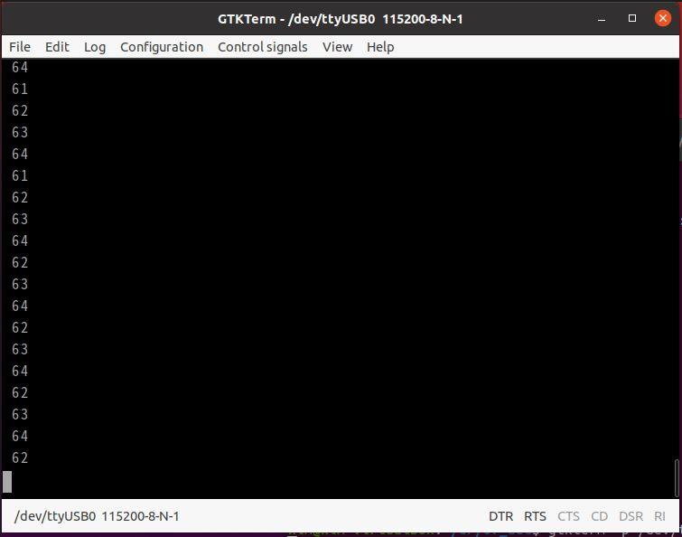

  ADC핀에 아무런 신호를 인가하지 않았을때 모습이다.

  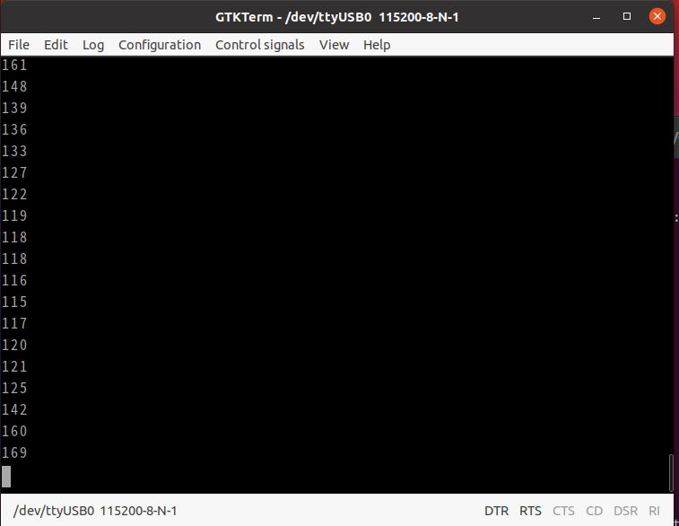

  ADC GPIO핀에 손으로 접촉시 전압이 바뀌면서 읽어온 모습이다. 

---

## 3. Standard library를 사용하지않고 ADC UART 출력

- int to char함수

  ```c
  void itoaSub(int num,char *str){
      int tmp=num;
      int cnt2 = 0;
  
      while(tmp!=0){
          tmp/=10;
          cnt2++;
      }
      len = cnt2;
  
      str[cnt2]='\0';
      
      do{
          cnt2--;
          str[cnt2]=(char)(num%10+48);
          num = num/10;
  
      }while(num!=0);
  }
  ```

  ADC를 받아온값이 int형인데 이것을 UART로 출력하기위해서는 char형으로 변환해주어야한다. 우선적으로 temp라는 변수에 값을 저장해서 10으로 나눠서 총 길이(자리수)를 계산한다. 

  미리 정의한 buf를 넘겨주고 마지막에 NULL을 저장해 끝을 알려준다. 

  do-while 반복문을 통해서 배열의 마지막 자리부터 아스키코드를 이용하여 저장한다. 

- main.c

  ```c
  #include "STM32FDiscovery.h"
  
  unsigned char rec, adc_val;
  unsigned int count = 0;
  
  unsigned int uart_data[423]= {
  32, 32, 32, 32, 32, 32, 32, 32, 32, 32, 
  32, 95, 95, 95, 95, 95, 32, 32, 32, 32, 
  32, 32, 95, 95, 95, 95, 95, 32, 95, 95, 
  95, 32, 32, 32, 32, 32, 32, 32, 32, 95, 
  95, 95, 95, 95, 32, 32, 32, 95, 32, 32, 
  32, 32, 32, 32, 32, 32, 32, 32, 32, 32, 
  32, 32, 32, 95, 95, 95, 95, 32, 32, 10, 
  32, 32, 32, 32, 32, 47, 92, 32, 32, 32, 
  124, 95, 32, 32, 32, 95, 124, 32, 32, 32, 
  32, 47, 32, 95, 95, 95, 95, 124, 95, 95, 
  32, 92, 32, 32, 32, 32, 32, 32, 47, 32,
  95, 95, 95, 95, 124, 32, 124, 32, 124, 32, 
  32, 32, 32, 32, 32, 32, 32, 47, 92, 32,
  32, 32, 124, 32, 32, 95, 32, 92, 32, 10, 
  32, 32, 32, 32, 47, 32, 32, 92, 32, 32,
  32, 32, 124, 32, 124, 95, 95, 95, 95, 95,
  124, 32, 40, 95, 95, 95, 32, 32, 32, 32,
  41, 32, 124, 95, 95, 95, 32, 124, 32, 124, 
  32, 32, 32, 32, 32, 32, 124, 32, 124, 32, 
  32, 32, 32, 32, 32, 32, 47, 32, 32, 92, 
  32, 32, 124, 32, 124, 95, 41, 32, 124, 10, 
  32, 32, 32, 47, 32, 47, 92, 32, 92, 32, 
  32, 32, 124, 32, 124, 95, 95, 95, 95, 95,
  95, 92, 95, 95, 95, 32, 92, 32, 32, 47, 
  32, 47, 47, 32, 95, 32, 92, 124, 32, 124, 
  32, 32, 32, 32, 32, 32, 124, 32, 124, 32, 
  32, 32, 32, 32, 32, 47, 32, 47, 92, 32, 
  92, 32, 124, 32, 32, 95, 32, 60, 32, 10, 
  32, 32, 47, 32, 95, 95, 95, 95, 32, 92, 
  32, 95, 124, 32, 124, 95, 32, 32, 32, 32, 
  32, 95, 95, 95, 95, 41, 32, 124, 47, 32, 
  47, 124, 32, 40, 95, 41, 32, 124, 32, 124, 
  95, 95, 95, 95, 32, 32, 124, 32, 124, 95, 
  95, 95, 95, 32, 47, 32, 95, 95, 95, 95, 
  32, 92, 124, 32, 124, 95, 41, 32, 124, 10, 
  32, 47, 95, 47, 32, 32, 32, 32, 92, 95, 
  92, 95, 95, 95, 95, 95, 124, 32, 32, 32, 
  124, 95, 95, 95, 95, 95, 47, 124, 95, 95, 
  95, 95, 92, 95, 95, 95, 47, 32, 92, 95, 
  95, 95, 95, 95, 124, 32, 124, 95, 95, 95, 
  95, 95, 95, 47, 95, 47, 32, 32, 32, 32, 
  92, 95, 92, 95, 95, 95, 95, 47, 32, 10,
  10, 10, 10};
  
  char buf[5];
  int len = 0;
  unsigned int enter = 10;
  void sendStr(char buf[], int max);
  void itoaSub(int num,char *str);
  
  void clk(void)
  {
  	RCC_CR = 0;
  	RCC_PLLCFGR = 0;
  	RCC_CFGR = 0;
  		
  	RCC_CR |= (1<<16); // HSE set
  	while( (RCC_CR & ( 1<<17) ) == 0 ); // wait until HSE ready
  	
  	RCC_PLLCFGR |= 8;//0x00000008; // set PLLM
  	RCC_PLLCFGR |= (336<<6);//|= (336<<6); // 		set PLLN
  	RCC_PLLCFGR |= (0<<16); // set PLLP
  	RCC_PLLCFGR |= (7<<24);//0x07000000; // set PLLQ
  
  	RCC_PLLCFGR |= (1<<22); // set PLL src HSE
  	
  
  	RCC_CR |= (1<<24); // PLL ON
  	while( (RCC_CR & (1<<25)) == 0); // wait until PLL ready
  	
  	FLASH_ACR |= 5;
  	RCC_CFGR |= 2; // set PLL to system clock
  	
  		
  	while( (RCC_CFGR & (12) ) != 8); // wait until PLL ready
  	
  	RCC_CFGR |= (1<<12) | (1<<10); // set APB1 div 4
  	RCC_CFGR |= (1<<15); // set APB2 div2	
  }
  
  void set_usart2() {
      // USART PA2, PA3
      RCC_AHB1ENR     |= 1<<0;
      GPIOA_MODER     |= (1<<5) | (1<<7); // use alternate mode PA2, PA3
      GPIOA_AFRL      |= (7<<8) | (7<<12); // use Alternate function 7
  
      // set USART2
      RCC_APB1ENR     |= (1<<17); // usart2 clk enable
      USART2_CR1      |= (0<<12);
      USART2_CR2      |= (0<<13) | (0<<12);
  
      USART2_BRR      |= (unsigned int)(42000000/115200);
  
      USART2_CR1      |= (1<<3) | (1<<2); // tx enable, rx enable 
      USART2_CR1      |= (1<<5); // RXNE interrupt enable by using interrupt mode not polling
      USART2_CR1      |= (1<<13); // USART enable 
  
      // USART interrupt enable
      NVIC_ISER1      |= 1<<6 ; // why using 6?? because ISER1 0~31, ISER1 start to 32 so can use 6
  
  
  }
  
  // ADC1, channel1 , PA1
  void set_adc1(){
      RCC_AHB1ENR |= 0x00000001;  // RCC clock enable
      GPIOA_MODER |= 3<<2;        // PA1 analog mode
      RCC_APB2ENR |= 1<<8;        // ADC1 clock enable
      RCC_CFGR    |= 1<<15 | 1<<13;   // set APB2 div4 = 42 MHz
  
      ADC1_CR2    |= 1<<0;        // ADC1 enable
  
      ADC1_SMPR2  |= 3<<0;        // channel 1 sampling cycle 56 cycle
      ADC1_CR1    |= 2<<24 | 1<<5;   // 8-bit resolution
                                      // end-of-conversion interrupt enable
      ADC1_CCR    |= 1<<16;       // PCLK2 div 4
      ADC1_SQR1   |= 0<<20;       // channel 1 : 1 conversion
      ADC1_SQR3   |= 1<<0;        // 1st conversion : channel 1
  
      NVIC_ISER0  |= 1<<18;       // enable interrupt
  }
  
  
  
  void USART2_IRQHandler() {
      if( USART2_SR & (1<<5) ) {
          rec = USART2_DR; // when reading DR, SR is clear
  
          USART2_DR = rec;
          while ( !(USART2_SR & (1<<7)) ); // 잘보내졌는지 확인
          while ( !(USART2_SR & (1<<6)) );
          
  
          GPIOD_ODR ^= 1<<12;
  
          USART2_CR1 |= (1<<5); // set USART Interrupt
  
      }
  
  }
  void EXTI0_IRQHandler() {
  
      GPIOD_ODR ^= 1 << 13;
      GPIOD_ODR ^= 1 << 14;
      GPIOD_ODR ^= 1 << 15;
  
      EXTI_PR |= 1<<0;    // clear pending bit for EXTI0
  }
  
  void ADC1_IRQHandler(){
      if( ADC1_SR & 1<<1 ){
          adc_val = ADC1_DR & 0xFF; // masking for getting 8-bit
  
          itoaSub(adc_val,buf); 
          sendStr(buf, len);
     
      }
      len = 0;
      ADC1_CR2    |= 1<<30;
  }
  
  
  
  
  
  int main (void)
  {
  	
  	clk();
  	
  	RCC_CFGR |= 0x04600000;
  
      /* PORT A */
  	RCC_AHB1ENR  |= 1<<0; //RCC clock enable register	
      GPIOA_MODER  |= 0<<0; // input mode
      GPIOA_OTYPER |= 0<<0; // output push-pull
      GPIOA_PUPDR  |= 0<<0; // no pull-up, pull-down
  
      /* button intr set */
      SYSCFG_EXTICR1 |= 0<<0; //EXTI0 connect to PA0
      EXTI_IMR       |= 1<<0; //Mask EXTI0
      EXTI_RTSR      |= 1<<0; //risign edge trigger enable
      EXTI_FTSR      |= 0<<0; //falling edge trigger disable
      NVIC_ISER0     |= 1<<6; // enable EXTI0 interrupt
  	
  	/* PORT D */
  	RCC_AHB1ENR  |= 1<<3;		// PORTD enable
  	GPIOD_MODER  |= 1<<24;		// PORTD 12 general output mode
  	GPIOD_MODER  |= 1<<26;		// PORTD 13 general output mode
  	GPIOD_MODER  |= 1<<28;		// PORTD 14 general output mode
  	GPIOD_MODER  |= 1<<30;		// PORTD 15 general output mode
  	GPIOD_OTYPER |= 0x00000000;
  	GPIOD_PUPDR	 |= 0x00000000;
  	
  	GPIOD_ODR |= 1<<12;
  
      set_adc1();
      set_usart2();
  
      while( count < 423){
          USART2_DR = uart_data[count++];
          while ( !(USART2_SR & (1<<7)) ); // 잘보내졌는지 확인
          while ( !(USART2_SR & (1<<6)) );
      }
  
      ADC1_CR2    |= 1<<30;
  
  
  	while(1) {
  //        if( GPIOA_IDR & 0x00000001 ) {
  //            GPIOD_ODR ^= 1 << 13;
  //           GPIOD_ODR ^= 1 << 14;
  //            GPIOD_ODR ^= 1 << 15;
  //        }
  	}
  }
  
  
  void sendStr(char buf[], int max){
      int cnt = 0;
  
      while( cnt < max ){
          USART2_DR = buf[cnt++];
          while ( !(USART2_SR & (1<<7)) ); // 잘보내졌는지 확인
          while ( !(USART2_SR & (1<<6)) );
      }
      
      USART2_DR = enter;
      while ( !(USART2_SR & (1<<7)) ); // 잘보내졌는지 확인
      while ( !(USART2_SR & (1<<6)) );
      
  
  }
  
  void itoaSub(int num,char *str){
      int tmp=num;
      int cnt2 = 0;
  
      while(tmp!=0){
          tmp/=10;
          cnt2++;
      }
      len = cnt2;
  
      str[cnt2]='\0';
      
      do{
          cnt2--;
          str[cnt2]=(char)(num%10+48);
          num = num/10;
  
      }while(num!=0);
  }
  ```

  sprintf의 라이브러리함수를 직접 구현하여 변경했다.

- 실행결과

  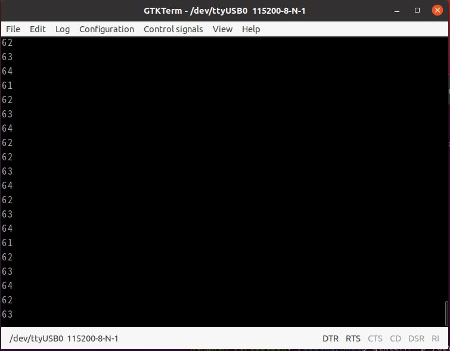

  ADC핀에 아무런 신호를 가하지 않았을때 나오는 모습이다.

  라이브러리를이용해 구현한 실행결과와 비슷한 값을 가지고 있다.

  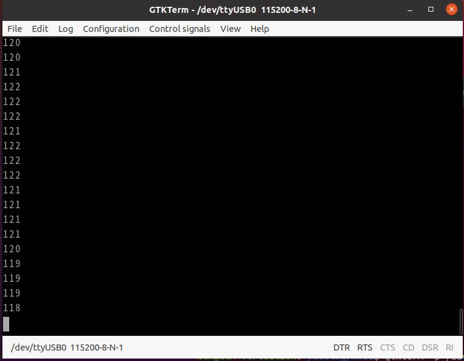

  ADC핀에 손으로 접촉하여 신호를 주었을때 나오는 값이다.

  라이브러리로 구현한 결과와 비슷한 value로 변화가 출력된다.

---


