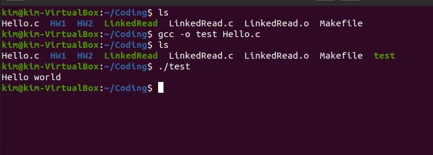
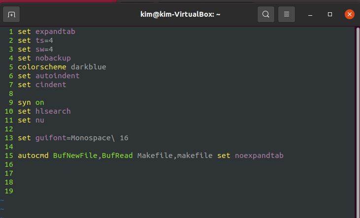
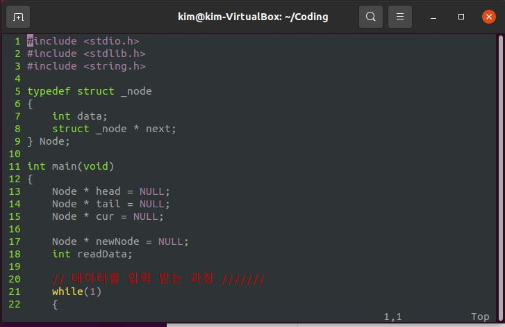
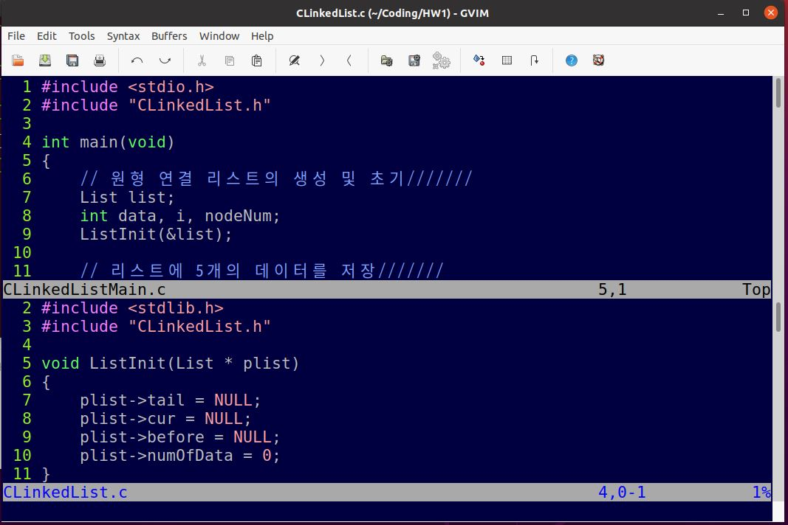
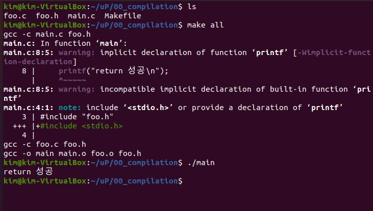
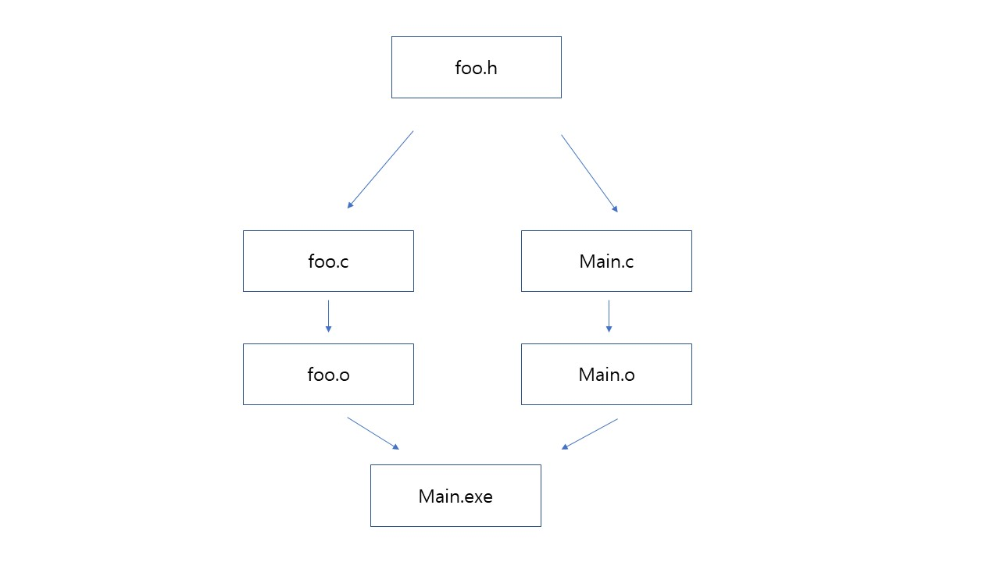

# 임베디드시스템설계실험 2주차 과제

## 1. Markdown

### 1.1 마크다운이란 ?

- 마크다운은 일반 텍스트 기반의 경량 마크업언어 이다. 

  일반 텍스트로 서식이 있는 문석를 작성하는 데 사용되며, 일반 마크업 언어에 비해 

  문법이 쉽고 간단한 것이 특징이다. 특히 HTML과 리치 텍스트(RTF) 등 서식 문서로 쉽게 

  변환 되기 때문에 응용 소프트웨어와 함께 배포되는 README 파일이나 

  온라인 게시물에 많이 사용된다. 

  확장 자는 .md 파일로 생성된다. 

### 1.2 마크다운을 쓰는 이유 ?

- 쉽기 때문이다. 
  - HTML을 모르는 사람이라더라도,  누구나 문법을 5분안에 배우고 쓸 수 있다.
- 글만 쓰면 알아서 깔금하게 예쁘게 표현가능하다.
- 확장성이 좋다.
  - 문법이 간단하고 HTML로 변환이 가능해서 마크다운을 지원하는 에디터에 복사하면 바로 수정이 가능.
- 소스 코드 입력에 좋다. 
  - 코딩하고 나서 소스를 그대로 입력 할 수 있기 때문에 복사해서 쓰기좋다.
- 프로그래머는 마크다운을 써야한다. 
  - 논문, 저널, Github 등 프로그래머라면 마크다운을 필수 이다.

### 1.3 마크다운 문법 정리

- **헤더**

  제목을 만들려면 `#` 다음에 제목을 작성 합니다. 사용하는 숫자 기호의 수는 제목 수준과 일치해야합니다 HTML의 `<h1>`부터 `<h6>`까지 제목을 표현할 수 있습니다.

  - h1: # 부(parts)에 사용됨.
  - h2: ## 장(chapters)에 사용됨.
  - h3: ###, 페이지 섹션에 사용함.
  - h4: ####, 하위 섹션에 사용됨.
  - h5: #####, 하위 섹션 아래의 하위 섹션에 사용됨.
  - h6: ######, 문단에

- **줄 바꿈**

  문장의 줄바꿈은 거의 작성된 문서에 형식을 따라 갑니다.(즉, “enter”로 줄바꿈 구분함) 적용이 안될 경우 아래를 참조 합니다.

  ```
  동해물과 백두산이 마르고 닳도록 
  하느님이 보우하사 우리나라 만세  
  
  무궁화 삼천리 화려 강산<br>
  대한 사람 대한으로 길이 보전하세
  ```

  ```
  결과
  ```

  동해물과 백두산이 마르고 닳도록 하느님이 보우하사 우리나라 만세 무궁화 삼천리 화려 강산
  대한 사람 대한으로 길이 보전하세

- **이미지** 

  ```
  이미지를 연결 하려면 다음과 같이하십시오.
  [Imgur](https://i.imgur.com/4EjEpQX.png)
  
  이미지를 임베드하려면 다음과 같이하십시오.
  
  
  내부용 이미지를 연결하려면 다음과 같이하십시오.
  Format: [Alt Text](Media/images/figure-reference.png)
  
  내부용 이미지를 임베드하려면 다음과 같이하십시오.
  Format: 
  ```

  이때 내부용 이미지를 표현할때 상대주소로 해주는것이 적절하다. 

  그래야 폴더를 열었을때 사용자가 쉽게 이미지를 할수 있다. 

  절대경로로 하였을때 C드라이브 - 사용자 이름 폴더 - 등등 으로 참조가 되었을때

  다른 사용자와 PC환경이 달라지기 때문에 절대경로 참조로 이미지 확인이 불가능해진다.

- **코드 블록**

  코드블록을 문서 중간에 넣으려면 띄어 쓰기로 코드 블록을 삽일 할 수 있다.

  또는 `을 세번 입력하여 생성 가능하다.
  
  ```
  ​``` 을 넣어서 이렇게 블록처리가 가능.
  ```
  
  
## 2. gcc 

### 2.1 gcc란?

- **GNU 컴파일러 모음**(GNU Compiler Collection, 줄여서 **GCC**)는 [GNU 프로젝트](https://ko.wikipedia.org/wiki/GNU_프로젝트)의 일환으로 개발되어 널리 쓰이고 있는 [컴파일러](https://ko.wikipedia.org/wiki/컴파일러)이다.

  GCC는 원래 C만을 지원했던 컴파일러로 이름도 GNU C 컴파일러 였다. 그러나

  나중에 C++, 자바, 포트란, 에이다 등 여러 언어를 컴파일 할 수 있게 되면서, 현재의

  이름으로 바뀌게 되었다. 

- GCC는 [리처드 스톨만](https://ko.wikipedia.org/wiki/리처드_스톨만)이 1987년 GNU 프로젝트의 컴파일러로 작성했다. 

  GNU 시스템의 공식 컴파일러이므로 GCC는 많은 컴파일러와 운영 체제를 만드는 데 사용되었다. 한편, 시스템 네이티브 컴파일러를 사용했을 때 비해서 GCC를 사용하면 같은 파서로 코드를 처리하므로 이식성을 향상시킬 수 있다. GCC는 상용 컴파일러에 비해서 느린 코드를 생성했지만 최근 많이 개선되었다.

### 2.2 gcc 설치 

- 리눅스에서의 gcc 설치 터미널 명령어

  ```
  sudo apt-get install gcc
  ```

  ```
  sudo apt-get install g++
  ```

  gcc와 g++을 같이 설치하도록 하자. 

### 2.2 gcc  컴파일 방법

- gcc 버전확인

  ``` 
  gcc -v
  ```

- gcc 로 컴파일 할 파일명

  ```
  gcc 파일명.c
  ```

  a.out이라는 실행 파일이 생성된다.

- 실행파일의 이름을 지정하여 컴파일

  ```
  gcc -o test test.c 
  ```

  test라는 이름으로 실행파일이 생성

- 실행파일 이름을 지정하지 않고 컴파일만하고 링크하지 않기

  ```
  gcc -c test.c
  ```

  test.o이라는 오브젝트 파일만 생성되었다. 이때 C파일 이름을 따라가게 된다. 

### 2.3 gcc를 이용하여 컴파일 해보기 

- Hello World 출력 프로그램 컴파일

  ```c
  #include <stdio.h>
  int main(){
      printf("Hello world\n");
  }
  ```

  ```
  gcc -o test Hello.c
  ```

  ​	

  Hello world가 정상 출력 된 모습.


## 3. vi 에디터

### 3.1 vi 란?

- vi는 유닉스 환경에서 가장 많이 쓰이는 문서 편집기이다. 

  vi라는 이름은 한 줄씩 편집하는 줄단위 편집기가 아니라 한 화면을 편집하는 비주얼 에디터 라는 뜻에서

  유래했다. 간결하면서도, 강력한 기능으로 열광적인 사용자가 많다.

- vi는 명령모드(command mode)와 편집모드(insert mode)가 있으며 일단 프로그램을 시작하면 일반적으로 명령모드로 시작하게 된다. 

  이때 i 키를 누르면 편집모드로 들어갈수 있다. 

- esc키를 눌러서 편집모드로 나시 빠져 나올 수 있다.

### 3.2 vi에디터 설치 

- vi 에디터를 리눅스 환경에서 설치해보자. 

  ```
  sudo apt-get install vi
  ```

- vim도 설치 해보자

  ```
  sudo apt-get install vim
  ```

- 그래픽을 제공하는 gvim도 설치해보자

  ```
  sudo apt-get install gvim
  ```

### 3.3 vi 명령어 

- vi에는 명령모드, 편집모드 두가지가 존재한다. 

  명령어를 잘 사용하면 빠르게 코딩이 가능하다. 

  따라서 명령어를 숙지하고 있는것이 매우 중요하다. 


- 명령모드 에서의 명령어 모음

  | **모드**       | **명령키**                                                   |                **설명**                 |
  | -------------- | ------------------------------------------------------------ | :-------------------------------------: |
  | 마지막 행 모드 | :q                                                           | vi에서 작업한것이 없을때 vi 종료합니다. |
  | :q!            | 작업한 내용을 저장하지 않고 종료합니다.                      |                                         |
  | :w[파일명]     | 작업한 내용을 저장만 한다. 파일명을 지정하면 새 파일로 저장합니다. |                                         |
  | :wq. :wq!      | 작업한 내용을 저장하고 vi를 종료합니다.                      |                                         |
  | 명령 모드      | ZZ (대문자)                                                  | 작업한 내용을 저장하고 vi를 종료합니다. |

- 입력모드로 전환하기 

  | **명령키**  | **설명**                                                |
  | ----------- | ------------------------------------------------------- |
  | i           | 현재 커서 앞에 입력합니다.                              |
  | a           | 현재 커서 뒤에 입력합니다.                              |
  | o           | 커서가 위치한 행의 다음 행에 입력합니다.                |
  | I(대문자 i) | 커서가 위치한 행의 첫 컬럼으로 이동하여 입력합니다.     |
  | A           | 커서가 위치한 행의 마지막 컬럼으로 이동하여 입력합니다. |
  | O           | 커서가 위치한 행의 이전 행에 입력합니다.                |

- 커서 이동하기

  | **명령키** | **설명**                                                 |
  | ---------- | -------------------------------------------------------- |
  | k          | 커서를 위로 이동합니다.                                  |
  | j          | 커서를 아래로 이동합니다.                                |
  | h          | 커서를 왼쪽으로 이동합니다.                              |
  | l          | 커서를 오른쪽으로 이동합니다.                            |
  | ^ / O      | 커서를 현재 행의 처음으로 이동합니다.                    |
  | $          | 커서를 현재 행의 마지막으로 이동합니다.                  |
  | -          | 커서를 한줄 위 처음으로 이동합니다.                      |
  | + / Enter  | 커서를 다음 행의 처음으로 이동합니다.                    |
  | H          | 커서를 화면의 맨 윗행으로 이동합니다.                    |
  | M          | 커서를 화면의 중간 행으로 이동합니다.                    |
  | L          | 커서를 화면의 맨 아랫행으로 이동합니다.                  |
  | w          | 커서를 다음 단어의 첫 글자로 이동합니다.                 |
  | b          | 커서를 앞 단어의 첫 글자로 이동합니다.                   |
  | e          | 커서를 다음 단어의 마지막 글자로 이동합니다.             |
  | G          | 파일의 마지막 행으로 커서를 이동합니다.                  |
  | 행번호G    | 지정한 행 번호로 커서를 이동합니다.                      |
  | :행번호    | 지정한 행 번호로 커서를 이동합니다. (마지막 행 모드)     |
  | :$         | 파일의 마지막 행으로 커서를 이동합니다. (마지막 행 모드) |

- 화면 이동하기

  | **명령 키**          | **설명**                            |
  | -------------------- | ----------------------------------- |
  | Ctrl + u             | 화면의 절반 만큼 위로 이동합니다.   |
  | Ctrl +ㅇ             | 화면의 절반 만큼 아래로 이동합니다. |
  | Ctrl + b / Page Up   | 한화면 위로 이동합니다.             |
  | Ctrl + f / Page Down | 한화면 아래로 이동합니다.           |
  | Ctrl + y             | 화면을 한 행 위로 이동합니다.       |
  | Ctrl + e             | 화면을 한 행 아래로 이동합니다.     |

- 내용 수정하기 

  | **명령 키**            | **설명**                                                     |
  | ---------------------- | ------------------------------------------------------------ |
  | r                      | 커서가 위치한 글자를 다른 글자로 수정합니다.                 |
  | cw, [수정할 단어 수]cw | 커서위치에서부터 현재 단어의 끝까지 수정합니다. 숫자cw는 커서 위치로부터 지정한 숫자의 단어 만큼 수정합니다. |
  | s, [수정할 글자 수]s   | 커서 위치로부터 ESC키를 입력할때까지 수정합니다. 숫자s는 커서 위치로부터 지정한 숫자만의 글자를 수정합니다. |
  | cc                     | 커서가 위치한 행의 내용을 모두 수정합니다.                   |
  | C                      | 커서 위치로부터 행의 끝까지 수정합니다.                      |

- 내용 삭제하기

  | **명령 키**            | **설명**                                                     |
  | ---------------------- | ------------------------------------------------------------ |
  | x, [삭제할 글자 수]x   | 커서가 위치한 글자를 삭제합니다. x앞에 삭제할 글자수를 지정할수도 있습니다. |
  | dw, [삭제할 단어 수]dw | 커서가 위치한 단어를 삭제합니다. dw앞에 삭제할 단어수를 지정할수도 있습니다. |
  | dd, [삭제할 행 수]dd   | 커서가 위치한 행을 삭제합니다. dd앞에 삭제할 행의수를 지정할수도 있습니다. |
  | D                      | 커서 위치로부터 행의 끝까지 삭제합니다.                      |

- 명령 취소하기

  | 명령 키 | 설명                                                |
  | ------- | --------------------------------------------------- |
  | u       | 명령을 취소합니다.                                  |
  | U       | 해당 행에서 한 모든 명령을 취소합니다.              |
  | :e!     | 마지막으로 저장한 내용 이후의 것을 모두 취소합니다. |

- 범위 지정하기

  | **명령 키** | **설명**                                     |
  | ----------- | -------------------------------------------- |
  | 1, $, %     | 1행부터 마지막 행까지 범위를 지정합니다.     |
  | 1,.         | 1행부터 커서가 있는 행까지 지정합니다.       |
  | .,$         | 커서가 있는 행부터 마지막 행까지 지정합니다. |
  | .,.+2       | 현재 행과 두번째 아랫행까지 지정합니다.      |
  | 10,20       | 10행부터 20행까지 지정합니다.                |

- 내용 복사하기/ 잘라내기 / 붙이기

  | **명령 키**              | **설명**                                                     |
  | ------------------------ | ------------------------------------------------------------ |
  | yy, [복사할 행 수]yy     | 커서가 위치한 행을 복사합니다. yy앞에 복사할 행의 수를 지정할 수도 있습니다. |
  | dd, [잘라내기할 행 수]dd | 커서가 위치한 행을 잘라내기합니다. 삭제와 같은 명령어입니다. dd앞에 잘라내기할 행 숫자를 입력할 수도 있습니다. |
  | p                        | 커서가 위치한 행의 아래쪽에 붙여넣기를 합니다.               |
  | P                        | 커서가 위치한 행의 위쪽에 붙여넣기를 합니다.                 |

- 내용 검색하기

  | **명령 키** | **설명**                                |
  | ----------- | --------------------------------------- |
  | /문자열     | 문자열을 커서 아래 방향으로 검색합니다. |
  | ?문자열     | 문자열을 커서 위 방향으로 검색합니다.   |
  | n           | 원래 방향으로 다음 문자열을 검색합니다. |
  | N           | 반대 방향으로 다음 문자열을 검색합니다. |

- 내용 치환하기

  | **명령 키**                         | **설명**                                                     |
  | ----------------------------------- | ------------------------------------------------------------ |
  | :s/[대상문자열]/[바꿀문자열]        | 커서가 위치한 행에서 첫번째로 나오는 대상문자열을 바꿀문자열로 바꿉니다. |
  | :%s[대상문자열]/[바꿀문자열]        | 파일 전체에서 모든 대상문자열을 바꿀문자열로 바꿉니다.       |
  | :[범위]s[대상문자열]/[바꿀문자열]   | 범위 내 모든 각 행에서 첫번쨰로 나오는 대상문자열을 바꿀문자열로 바꿉니다. |
  | :[범위]s[대상문자열]/[바꿀문자열]g  | 범위 내 모든 행에서 대상문자열을 바꿀문자열로 바꿉니다.      |
  | :[범위]s[대상문자열]/[바꿀문자열]gc | 범위 내 모든 행에서 대상문자열을 바꿀문자열로 바꾸되 수정할 지 여부를 묻습니다. |


### 3.4 vi 환경설정

- vi 에디터에서 들여쓰기, 폰트 등 개발환경 설정을 해보자 
- 홈 디렉토리에서 .vimrc 파일을 생성해야한다. 
- 에디터가 실행할때 이 파일을 실행하고나서 에디터가 실행된다. 


- 화면 설정

  ```
  syntax on " 형식별 구문 강조 표시
  colorschme [scheme명] " 테마 적용.
  set number " 라인 넘버 표시. (= nu)
  set showcmd " 사용자가 입력한 명령어 표시
  set showmatch " 현재 선택된 괄호의 쌍을 표시
  set relativenumber " 커서를 기준으로 라인 넘버 표시. 커서 위치에 따라 바뀜. (= rnu)
  set cursorline " 커서가 있는 라인을 강조 표시. (= cul)
  set ruler " 커서 위치 표시. (= ru)
  set laststatus=2 " 상태바 표시. (= ls) [0: 상태바 미표시 / 1: 2개 이상의 윈도우에서 표시 / 2: 항상 표시]
  " 상태바 커스터마이징 %<item>으로 사용하며, \는 구분자로 공백을 넣을 경우는 구분자를 넣어줘야함.
  set statusline=%F\ %y%m%r\ %=Line:\ %l/%L\ [%p%%]\ Col:%c\ Buf:%n
  hi statusline ctermfg=White ctermbg=4 cterm=none "활성화된 상태바 배경색 및 폰트색 설정
  hi statuslineNC ctermfg=White ctermbg=8 cterm=none " 윈도우가 2개 이상인 경우 비활성화된 윈도우의 배경색 및 폰트색 설정
  set mouse=a " 마우스로 스크롤 및 리사이즈 가능. [n : Normal mode / v : Visual mode / i : Insert mode / a : All modes]
  ```

- 검색 설정

  ```
  set hlsearch " 검색된 결과 강조 표시. (= hls)
  set ignorecase " 검색시 대소문자를 구분하지 않음. (= ic)
  set incsearch " 검색어를 입력할 때마다 일치하는 문자열을 강조해서 표시. (= is)
  set smartcase " ignore 옵션이 켜져있더라도 검색어에 대문자가 있다면 정확히 일치하는 문자열을 찾음. (= scs)
  ```

- 들여쓰기 설정

  ```
  set autoindent " 새로운 라인이 추가될 때, 이전 라인의 들여쓰기에 자동으로 맞춤. (= ai)
  set expandtab  " Tab을 Space로 변경. (= et)
  set tabstop=4 " 탭으로 들여쓰기시 사용할 스페이스바 개수. (= ts)
  set shiftwidth=4 " <<, >> 으로 들여쓰기시 사용할 스페이스바 개수. (= sw)
  set softtabstop=4 " 스페이스바 n개를 하나의 탭으로 처리. (= sts)
  " ex) 스페이스바 4개가 연속으로 있다면 백스페이스로 스페이스바를 지우면 스페이스바 4개를 하나의 탭으로 인식해 삭제.
  filetype indent on " indent.vim 파일에 설정된 파일 형식별 들여쓰기 적용.
  ```

- 입력 설정

  ```
  set clipboard=unnamed " vim에서 복사한 내용이 클립보드에 저장
  set backspace=eol,start,indent " 라인의 시작과 끝의 들여쓰기를 백스페이스로 지움.
  set history=1000 " 편집한 내용 저장 개수 (되돌리기 제한 설정)
  set paste " 다른 곳에서 복사한 내용을 붙여넣을 때, 자동 들여쓰기가 적용되는 것을 막아 복사한 내용을 들여쓰기없이 복사.
  set pastetoggle=<F2> " paste 옵션이 적용되면 들여쓰기가 옵션이 제대로 작동하지 않기 때문에 toggle식으로 옵션을 키고 끌 수 있음.
  ```

### 3.5 vi 에디터 환결설정 적용

- vi 에디터 환경설정 명령어가 많은데 실제로 적용해보자.

  ​	

  ​	

- 실제 에디터 환경 설정을 적용되어 예쁘게 텍스트가 보이는 모습을 볼 수있다. 

### 3.6 gvim을 이용하여 이중창 설정

- 코딩을 하다보면 창을 여러개 띄우고 편집해야 할 일이 생긴다.

  이때 gvim을 이용하여 이중 창 설정하면 된다.

  ​	


- 이중창 명령어

  ```
  :sp 띄울파일명
  ```

  

- 명령창 이동

  ```
  Ctrl + ww 
  ```

  해당 명령어로 다른창으로 이동이 가능하다. 

## 4. Makefile

### 4.1 Makefile 이란?

- Makefile은 파일 관리 유틸리티이다. 

- 우리는 앞서 gcc를 이용하요 소스파일을 컴파일 해보았다.

  그러면 항상 gcc를 입력해서 컴파일 해야되나?

- Makefile은 일련의 gcc명령어를 집합시켜서 make 커맨드 한번에 컴파일 할 수있도록

  해주는 강력한 유틸리티이다. 

### 4.2 Make를 쓰는 이유

- 각 파일에 대한 반복적 명령의 자동화로 인한 시간 절약
- 프로그램의 종속 구조를 빠르게 파악 할 수 있으며 관리가 용이
- 단순 반복 작업 및 재작성을 최소화


### 4.3  Makefile 만들기

- 수업시간에 만든 Makefile 파일 예시 이다.

  ```
  help:
  	echo "make all"
  	echo "make clean"
  	
  all:
  	gcc -c main.c foo.h
  	gcc -c foo.c foo.h
  	
  	gcc -o main main.o foo.o foo.h
  	
  clean:
  	rm *.o
  	rm main
  ```

- make help 

  터미널에서 make help를 입력하면 all 과 clean이 정의되어 있다고 

  알려준다.

- make all

  터미널에서 make all을 입력하면 all(타겟)에 레이블이 되어 있으므로

  gcc -c main.c 부터 차례대로 명령을 실행한다. 

- make clean

  터미널에서 make clean을 입력하면 clean(타겟)에 레이블이 되어 있으므로

  rm *.o 

  rm main 

  등 미리 정의된 삭제 리눅스 명령어 실행된다. 

- 중요한점은 레이블을 생성하고 Tab이 꼭 들어가야 된다. !!!!
- Makefile은 꼭 C, 헤더 등 같은 디렉토리에서 M은 대문자로 만들어야한다!

### 4.4 Makefile로 컴파일 해보기

### 		


- 간단한 파일로 헤더파일과 C파일로 실행파일을 만들어 보았다. 

  실행사진 파일을 보면 make all 커맨드로 gcc 명령어가 실행된 모습을 보일 수 있다.


##  5. Header

### 5.1 헤더 파일이란?

- 컴퓨터 프로그래밍에서, 특히 C와 C++ 프로그래밍 언어에서, 헤더 파일(header file) 또는 인클루드 파일

  (include file)은 컴파일러에 의해 다른 소스 파일에 자동으로 포함된 소스 코드의 파일이다.

  일반적으로 헤더 파일들은 다른 소스 파일 속의 첫 부분에 포함된다.

- 우리가 자주쓰는 stdio.h 과 stdlib.h 등등 컴파일러에 포함된 소스 파일이다. 

- 프로그래밍 시작시 맨 처음에 선언하는 이유가 여기 소스파일부터 읽어서

  프로그램을 시작하라는 의미이다. 

### 5.2  헤더파일 작성 Tip

- 수업시간에 작성한 파일에는 #ifndef _name 이라고 정의된 부분이 없다. 

- 이말인 즉슨, 헤더파일이 프로그램에서 딱 한번만 필요하기때문에 사용한다. 

  ```c
  #ifndef _FOO_H
  #define _FOO_H
  ~~~
  #endif
  ```

  으로 헤더파일을 작성하는게 좋다. 

### 5.3 헤더파일을 사용하는 이유는?

- 일일이 프로그래밍 하는 프로그래머는 좋은 성과를 낼 수 없다.
- 아무리 머리가 좋아도, 더 머리가 뛰어난 사람이 제공하는 라이브러리가 있다.
- 굳이 일일이 코딩 할 필요 없이 라이브러리(헤더) 파일을 적극 사용하여 프로그램을 만들자.
- C언어 및 여러 컴파일러에서 제공해주는 헤더파일은 수백가지가 넘는다. 
- 이미 기능은 만들어져 있고 우리는 잘 사용하기만 하면된다.
- 또한 사용자 정의 헤더파일을 만들때, 프로그래밍을 좀 더 간편화 하기위하여 사용한다 !!!

## 6. C 코드 정리 

### 6.1 수업 중 만든 프로그램 

- 수업중 만든 프로그램을 정리해보자

  

- 우리가 만든 프로그램의 조직을 나타내는 그림이다. 
- foo.h가 먼저 선언되어 있고 foo.c 와 main.c 각각 참조한다.
- 오브젝트 파일이 생성되며, 실행파일을 만들수 있다.


### 6.2 코드 분석

- foo.h 파일 

  ```c
  int foo(int i);
  ```

  foo 라는 함수만 정의 되어 있다.

- foo.c 파일

  ```c
  #include "foo.h"
  
  int foo (int i){
  return i+1;
  }
  ```

  foo 헤더를 참고하고 foo 함수에 대한 것이 정의 되어 있다. 호출된 값의 +1을 하여 반환한다.

- main.c 파일

  ```c
  #include "foo.h"
  int main(){
  	int a = foo(10);
  	if(a==11){
  		printf("return 성공\n");
  	}
  	else{ }
  	
  	return 0;
  }
  ```

  foo 함수를 호출하여 호출한 값의 +1이 들어오면 return 성공을 출력한다. 


### 6.3 어떤 코드가 좋은 코드인가?

- 프로그램 작성시 좋은 코드를 만드려면 어떻게 하면 될까?
  - 프로그램을 단순화 하자.
  - 헤더파일을 만들자
  - 프로토타입을 정의하고 파일을 세분화하자 
  - 누구나 알수 있게 코드를 짜자 
  - 주석을 열심히 달자
  - Easy is Simple !!
- 나만의 라이브러리를 만들어서 적극 활용하자 !!!! 
- 고수의 라이브러리 불러오는 습관도 활요하자 !!!!