# Embedded System Design Week 3 Assignmnet 

## 1. Compile & Linking

### 1.1 Compile 이란? 

- 컴파일은 특정 프로그래밍 언어(C 등등)를 다른 언어로 옮기는 번역 프로그램이다. 
- C언어로 된 프로그램을 원시언어(기계어)로 변환 시켜주는 것이다. 
- 인터프리터와 다른점은 인터프리터는 한줄 한줄 읽는것이다. 
- Compile을 해주는 프로그램을 우리는 흔히 Compiler 라고 한다. 


### 1.2 Linking 이란?

- Linking(링킹)은 **여러 개의 코드와 데이터를 모아서 연결**하여 메모리에 로드될 수 있고 실행될 수 있는 한 개의 파일로 만드는 작업이다. 이 파일이 메모리에 로딩되어 실행된다. 링크는 컴파일시에 수행되는 경우도 있고, 로딩시에 수행되는 경우도 있고, 실행시에 수행되는 경우도 있다.

- Linker(링커)란 링킹을 담당하는 프로그램이다. 

- 링커는 소프트웨어 개발에서 **독립적인 컴파일을 가능하게** 하는 아주 중요한 역할을 담당한다. 

- 링커 덕분에 큰 규모의 응용프로그램을 한 개의 소스 파일로 구성하는 대신 별도로 수정할 수 있고, 컴파일할 수 있는 보다 관리할 만한 규모의 더 작은 모듈들로 나눌 수 있다.

- 즉, 아주 거대한 프로그램을 하나의 소스 파일이 아니라 수많은 소스 파일로 모듈화하여 개발을 진행할 수 있는 것이다. 링커 덕분에 우리는 **모듈 중에 한 개를 변경할 때, 다른 파일들을 재컴파일할 필요 없이 \**이 파일만을 간단히 재컴파일하고\**** 이를 다시 링크하여 변경사항을 적용할 수 있다.

  

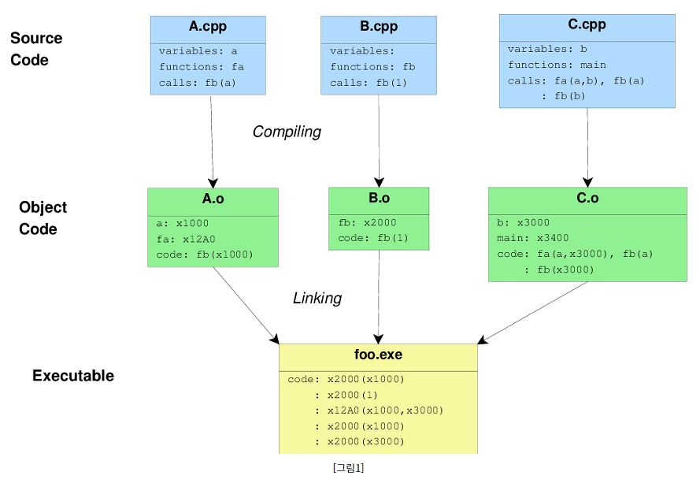

위 그림을 보자

- C파일을 목적 파일로 바꿔주는것이 컴파일 과정
- 목적파일을 실행파일로 바꿔주는것이 링킹이다.


## 2. Compile & Linking 실습

### 2.1 File Structure

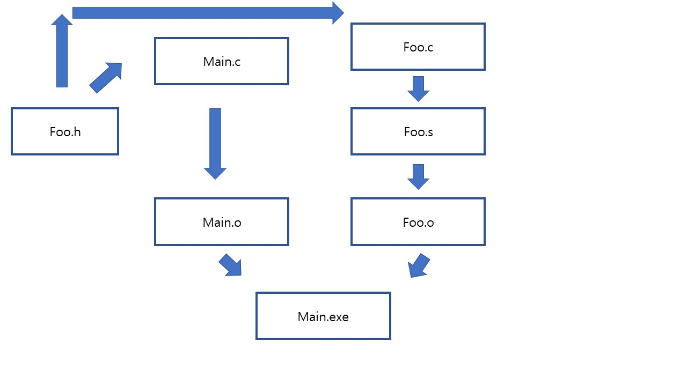

위 사진이 우리가 정의할 파일들의 구조이다. 

- Main.exe는 main.o랑 foo.o 두개의 오브젝트 파일로 구성된다.
- main.o는 main.c로부터 얻어진다. (컴파일)
- foo.o는 foo.s로 부터 얻어진다.(링킹)
- foo.s는 foo.c로 부터 얻어진다.(GNU Assembler)
- main.c와 foo.c는 foo.h를 참조한다.


### 2.2  Code 

- Makefile

  ```makefile
  foo.o : foo.c
  	gcc -S foo.c -o foo.s
  	as -o foo.o foo.s
  
  main.o: main.c
  	gcc -c main.c
  
  all: foo.o main.o
  	gcc -o main main.o foo.o
  	./main 
  
  dis:
  	objdump -d -S main > main_dis.s
  ```


- foo.c

  ```c
  int foo(int x){
  
  
      int s = x;
  
      int y = x + 2;
  
      return y;
  
  }
  ```

  

- main.c

  ```c
  #include "foo.h"
  #include <stdio.h>
  
  int main(){
      int y = foo(3);
      printf(" y is %d\n", y);
  
  
  }
  ```

  

- foo.h

  ```c
  int foo(int x);
  ```


### 2.3 실행결과


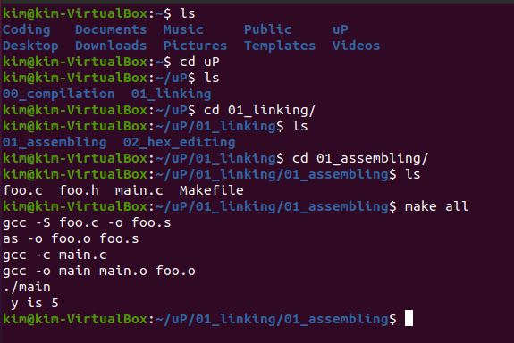

3을 foo 함수에 인자로 줘서 2를 증가시킨 값을 받아 정상출력됨을 보인다.


### 2.4 Make과정


- foo.c를 foo.s로 만들기

  ```makefile
  gcc -S foo.c -o foo.s
  ```

  foo.c파일을 어셈블리 파일로 만드는데 이름은 foo.s로 지정해준 명령어이다. 

- foo.s를 foo.o로 만들기 

  ```makefile
  as -o foo.o foo.s
  ```

  foo.s파일을 foo.o 파일로 링킹 해주는 과정이다.

- main.c를 main.o로 만들기

  ```makefile
  gcc -c main.c
  ```

  별다른 이름 지정없이 바로 오브젝트 파일로 만든 명령어이다.

- main.o와 foo.o를 결합하여 main.exe 실행파일 만들기 

  ```makefile
  gcc -o main main.o foo.o
  ```

  main.o와 foo.o의 오브젝트파일을 합쳐서 exe파일을 만드는 명령어 이다.


총 4번의 Make명령어를 수행하여 실행파일을 만들었다. 


- Make명령어에 보면 dis라고 정의해준것을 보자

  ```
  objdump -d -S main > main_dis.s
  ```

  objdump를 이용하여 main.exe를 main_dis.s라는 어셈블리 파일로 만들었는데 

  objdump는 GNU 바이너리 유틸리티의 일부로서, 라이브러리, 컴파일된 오브젝트 모듈, 공유 오브젝트 파일, 독립 실행파일등의 바이너리 파일들의 정보를 보여주는 프로그램이다.


## 3. Hex Disassembling & Editing

### 3.1 File Structure

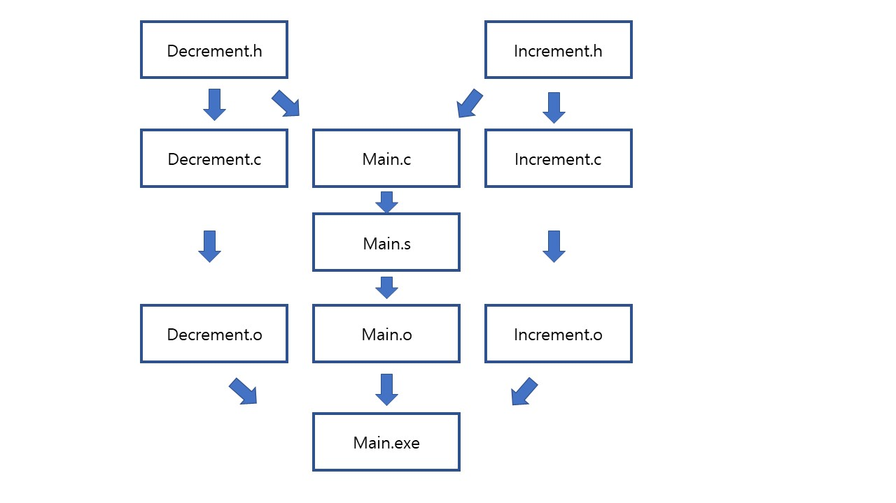


- 우리가 실습할 파일의 구조 모형이다.
- main 실행파일을 얻고 Hex Editing 하여 다른 홈수를 호출시켜보자.
- 여기서 절대 컴파일을 다시해서 실행파일을 다시만들지 말자. 그러면 기존에 만든 바이너리값이 깨진다.
- 단지 메인파일에서 바이너리값만 바꾸어서 프로그램을 수정시키는것이다. 


### 3.2 Code

- Makefile

  ```makefile
  incerement.o: increment.c
  	gcc -c increment.c
  
  
  decrement.o: decrement.c
  	gcc -c decrement.c
  
  main.s: main.c
  	gcc -S main.c -o main.s
  
  main.o: main.s
  	as -o main.o main.s
  
  all: increment.o decrement.o main.o
  	gcc -o main main.o increment.o decrement.o
  	./main 
  
  dis:
  	objdump -d -S main > main_dis.s
  ```

- decrement.h

  ```c
  int decrement(int i);
  ```

- decrement.c

  ```c
  
  int decrement(int i){
  
      return i-1;
      
  }
  ```

- increment.h

  ```c
  int increment(int i);
  ```

- increment.c

  ```c
  int increment(int i){
  
      return i+1;
  
  }
  ```

- main.c

  ```c
  #include "increment.h"
  #include "decrement.h"
  #include <stdio.h>
  
  int main(){
      int y = increment(10);
      printf(" y is %d\n", y);
  
  
  
  }
  ```

- main.s

  ```assembly
  	.file	"main.c"
  	.text
  	.section	.rodata
  .LC0:
  	.string	" y is %d\n"
  	.text
  	.globl	main
  	.type	main, @function
  main:
  .LFB0:
  	.cfi_startproc
  	endbr64
  	pushq	%rbp
  	.cfi_def_cfa_offset 16
  	.cfi_offset 6, -16
  	movq	%rsp, %rbp
  	.cfi_def_cfa_register 6
  	subq	$16, %rsp
  	movl	$10, %edi
  	call	increment@PLT
  	movl	%eax, -4(%rbp)
  	movl	-4(%rbp), %eax
  	movl	%eax, %esi
  	leaq	.LC0(%rip), %rdi
  	movl	$0, %eax
  	call	printf@PLT
  	movl	$0, %eax
  	leave
  	.cfi_def_cfa 7, 8
  	ret
  	.cfi_endproc
  .LFE0:
  	.size	main, .-main
  	.ident	"GCC: (Ubuntu 9.3.0-17ubuntu1~20.04) 9.3.0"
  	.section	.note.GNU-stack,"",@progbits
  	.section	.note.gnu.property,"a"
  	.align 8
  	.long	 1f - 0f
  	.long	 4f - 1f
  	.long	 5
  0:
  	.string	 "GNU"
  1:
  	.align 8
  	.long	 0xc0000002
  	.long	 3f - 2f
  2:
  	.long	 0x3
  3:
  	.align 8
  4:
  
  ```

  call	increment@PLT에서 함수호출 하는 부분이 보이는데 저 부분을 Hex값을 찾아내서 바꾸면된다.


### 3.3 실행결과

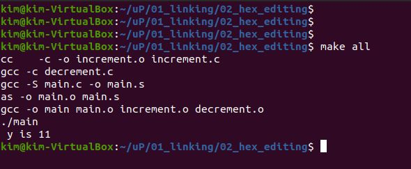

Increment함수에 10을 전달하여 정상적으로 11을 리턴받아 출력됨을 보인다. 

링킹&컴파일이 정상적으로 작동되었는데 여기서 어떻게 실행파일을 건드려서 다른 함수(decrement)를 호출할수 있을까 ?


### 3.4 Hex Editing

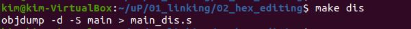

objdump 명령어를 이용하여 main실행파일의 어셈블리 변환 코드를 읽어보자. 

- main_dis.s

  ```assembly
  
  main:     file format elf64-x86-64
  
  
  Disassembly of section .init:
  
  0000000000001000 <_init>:
      1000:	f3 0f 1e fa          	endbr64 
      1004:	48 83 ec 08          	sub    $0x8,%rsp
      1008:	48 8b 05 d9 2f 00 00 	mov    0x2fd9(%rip),%rax        # 3fe8 <__gmon_start__>
      100f:	48 85 c0             	test   %rax,%rax
      1012:	74 02                	je     1016 <_init+0x16>
      1014:	ff d0                	callq  *%rax
      1016:	48 83 c4 08          	add    $0x8,%rsp
      101a:	c3                   	retq   
  
  Disassembly of section .plt:
  
  0000000000001020 <.plt>:
      1020:	ff 35 9a 2f 00 00    	pushq  0x2f9a(%rip)        # 3fc0 <_GLOBAL_OFFSET_TABLE_+0x8>
      1026:	f2 ff 25 9b 2f 00 00 	bnd jmpq *0x2f9b(%rip)        # 3fc8 <_GLOBAL_OFFSET_TABLE_+0x10>
      102d:	0f 1f 00             	nopl   (%rax)
      1030:	f3 0f 1e fa          	endbr64 
      1034:	68 00 00 00 00       	pushq  $0x0
      1039:	f2 e9 e1 ff ff ff    	bnd jmpq 1020 <.plt>
      103f:	90                   	nop
  
  Disassembly of section .plt.got:
  
  0000000000001040 <__cxa_finalize@plt>:
      1040:	f3 0f 1e fa          	endbr64 
      1044:	f2 ff 25 ad 2f 00 00 	bnd jmpq *0x2fad(%rip)        # 3ff8 <__cxa_finalize@GLIBC_2.2.5>
      104b:	0f 1f 44 00 00       	nopl   0x0(%rax,%rax,1)
  
  Disassembly of section .plt.sec:
  
  0000000000001050 <printf@plt>:
      1050:	f3 0f 1e fa          	endbr64 
      1054:	f2 ff 25 75 2f 00 00 	bnd jmpq *0x2f75(%rip)        # 3fd0 <printf@GLIBC_2.2.5>
      105b:	0f 1f 44 00 00       	nopl   0x0(%rax,%rax,1)
  
  Disassembly of section .text:
  
  0000000000001060 <_start>:
      1060:	f3 0f 1e fa          	endbr64 
      1064:	31 ed                	xor    %ebp,%ebp
      1066:	49 89 d1             	mov    %rdx,%r9
      1069:	5e                   	pop    %rsi
      106a:	48 89 e2             	mov    %rsp,%rdx
      106d:	48 83 e4 f0          	and    $0xfffffffffffffff0,%rsp
      1071:	50                   	push   %rax
      1072:	54                   	push   %rsp
      1073:	4c 8d 05 a6 01 00 00 	lea    0x1a6(%rip),%r8        # 1220 <__libc_csu_fini>
      107a:	48 8d 0d 2f 01 00 00 	lea    0x12f(%rip),%rcx        # 11b0 <__libc_csu_init>
      1081:	48 8d 3d c1 00 00 00 	lea    0xc1(%rip),%rdi        # 1149 <main>
      1088:	ff 15 52 2f 00 00    	callq  *0x2f52(%rip)        # 3fe0 <__libc_start_main@GLIBC_2.2.5>
      108e:	f4                   	hlt    
      108f:	90                   	nop
  
  0000000000001090 <deregister_tm_clones>:
      1090:	48 8d 3d 79 2f 00 00 	lea    0x2f79(%rip),%rdi        # 4010 <__TMC_END__>
      1097:	48 8d 05 72 2f 00 00 	lea    0x2f72(%rip),%rax        # 4010 <__TMC_END__>
      109e:	48 39 f8             	cmp    %rdi,%rax
      10a1:	74 15                	je     10b8 <deregister_tm_clones+0x28>
      10a3:	48 8b 05 2e 2f 00 00 	mov    0x2f2e(%rip),%rax        # 3fd8 <_ITM_deregisterTMCloneTable>
      10aa:	48 85 c0             	test   %rax,%rax
      10ad:	74 09                	je     10b8 <deregister_tm_clones+0x28>
      10af:	ff e0                	jmpq   *%rax
      10b1:	0f 1f 80 00 00 00 00 	nopl   0x0(%rax)
      10b8:	c3                   	retq   
      10b9:	0f 1f 80 00 00 00 00 	nopl   0x0(%rax)
  
  00000000000010c0 <register_tm_clones>:
      10c0:	48 8d 3d 49 2f 00 00 	lea    0x2f49(%rip),%rdi        # 4010 <__TMC_END__>
      10c7:	48 8d 35 42 2f 00 00 	lea    0x2f42(%rip),%rsi        # 4010 <__TMC_END__>
      10ce:	48 29 fe             	sub    %rdi,%rsi
      10d1:	48 89 f0             	mov    %rsi,%rax
      10d4:	48 c1 ee 3f          	shr    $0x3f,%rsi
      10d8:	48 c1 f8 03          	sar    $0x3,%rax
      10dc:	48 01 c6             	add    %rax,%rsi
      10df:	48 d1 fe             	sar    %rsi
      10e2:	74 14                	je     10f8 <register_tm_clones+0x38>
      10e4:	48 8b 05 05 2f 00 00 	mov    0x2f05(%rip),%rax        # 3ff0 <_ITM_registerTMCloneTable>
      10eb:	48 85 c0             	test   %rax,%rax
      10ee:	74 08                	je     10f8 <register_tm_clones+0x38>
      10f0:	ff e0                	jmpq   *%rax
      10f2:	66 0f 1f 44 00 00    	nopw   0x0(%rax,%rax,1)
      10f8:	c3                   	retq   
      10f9:	0f 1f 80 00 00 00 00 	nopl   0x0(%rax)
  
  0000000000001100 <__do_global_dtors_aux>:
      1100:	f3 0f 1e fa          	endbr64 
      1104:	80 3d 05 2f 00 00 00 	cmpb   $0x0,0x2f05(%rip)        # 4010 <__TMC_END__>
      110b:	75 2b                	jne    1138 <__do_global_dtors_aux+0x38>
      110d:	55                   	push   %rbp
      110e:	48 83 3d e2 2e 00 00 	cmpq   $0x0,0x2ee2(%rip)        # 3ff8 <__cxa_finalize@GLIBC_2.2.5>
      1115:	00 
      1116:	48 89 e5             	mov    %rsp,%rbp
      1119:	74 0c                	je     1127 <__do_global_dtors_aux+0x27>
      111b:	48 8b 3d e6 2e 00 00 	mov    0x2ee6(%rip),%rdi        # 4008 <__dso_handle>
      1122:	e8 19 ff ff ff       	callq  1040 <__cxa_finalize@plt>
      1127:	e8 64 ff ff ff       	callq  1090 <deregister_tm_clones>
      112c:	c6 05 dd 2e 00 00 01 	movb   $0x1,0x2edd(%rip)        # 4010 <__TMC_END__>
      1133:	5d                   	pop    %rbp
      1134:	c3                   	retq   
      1135:	0f 1f 00             	nopl   (%rax)
      1138:	c3                   	retq   
      1139:	0f 1f 80 00 00 00 00 	nopl   0x0(%rax)
  
  0000000000001140 <frame_dummy>:
      1140:	f3 0f 1e fa          	endbr64 
      1144:	e9 77 ff ff ff       	jmpq   10c0 <register_tm_clones>
  
  0000000000001149 <main>:
      1149:	f3 0f 1e fa          	endbr64 
      114d:	55                   	push   %rbp
      114e:	48 89 e5             	mov    %rsp,%rbp
      1151:	48 83 ec 10          	sub    $0x10,%rsp
      1155:	bf 0a 00 00 00       	mov    $0xa,%edi
      115a:	e8 20 00 00 00       	callq  117f <increment>
      115f:	89 45 fc             	mov    %eax,-0x4(%rbp)
      1162:	8b 45 fc             	mov    -0x4(%rbp),%eax
      1165:	89 c6                	mov    %eax,%esi
      1167:	48 8d 3d 96 0e 00 00 	lea    0xe96(%rip),%rdi        # 2004 <_IO_stdin_used+0x4>
      116e:	b8 00 00 00 00       	mov    $0x0,%eax
      1173:	e8 d8 fe ff ff       	callq  1050 <printf@plt>
      1178:	b8 00 00 00 00       	mov    $0x0,%eax
      117d:	c9                   	leaveq 
      117e:	c3                   	retq   
  
  000000000000117f <increment>:
      117f:	f3 0f 1e fa          	endbr64 
      1183:	55                   	push   %rbp
      1184:	48 89 e5             	mov    %rsp,%rbp
      1187:	89 7d fc             	mov    %edi,-0x4(%rbp)
      118a:	8b 45 fc             	mov    -0x4(%rbp),%eax
      118d:	83 c0 01             	add    $0x1,%eax
      1190:	5d                   	pop    %rbp
      1191:	c3                   	retq   
  
  0000000000001192 <decrement>:
      1192:	f3 0f 1e fa          	endbr64 
      1196:	55                   	push   %rbp
      1197:	48 89 e5             	mov    %rsp,%rbp
      119a:	89 7d fc             	mov    %edi,-0x4(%rbp)
      119d:	8b 45 fc             	mov    -0x4(%rbp),%eax
      11a0:	83 e8 01             	sub    $0x1,%eax
      11a3:	5d                   	pop    %rbp
      11a4:	c3                   	retq   
      11a5:	66 2e 0f 1f 84 00 00 	nopw   %cs:0x0(%rax,%rax,1)
      11ac:	00 00 00 
      11af:	90                   	nop
  
  00000000000011b0 <__libc_csu_init>:
      11b0:	f3 0f 1e fa          	endbr64 
      11b4:	41 57                	push   %r15
      11b6:	4c 8d 3d fb 2b 00 00 	lea    0x2bfb(%rip),%r15        # 3db8 <__frame_dummy_init_array_entry>
      11bd:	41 56                	push   %r14
      11bf:	49 89 d6             	mov    %rdx,%r14
      11c2:	41 55                	push   %r13
      11c4:	49 89 f5             	mov    %rsi,%r13
      11c7:	41 54                	push   %r12
      11c9:	41 89 fc             	mov    %edi,%r12d
      11cc:	55                   	push   %rbp
      11cd:	48 8d 2d ec 2b 00 00 	lea    0x2bec(%rip),%rbp        # 3dc0 <__do_global_dtors_aux_fini_array_entry>
      11d4:	53                   	push   %rbx
      11d5:	4c 29 fd             	sub    %r15,%rbp
      11d8:	48 83 ec 08          	sub    $0x8,%rsp
      11dc:	e8 1f fe ff ff       	callq  1000 <_init>
      11e1:	48 c1 fd 03          	sar    $0x3,%rbp
      11e5:	74 1f                	je     1206 <__libc_csu_init+0x56>
      11e7:	31 db                	xor    %ebx,%ebx
      11e9:	0f 1f 80 00 00 00 00 	nopl   0x0(%rax)
      11f0:	4c 89 f2             	mov    %r14,%rdx
      11f3:	4c 89 ee             	mov    %r13,%rsi
      11f6:	44 89 e7             	mov    %r12d,%edi
      11f9:	41 ff 14 df          	callq  *(%r15,%rbx,8)
      11fd:	48 83 c3 01          	add    $0x1,%rbx
      1201:	48 39 dd             	cmp    %rbx,%rbp
      1204:	75 ea                	jne    11f0 <__libc_csu_init+0x40>
      1206:	48 83 c4 08          	add    $0x8,%rsp
      120a:	5b                   	pop    %rbx
      120b:	5d                   	pop    %rbp
      120c:	41 5c                	pop    %r12
      120e:	41 5d                	pop    %r13
      1210:	41 5e                	pop    %r14
      1212:	41 5f                	pop    %r15
      1214:	c3                   	retq   
      1215:	66 66 2e 0f 1f 84 00 	data16 nopw %cs:0x0(%rax,%rax,1)
      121c:	00 00 00 00 
  
  0000000000001220 <__libc_csu_fini>:
      1220:	f3 0f 1e fa          	endbr64 
      1224:	c3                   	retq   
  
  Disassembly of section .fini:
  
  0000000000001228 <_fini>:
      1228:	f3 0f 1e fa          	endbr64 
      122c:	48 83 ec 08          	sub    $0x8,%rsp
      1230:	48 83 c4 08          	add    $0x8,%rsp
      1234:	c3                   	retq   
  
  ```

  115a:	e8 20 00 00 00       	callq  117f <increment>

  이 부분이 함수호출 역할을 하는 핵심이다. 

  어셈블리로 117f주소에 있는 함수롤 callq 하겠다는 것인데 다음 주소지 115f에서 20만큼 떨어진곳이 117f임을 알려주는것이다. 

  이 부분이 e8 20 hex값으로 입력되어 있는것이다. 


- 우리가 decrement 함수를 호출하려면 어떤 주소지를 호출해야 할까 ?

  decrement의 주소지는 1192부터 시작된다. 115f부터 얼마만큼 차이가 날까 ?

  1192-115f = 33

  33의 hex값 만큼 떨어져있으므로  20대신 33으로 실행파일에서 변경 시켜주면 함수 호출변경이 가능하다.


- main.exe

  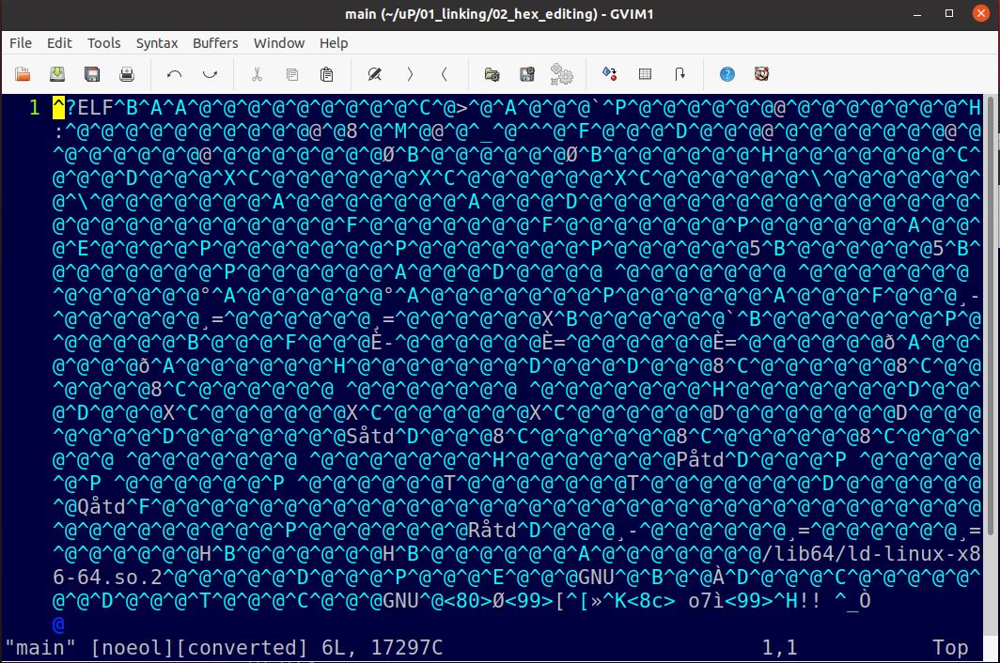

gvim 으로 main파일을 그냥 열어봤더니 알수없는 문자들로 가득하다?

이것은 아스키코드로 변환되어 이진 값이 보여지는것들이다. 

이것을 우리가 해석할수 있도록 

```
:%!xxd
```

hex edit 모드 진입하여 수정해보자.


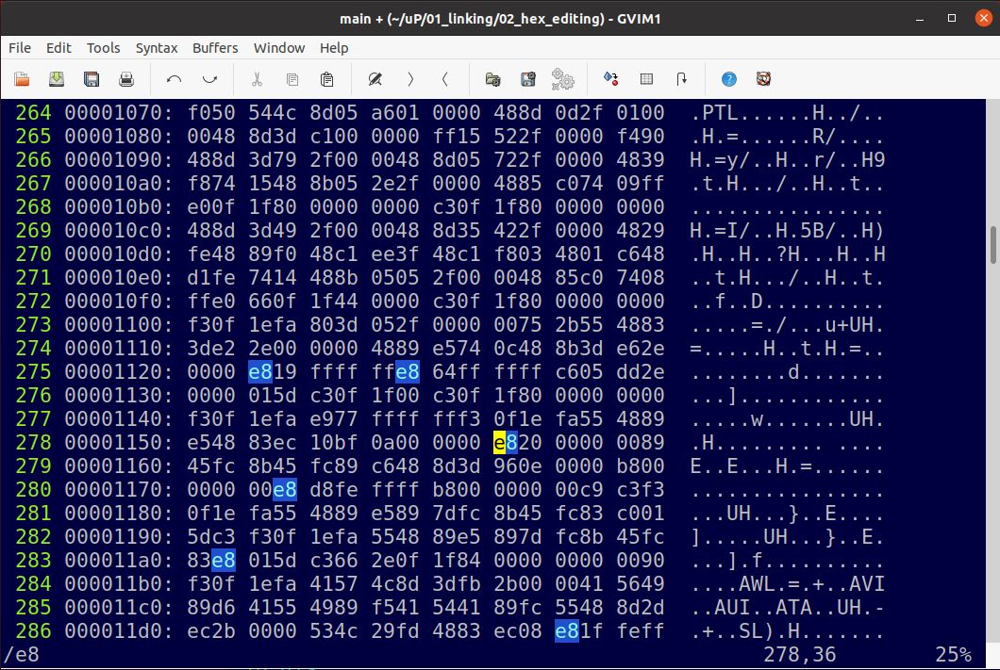


/e8로 e8이 있는 부분을 넘겨서 20이 나오는것을 찾았다. 

여기서 20을 33으로 바꿔주면 다른 함수를 호출 하게끔 해준다.


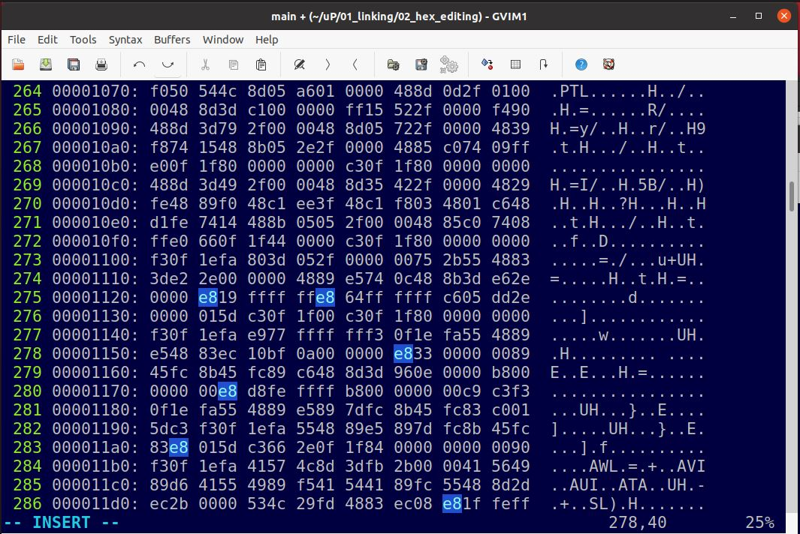

33으로 값을 변경했다. 

- 여기서 중요한점은 절대 빠져 나올때 습관적으로 :wq로 나오지말자
- :%!xxd -r로 빠져나오자.

- 그런 다음 :wq 저장하고 나오자. 안그러면 저 글자그대로 저장이 되기때문에 깨진다. 


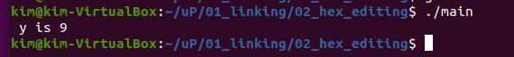

정상적으로 increment함수가 아닌 decrement 함수를 호출시켰다.

- 우리는 단지 바이너리 값만 바꿔서 컴파일&링킹 없이 다른 함수를 호출시키게끔 실행파일을 바꿨다. 
- 전자공학도라면 이런 HW부분까지 고려하여 프로그래밍 할 줄 알아야한다. 
- 컴퓨터공학과를 다른점이 바로 이런 디테일한 부분인것 같다. 


## 4. Password Neutralization by Hex Editing 

### 4.1 foo파일을 어셈블리 파일로 바꾸자

- 현재 디렉토리에 해결해야될 foo 파일이 존재한다.


- 다음과 같이 명령어를 입력해서 실행파일로 바꾸자.

  

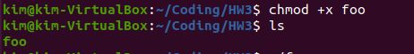

```shell
chmod +x foo
```


- 실행파일을 실행해보자

  

  비밀번호가 달라 실행이 되지 않았다. 

- 실행파일을 어셈블리 파일로 바꿔보자. 

  

  ```sh
  objdump -d -S foo > foo_dis.s
  ```

- foo_dis.s 어셈블리 파일을 실행시켜보자.

  ```sh
  gvim foo_dis.s
  ```

  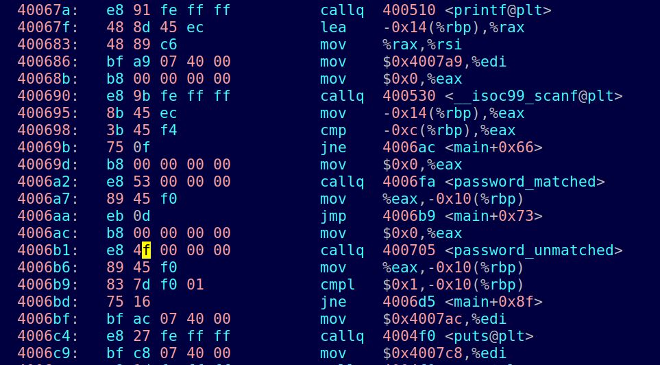

  무언가 여러 함수들이 호출되고 있는 모습이다. 

  여기서 callq 400705 <password_unmatched> 부분을 보자 

  e8 4ㄹ로 패스워드가 일치 하지 않을때 함수를 호출해라. 그 주소는 4006B6으로부터 4f만큼 떨어진 곳에 있다. 해석이 된다. 

- 4006B6+4F = 400705로 가보자

  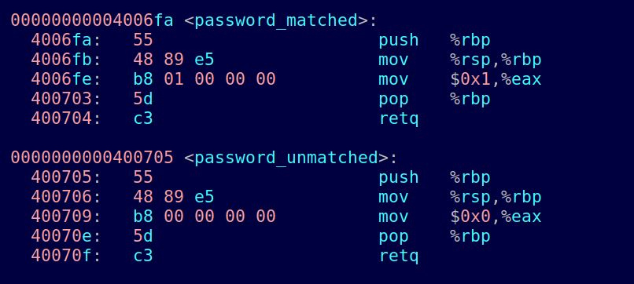

  실제로 password_unmatched 함수가 400705주소에서 실행되고 있지 않는가 ?

  그럼 함수호출을 저 주소가아닌 password_matched 주소로 바꿔주면

  password가 일치하던 안하던 무조건 matched 함수를 호출 시킬것 아닌가?

  password_matched 주소가 4006FA니 4006B6주소로부터 44만큼 떨어져있다.

  4F를 44로 바꿔주면 password_matched 함수가 호출되는 것이다! 


- 바이너리 값을 바꿔서 함수호출을 바꿔보자.

  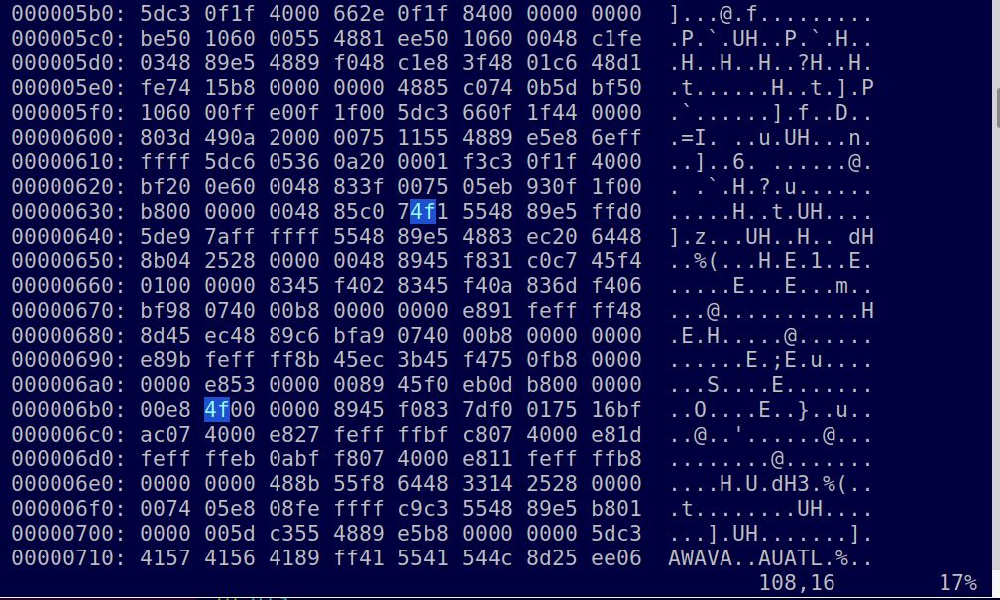

  e8 다음에 4f로 주소를 알려주고있다. 이부분을 44로 바꿔보자.


​		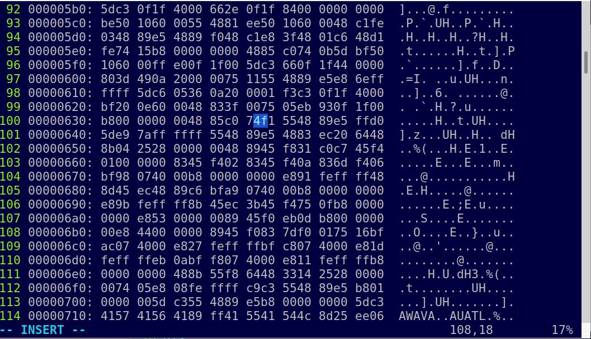

​		44로 바꾸어 

```
%!xxd -r
```

꼭 해당 명령어를 입력하고 빠져 나오자. 그런다음 :wq로 저장하고 나오자. 이건 꼭 기억해주어야한다. 


- Hex Editing 결과

  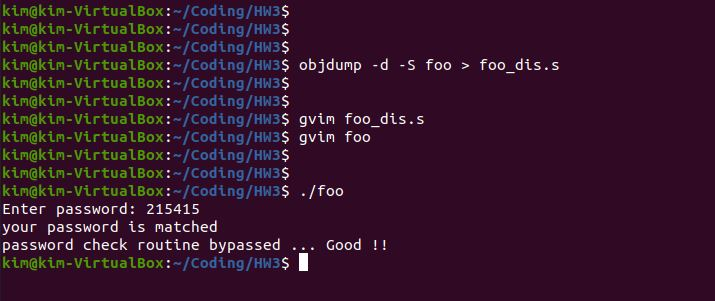

  아무 숫자나 입력했는데 password_match 함수가 실행되어 정상 프로그램 동작이 되는것을 볼 수 있다.

### 4.2 Password 추적 

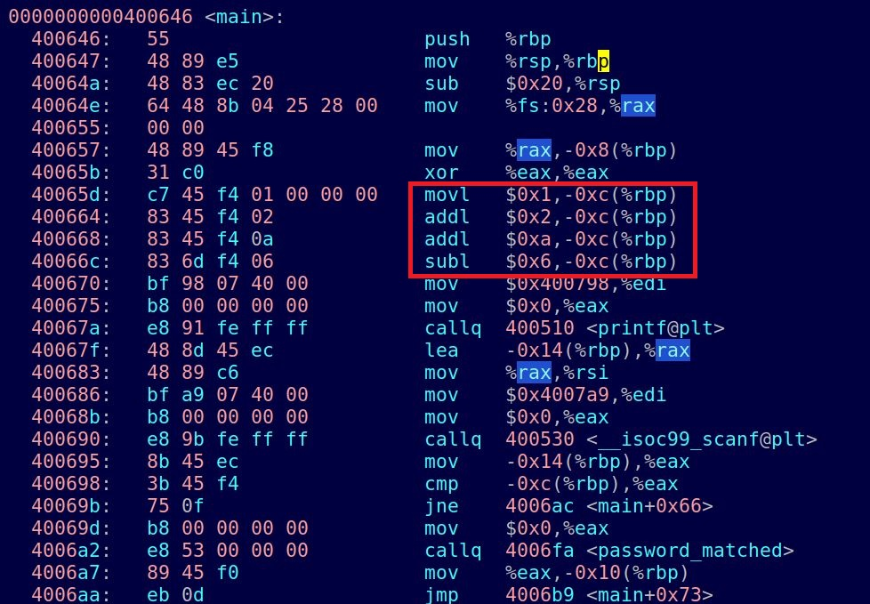

​			비밀번호를 우회하는 프로그램으로 Hex Editing 해보았다.

​			더 나아가서 아예 비밀번호를 추적해보자.

​			rbp를 알아보자, 64비트에 사용되는 스택포인터이다. 여기에 mov 명령어를 이용하여 0x1을 이동시켰다. 

​			그리고 나서 add로 0x2, 0xa를 수행하고 sub로 0x6을 수행했다. 그리고 나서 cmp에서 조건연산이 수행된다. 


- 10진수로 해석하자면 이렇게된다

  1 + 2 + 10 - 6 = 7 이된다.

  따라서 비밀번호는 7이다.

  7이 입력됬을때 조건문에서 비교를한다음 password_matched 함수가 호출되는 것이다 !! 


- 다른 숫자와 7을 입력해서 확인해보자. 

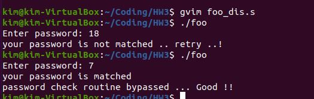


​	18을 입력했을때는 틀렸다고 나오고, 7을 입력했을때 정상적으로 수행됨을 보인다. 

​	어셈블리 역 추적을 이용하여 프로그램의 Password를 알아냈다 !


### 4.3 고찰

- 이처럼 실행파일을 어셈블리파일로 바꿔서 해석 할 수 있다.
- 전자공학도라면 이렇게 LOW한 프로그래밍 까지 갖춰야 진정한 엔지니어가 될 수 있음을 느꼈다.
- object 파일, C파일, Assembly 파일을 집합시켜 실행파일을 만들 능력을 기를 수 있었다.
- ARM Assembly 명령어를 간단하게 해석하여 결과를 바꿀 수 있다.
- 번외로 vi 에디터의 명령어로만 프로그래밍하여 빠르게 효율적으로 코드를 작성 할 수 있다. 


