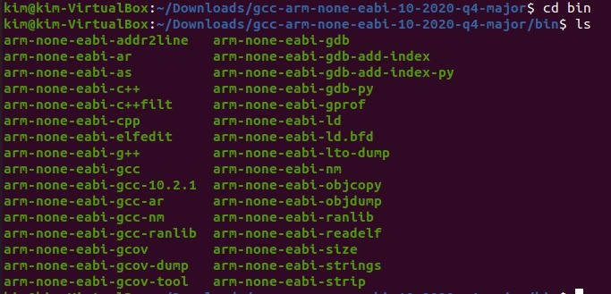

# Embedded System Design Lab Week 4 Homework

## 1. ARM cross compiler & QEMU 설치

### 1.1 ARM cross compiler란?

Embedded System을 개발할 때 대부분의 프로세스는 ARM코어를 사용한다. 

때문에 개발환경으로 ARM cross compiler를 설치해주어야 한다.

우리는 인텔의 x86 아키텍처의 컴퓨터를 사용하고 있어서 ARM 아키텍처로 호환되기위해서는

이런 별도의 cross compiler 설치 과정이 필요하다.

qemu는 가상화 소프트웨어중 하나이다. 호스트 컴퓨터에서 다른 가상의 CPU 및 주변기기들을 포함한 완전한 컴퓨터 시스템을 에뮬

레이팅하는 기능을 제공해준다. 

qemu를 통해 가상의 ARM 계열의 CPU환경을 구축하고 리눅스,DOS등 게스트 운영체제를 가상의 환경에서 구동시키게 해준다. 


### 1.2 GNU Arm Embedded Tool 다운로드 

- GNU Arm Embedded Toolchain Downloads

```http
https://developer.arm.com/tools-and-software/open-source-software/developer-tools/gnu-toolchain/gnu-rm/downloads
```

위 주소에서 접속하여 Toolchain을 다운로드 받자.


x86의 리눅스 64비트 파일을 다운로드 받자. 


### 1.3 xPACK QEMU 다운로드

- Install th xPack QEMU Arm binaries

  ```HTTP
  https://xpack.github.io/qemu-arm/install/
  ```

  xPack QEMU를 다운로드 받자. 

  

releases 를 클릭하여


linux-x64 버전을 다운로드 받자. 

```shell
bzip2 -d 파일명
gzip -d 파일명
```

으로 압축 해제하면 tar파일이 생성되는데 

```
tar xvf 파일명
```

으로 압축해제를하여 폴더를 생성시켜보자. 


두 폴더가 정상 생성됨을 확인할 수 있다. 


### 1.4 Download File 확인

- gcc-arm-none-eabi-10-2020-q4-major 폴더 확인

  

  arm 개발환경 file이 설치되어 있다. 

- xpack-qemu-arm-2.8.0-12 폴더 확인

  

  qemu 개발환경 file이 설치 되어있다.


# 2. 환경변수 설정

### 2.1 환경변수란? 

어떤 프로그램이 돌아가게 해주는 실행파일의 경로를 잡아주는 걸 환경변수 세팅이라고하는데, 

리눅스에는 매우 다양한 환경변수들이 있다. 

우리가 리눅스에서 사용하는 명령어들도 결국 일종의 실행파일인데 명령어 입력 시 환경변수에

잡혀 있는 PATH를 따라가서 해당 파일이 실행되는 원리로 명령어가 작동된다는 것이다.


### 2.2 환경변수 설정


Home Directories에서 .bashrc 파일을 열어보자.


- bashrc파일 마지막 부분에 해당 부분을 추가해주자.


```
alias vi="gvim"
```

gvim이라는 명령어를  vi라는 변수이름으로 지정하겠다는 의미이다.

alias는 명령어들을 쉽고 간단한 조합으로 $를 붙이지 않고도 사용할 수 있는 변수의 종류이다.


```
export PATH="/home/kim/Downloads/gcc-arm-none-eabi-10-2020-q4-major/bin:/home/kim/Downloads/xpack-qemu-arm-2.8.0-12/bin:$PATH"
```

환경변수를 새로 등록하거나 편집하는 명령어는 export PATH로 지정해주어야 한다. 

한가지 주의해야 할 점은  기존 환경변수에 덮어쓰기 하지않도록 하기위해 $PATH를 설정해주었다. gcc-arm설치 주소와 ':' 으로 연결하여 qemu 설치주소가 연결되어 같이 지정해주었다. 


echo $PATH를 입력하여 PATH가 연결되어 있음을 확인 할 수 있다.

이로서 환경 변수 설정이 완료되었으며 어디서든 해당 경로를 이용해서 컴파일 할 수 있는 환경이 구축되었다. 


## 3. ARM Firmware Project File 분석

### 3.1 Makefile

```makefile
CC= arm-none-eabi-gcc

LD= arm-none-eabi-gcc

OBJCOPY = arm-none-eabi-objcopy

CFLAGS= -mcpu=cortex-m4 -mthumb -mfloat-abi=hard -mfpu=fpv4-sp-d16 -DSTM32 -DSTM32F4 -DSTM32F411VETx -DSTM32F411E_DISCO

CFLAGS += -DDEBUG -DSTM32F411xE -DUSE_STDPERIPH_DRIVER -O0 -g3 -Wall -fmessage-length=0 -ffunction-sections -c -MMD -MP

LFLAGS= -mcpu=cortex-m4 -mthumb -mfloat-abi=hard -mfpu=fpv4-sp-d16 -T"LinkerScript.ld" -Wl,-Map=out.map -Wl,--gc-sections

all:
	$(CC) $(CFLAGS) main.c
	$(CC) $(CFLAGS) startup.s
	$(LD) $(LFLAGS) -o out.elf main.o startup.o

bin:
	$(OBJCOPY) -O binary "out.elf" "out.bin"

gdb:
	arm-none-eabi-gdb

qemu:
	qemu-system-gnuarmeclipse --verbose --verbose --board STM32F4-Discovery --mcu STM32F407VG --gdb tcp::1234 -d unimp,guest_errors --semihosting-config enable=on,target=native --semihosting-cmdline out
```

우선 make all을 했을때 실행되는 경로를 알아보자

CC, CFLAGS, LD, LFLAGS로 매크로 정의가 되어있음을 보인다. 

CC와 LD는 우리가 기존에 설치한 arm gcc 컴파일 명령어 이다.

CLFAGS와 LFLAGS는 STM사의 MCU보드를 이용하겠다는 명령어이다. 

MCU의 정확한 정보를 입력하여 object파일 생성을 할 수 있게끔 하는 명령어 이다. 


CFLAGS의 -mthumb은 32비트를 다 사용하지 않고, 11비트로 사용해서 전력을 줄이겠다는 의미이다. 

-mfloat는 소수 처리하는데 시간이 많이 걸려서 라이브러리를 사용해 시간을 아낄수 있다는 의미이다. 

링킹을 하여 out.elf파일을 만드는데 이는 ARM이 정의한 실행파일 확장자이다.


make bin을 이용하면 바이너리 파일이 생성된다.

make gdb는  arm gdb환경으로 시작하게끔 만들어준다. 

make qemu는 ARM환경의 보드를 에뮬레이션하여 가상으로 보드를 만들어준다. 

out.bin파일을 보드에 올릴수 있도록 도와준다. 


### 3.2 Main.c

```c
int main(void){


    unsigned int led = 0;


    while(1);


}
```

main함수안에 부호가없는 int led변수에 0을 넣는다. 

while(1)의 무한루프문을 생성시켜 꺼지지 않도록 파일을 구성했다. 


### 3.3 Startup.s

```assembly
	.syntax unified
	.cpu cortex-m4
	.thumb

.global g_vectors		// g_vectors 라는 변수의 프로토타입, 에러 나지 않도록
.global Reset_Handler

	.section	.isr_vector, "a", %progbits
	.type		g_vectors, %object
	.size		g_vectors, .-g_vectors

g_vectors:				// 링킹할 때 사용되는 레이블
	.word	_estack		// Stack pointer , 인터럽트 벡터 아님
	.word	Reset_Handler	// HW 인터럽트
	.word	0			// NMI_Handler
	.word	0			// HardFault_Handler
	.word	0			// MemManage_Handler
	.word	0			// BusFault_Handler
	.word	0			// UsageFault_Handler
	.word	0			
	.word	0			
	.word	0			
	.word	0			
	.word	0			// SVC_Handler
	.word	0			// DebugMon_Handler
	.word	0
	.word	0			// PendSV_Handler
	.word	SysTick_Handler
	.word	0
	.word	0
	.word	0
	.word	0
	.word	0
	.word	0
	.word	0
	.word	0
	.word	0
	.word	0
	.word	0
	.word	0
	.word	0
	.word	0
	.word	0
	.word	0
	.word	0
	.word	0
	.word	0
	.word	0
	.word	0
	.word	0
	.word	0
	.word	0
	.word	0
	.word	0
	.word	0
	.word	0
	.word	0
	.word	0
	.word	0
	.word	0
	.word	0
	.word	0
	.word	0
	.word	0
	.word	0
	.word	0
	.word	0
	.word	0
	.word	0
	.word	0
	.word	0
	.word	0
	.word	0
	.word	0
	.word	0
	.word	0
	.word	0
	.word	0
	.word	0
	.word	0
	.word	0
	.word	0
	.word	0
	.word	0
	.word	0
	.word	0
	.word	0
	.word	0
	.word	0
	.word	0
	.word	0
	.word	0
	.word	0
	.word	0
	.word	0
	.word	0
	.word	0
	.word	0
	.word	0
	.word	0
	.word	0
	.word	0
	.word	0
	.word	0
	.word	0
	.word	0
	.word	0
	.word	0
	.word	0
	.word	0


Reset_Handler:			// 어셈블러 점프 주소 리셋 인터럽트 서비스 루틴
	bl main				// Reset 인터럽트가 걸렸을때 main 수행

	
SysTick_Handler:


/*
NMI_Handler:
subroutines here
*/

```

부팅 과정 중 가장 첫번째 단계를 맏고 있는 파일이 Startup.s 어셈블리 소스파일이다.

어셈블리로 하는이유는?

1. 인터럽트 처리는 개발자의 몫인데, 인터럽트는 자주 발생된다.

   최대한 빨리 적게 개발하는 방법으로 실행 코드 수를 줄이는 방법이다.

2. 메모리 컨트롤러 레지스터 설정과 스택 주소 할당을 위해서 main함수도 C언어로 만들었기에 스택 영역이 필요하고, 스택 할당 전 SDRAM이 일고 쓰기가 가능해야 하기 때문에 스택 영역 할당 전 메모리 컨트롤러 레즈스터에 데이터값을 넣어 최과한다.


- 익셉션 벡터, 인터럽트 disable, PPL(Phase Looked Loop), SDRAM 초기화, 스택영역 할당, 변수 초기화, C언어의 main함수 진입 등을 어셈블리 언어로 만든다.
- 익셉션 벡터 : 임베디드 시스템이 리셋되거나 인터럽트 발생시 ARM core는 고정된 주소로 점프한 후 개발자가 지정한 주소로 다시 점프해서 프로그램이 흘러가도록 한다.
- 인터럽트 disalbe : 임베디드 시스템 부팅 초기가 매우 중요하기 때문에 그 순간 만큼은 인터럽트 받지 않기 위함.
- PPL 설정 : CPU와 각종 디바이스에 클럽 설정하기 위함
- 메모리 클러스터 설정 : CPU가 SDRAM 메모리를 읽기 쓰기 할 수 있도록 함
- main 함수 진입 : CPU가 SDRAM에 읽기 쓰기가 가능해지면 C 프로그램이 동작하기 위한 스택 영역 지정 후 C언어의 main으로 점프한다.
- startup.s와 main.c 파일을 컴파일 하면 누가 먼저 실행되어야 할지를 LinkerScript.ld 파일에서 결정할 수 있다. 


```assembly
	.syntax unified
	.cpu cortex-m4
	.thumb
```

Thumb 모드에서 동작하는 코드로 지정해주고 있다. 


```assembly
.global g_vectors		// g_vectors 라는 변수의 프로토타입, 에러 나지 않도록
.global Reset_Handler
```

다른 소스코드 파일에서 참조 할 수 있도록 전역 변수를 지정해주고 있다. 


### 3.4 LinkerScript.ld

```assembly
ENTRY(Reset_Handler)

_estack = 0x20020000; /* end of RAM, 램에서 가장 큰 주소 */

MEMORY
{
	RAM (xrw)	: ORIGIN = 0x20000000, LENGTH = 128k /* SRAM 영역 메모리 주소 20000000부터 128k */
	ROM (rx)	: ORIGIN = 0x08000000,  LENGTH = 512k	 /* code 영역 내의 flash 주소 8000000부터 512k */
}

SECTIONS
{
	.isr_vector	: 
	{
		. = ALIGN(4);
		KEEP(*(.isr_vector))
		. = ALIGN(4);
	} >ROM

	.text :
	{
		. = ALIGN(4);	
		*(.text)
		. = ALIGN(4);	
	} >ROM

}

						

```

- 컴파일을 하고 나면 오브젝트 파일이 만들어 질 때 4개의 독립된 영역으로 나누어 진다 : 코드 / 데이터 / 힙/ 스택
- 링크 스크립트는 섹션 영역의 start와 end 영역을 지정, 개발자가 링크 스크립트를 만들 때 임베디드 제품의 메모리 맵을 확인한 다음 각 섹션 영역을 어떻게 나눌 것인지 결정한 후 만든다.
- 일반적으로 .text_start와 .data_start 그리고 .bss_start 주소를 지정해주면 된다.
- arm-elf-size general.elf : 해당 섹션 영역의 사이즈를 알 수 있다.
- 어떤 컴파일을 사용하느냐에 따라 스케트(Scatter) 파일 또는 링크 스크립트 파일이라고 부른다.
- 만드는 방법
  - MCU 데이터 시트를 열어서 메모리 맵 확인 : 플래시 메모리 시작 주소와 사이즈, SDRAM 시작 주소와 사이즈 확인
  - 메모리 영역을 어떻게 나눌 것인지 결정 : 플래시 메모리에는 코드영역과 데이터영역 지정, SDRAM 영역은 주로 BSS(Block Started Segment)의 시작 주소 지정
  - 힙 영역은 링크 스크립트에서 따로 지정하지 않아도 됨. malloc 함수 자체가 자동으로 .bss_end+4 주소 이후로 잡아준다.
  - ARM 프로세서에서 스택은 상위주소에서 하위주소로 증가, Heap은 하위 주소에서 상위 주소로 증가.
  - 스택 영역 시작 주소 지정은 linker.ld에서 하지 않고 startup.s에서 지정


- Link Script 구성

  ```assembly
  /* Linker script to configure memory regions. */
  MEMORY
  {
  }
   
  
  ENTRY(Reset_Handler)
  
  SECTIONS
  {
  }
  ```

  Memory 와 Section으로 구성되어 있다.

  Memory 는 전체적인 코드의 분포를 설정하며, SECTION의 경우 각각의 Component들이 어떻게 배치될 것인지 Define된다.

- Memory

  ```assembly
  MEMORY
  {
  	RAM (xrw)	: ORIGIN = 0x20000000, LENGTH = 128k /* SRAM 영역 메모리 주소 20000000부터 128k */
  	ROM (rx)	: ORIGIN = 0x08000000,  LENGTH = 512k	 /* code 영역 내의 flash 주소 8000000부터 512k */
  }
  ```

  우선 눈여겨 볼 부분은 Memory 영역이다.

  FLASH (rx) 와 RAM (rwx)로 나누어진다.

  STM보드의 Datasheet를 참고하여 FLASH와 RAM의 메모리정보를 입력해주면된다.

  따라서 각각 시작 주소와 해당하는 크기를 써 주면 된다.

  **1) FLASH**

  여기서 FLASH 로 표기된 영역은 read & excute (rx) 속성을 가진다.

  소위 말하는 Code Area + Read Only Data 영역이 여기에 포함될 것이다.

  **2) RAM**

  마찬가지로 RAM영역은 read, write & excute (rwx)속성을 가지며,

  Writable Data 즉 Non Zero Initialized Data 및 Zero Initialized Data 영역 heap, stack 영역이 여기에 포함된다.

  세부적인 내용은 SECTIONS 에서 확인 가능하다.


- Section

  ```assembly
  SECTIONS
  {
  	.isr_vector	: 
  	{
  		. = ALIGN(4);
  		KEEP(*(.isr_vector))
  		. = ALIGN(4);
  	} >ROM
  
  	.text :
  	{
  		. = ALIGN(4);	
  		*(.text)
  		. = ALIGN(4);	
  	} >ROM
  
  }
  ```

  .isr_vector 및 read only data를 포함하고 있으며, FLASH 영역에서 첫번째로 할당된다. 

  여기서 .isr_vector는 start up code에서 **.section .isr_vector** 로 정의된 vector handler table의 시작 주소를 의미 한다.


### 3.5 startup.s와 main.c의 만남


링크에서 가장 중요한 부분 바로 링크 스크립트 파일이다.

링크 스트립트는 위에 그림에 나와 있는 섹션 영역의 start와 end 영역을 개발자가 지정하도록

 되어 있다.

즉, 개발자가 링크 스크립트를 만들 때 임베디드 제품의 메모리 맵을 확인한 다음 각 섹션 영역

을 어떻게 지정할지 결정한 후 만들면 된다. 일반적으로 .text_start와 .data_start 그리고

 .bss_start 주소를 지정해 주면 된다.

두 개의 오브젝트 파일을 하나의 바이너리로 만들 때 링크는 해당 오브젝트에서

 .text와 .data를 따로 분리하고 최종 바이너리로 만들 때는 같은 영역으로 

몰아서 만들어 낸다.


### 3.6 Firmware 과정 정리

1. C언어의 바이너리 코드가 적재될 메모리의 위치 지정

2. 변수, 스택, 동적메모리 할당영역의 위치 지정

3. 스택 레지스터 및 스택, 동적메모리 할당영역 초기화

4. 인터럽트 벡터의 위치지정

5. 인터럽트 벡터 레지스터 초기화 및 인터럽트 벡터의 초기화

   

## 4. QEMU로 펌웨어 로딩 & gdb로 타겟보드 에뮬레이팅

- QEMU로 펌웨어 로딩을 해보자.

  

  make qemu 명령어를 해당 디렉토리에가서 실행시켜보자 


정상적으로 보드가 loading 되었다. 


```makefile
qemu:
	qemu-system-gnuarmeclipse --verbose --verbose --board STM32F4-Discovery --mcu STM32F407VG --gdb tcp::1234 -d unimp,guest_errors --semihosting-config enable=on,target=native --semihosting-cmdline out
```

Makefile에서 해당 부분을 호출했으며 STM32F407VG 보드를 타겟팅 하였다.

그러나 아직 GDB Server listening on : 'tcp::1234'... 이라고 되어 있는데, 이는 로컬호스트의 호출을 기다리고 있는 상태이다.


- target 보드 호출해보기

  

  우선 make all을 하여 out.elf 파일과 main.d, main.o, startup.o, out.map 파일을 생성해보자.

  

  그 다음 make bin을 하여 out.bin파일을 만들자

  

  make gdb를 입력하여 gdb모드로 들어가자. 일련의 과정들이 업로드할 파일을 만들기 위함이다. 

  

  target remote :1234를 입력하여 타겟보드에 접속해보자.

  보드 터미널을 보면 connection accepted from 127.0.0.1이 나타난다.

  정상적으로 접속이 되었음을 보인다. 

- 보드에 파일 업로딩

  

  file out.elf를 입력하여 elf파일을 보드에 올려보자.

  

  load를 입력하니 보드 터미널에 바이트가 지정된 모습을 보인다. 

  

  b(break) main을 입력하여 main.c의 Breakpoint를 확인한다. 

  브레이크 포인트는 gdb와 같은 디버거가 프로그램을 실행 시킬 때 브레이크 포인트를 만나면 프로그램의 흐름이 일시적으로 멈추게 되고 브레이크 포인트 전까지만 프로그램을 실행시키게 된다. 

  

  c(continue)를 입력한다.

  gdb를 통해 파일을 실행 한 뒤 브레이크 포인트의 위치까지 진행하는 명령이다.
  
  
  
  n(next)를 입력하면 한줄씩 실행되는것이다. 
  
  
  
  info register를 입력하여 레지스터의 상태값을 확인할 수 있다.


## 5. gdb를 이용한 실행코드 분석

### 5.1 main함수 생성


unsigned int led 변수를 0으로 초기화 한 후 

3번 증가 연산을 하고, 3번 감소 연산을해서 다시 0으로 만드는 프로그램이다. 


Assembly 코드는 다음과 같다. r3레지스터에 0으로 초기화 후 add 1을 세번 연산하고 sub 1을 세번연산한다. 

### 5.2 보드에 파일 Upload


make all로 파일을 생성한다.


make bin으로 바이너리 생성


make gdb로 gdb모드 진입


새 터미널로 qemu를 이용하여 보드 on


target remote :1234를 이용하여 보드 타겟팅 진입


file out.elf 읽어오기 


load하여 보드에 업로딩

### 5.3 gdb로 코드 분석


b main으로 main함수 전까지 BreakPoint를 지정한다. 해당 지점까지 프로그램이 실행되며 이 이후부터 확인하면된다. 


c(Continue)를 입력하여 시작한다.


n을 눌러 다음줄을 실행시켰으며 info local으로 변수값을 확인했다. 


현재 r3 레지스터에 변수 3이 저장되어 있음을 보인다. 

pc가 main+28에 있는데 sub연산이 실행되는 main+30전까지 pc가 위치해있음을 정확히 보인다. 


n으로 계속 다음줄을 실행시켰으며 다시 감소연산으로 변수가 0이 되었음을 보인다. 


info register로 다시 r3의 값이 0임을 보인다. 

이로써 gdb를 이용하여 breakpoint를 설정하고 원하는 위치로 옮겨서 디버깅을 하는 과정을 실행해 보았다.