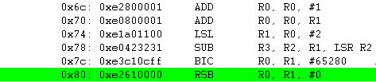
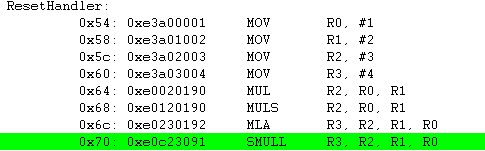
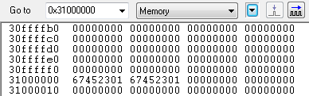
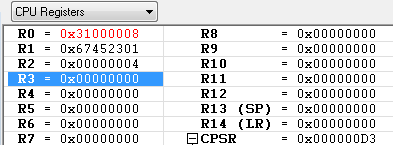
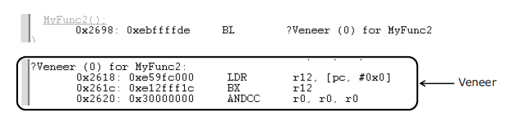
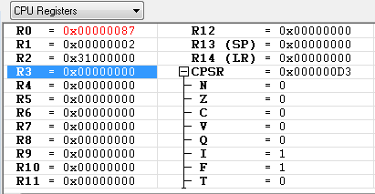
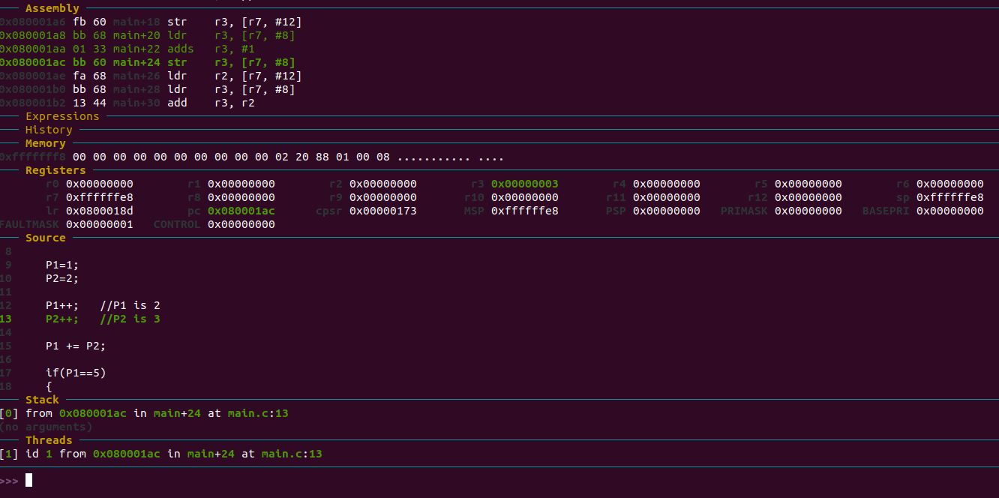

# Embedded System Design Lab Week 5 Homework

## 1. STM32F4 for ARM Cortex M4 개요

### 1.1 ARM 이란?

- **특징**

  - ARM 이란 프로세서의 코어를 설계하는 회사이다 즉 아키텍처를 설계하는 회사이다
  - 이러한 코어 아키텍처를 삼성, LG 등과같은 기업이 사서 ARM 프로세서를 제작한다.
  - 클래식 코어버전 : ARM 7 -> ARM 9 -> ARM 11
  - ARM 의 버전은 2씩 올라가며 홀수 를 사용한다. 짝수 ARM 버전은 ARM 직원들이 사용하는 버전이며 시판되기전에 버그를 잡는 용도로 사용된다.
  - 최근에는 ARM Cortex-M , Cortex-R, Cortex-A 버전으로 버전업이되어 출시되었다. 클래식 버전보다 성능이 많이 뛰어나 cortex(피질) 라는 단어를 붙이게 되었다.
  - M버전(저전력)은 자동차에 사용되며, R버전은 영상처리 카메라, A버전(고성능)은 스마트폰에 사용된다.

- **명령어 Set**

  Core 명령어로 Thumb / Thumb-2를 사용하는데, 명령어 자체에 조건부 실행이 가능하도록 되어있다. DSP와 VFP(부동소수점 연산보조 프로세서)와 같은 Coprocessor를 이용한 명령어 세트도 지원한다. Cortex-A는 리틀엔디안과 빅엔디안을 모두 쓸수있지만 Cotex-M은 리틀엔디안만 사용이 가능하다.

- **버스 구조**

  AMBA(Advanced Microcontroller Bus Architecture) 버스 구조를 사용한다. Cortex-M은 시스템 버스로는 AHB (High-performance) 를 사용하고 주변장치에는 AHB보다 느리지만 여러 접속장치 연결이 유리한 APB(Peripheral) 를 사용한다. AHB와 APB가 연결되기 위해 Bridge가 있다. 

  AHB에 연결되는 것들 : Core, RAM

  APB에 연결되는 것들 : Timer, UART, Key등등 I/O

- **쓰임새** 

  임베디드 장치, 보안장치 (SIM카드, 결제관련 시스템) : Cortex-M

  Open Flatform (리눅스, 안드로이드, 오락기, 네트워크 장비 등) : Cortex-A

  \* 고성능 시스템일수록 외부 추가 고용량 RAM / TFT-LCD 등 추가가 된다. 

- **주요 ARM MCU 제품 제조회사**

  1. STMicroelectorices : Cortex-M 강자

  2. Microchips Technology (Atmel 인수) : SAM 브랜드명

  3. TI (Texas Instruments) : Cortex-A, Cortex-M4 주력

  4. NXP : (Freescal 인수)

  5. Toshiba

  6. Nuvoton : 대만회사

  

### 1.2 STM32F4 MCU 구조

- **STM32F4**

  - 실제 사용할 보드는 STM32F4 라는 보드이며 과거 STM 사에서 제작한 32bit 보드로 라이센스를 팔았지만 이름 그대로 STM을 사용하고 있다.
  - STM32F4 ARM-cortex-M4 프로세서를 사용한다. 최대클럭 168MHZ, DSP, 32bit의 특징을 가지고 있다.
  - 마이프로세서에서 가장 중요한 것은 +와 GND를 물려서 밥을 주고, 타이머를 동작시켜서 레지스터를 사용하여 데이터를 이동시키는 것이 마이크로 프로세서에서 하는 가장 중요한 동작이다.
  - 마이크로프로세서는 시간, 즉 펄스(Pulse) 에 따라 일을 한다.

- **주파수**

  - 주파수란 1초에 몇번을 진동하느냐를를 말한다.
  - 4Hz는 1초에 4번을 진동 -> 1/4(s) -> 0.25(s) -> 250ms
  - 10Hz는 1초에 10번 진동-> 1/10(s) -> 0.1(s) -> 100ms
  - Hz가 높을수록 시간은 낮아진다. 반대로 Hz가 낮을수록 시간은 증가한다.
  - 

  - 위그림은 5Hz 주파수와 7Hz 주파수를 보여준다.
  - 마이크로프로세서는 엣지에서 동작을한다. 엣지는 Falling edge 와 Rising edge 가 있으며 Falling으로 할지 Rising으로 할지는 설정이 가능하다.
  - 일반적으로 마이크로프로세서는 Falling edge를 사용한다.

- **클럭(Clock)**

  - 마이크로 프로세서에서 시간을 가한다라는 말은 = 동작속도를 설정한다는 말이다.
  - 클럭 이 작으면 전력소모가 낮아지고, 클럭이 크면 속도가 증가한다, 따라서 사용자에 알맞게 클럭을 동작시켜야한다. 이때 사용자에게 알맞게라는 것은 사용자가 느끼기에 배터리 소모속도도 적당하고 디바이스의 속도도 빠른것을 말한다.
  - STM32F4의 최대 클럭은 168MHz이지만 위와 같은 이유로 클럭을 분할해서 알맞게 사용한다.
  - 분할을 할때 마이크로 프로세서 옆에붙은 오실레이터 or 크리스탈 이 클럭의 분할을 도와준다.
  - 
  - 위사진에서 보면 보드 중앙의 stm32f4 마이크로프로세서 위에 쇠뭉치같은게 붙어있는데 이것이 오실레이터 또는 크리스탈이다.

- **레지스터(Register)**

  

  - 레지스터는 쉽게말해 기억장치이다. 다수의 플립플롭으로 구성된 메모리 이다.
  - 왜 레지스터라는 명칭을 쓸까? 바로 CPU 내에있는 메모리로 CPU에서 가장 가까운 위치에 있기때문이다. 실제로 이 레지스터는 버스를 타지 않기때문에 빠른연산이 가능하다.
  - 레지스터는 빠른속도를 같는만큼 전력소모는 증가한다.
  - 메모리인 레지스터는 사용자의 명령을 받고 , 명령에 따른 답을 받아서 사용자에게 주는 인터페이스 역할을한다.
  - 레지스터에 명령을 내리면 레지스터가 알아서 프로세서1, 프로세서2, … 동작가능한 프로세서를 선택하여 활성화시키고 명령을 처리한뒤 완료된 결과를 다시 레지스터에 놓는다. 그러면 유저는 레지스터에온 결과를 확인한다.

- **AMBA(Advnaced Microcontroller Bus Architecture)**

  - 예전에는 마이크로 프로세서의 버스구조가 체계화 되어있지 않았다.
  - 최근에 체계적이고 잘 구조화된 버스를 도입하였는데 그것이 바로 AMBA 이다.
  - Advaced High-Performance Bus(AHB)
  - Advaced Peripharal Bus(APB)
  - 위 2가지 버스이외에 2가지 버스가 더있지만 가장많이 쓰이는 버스가 위의 2가지 버스이다.

- **STM32F4의 메모리**

  - GPIO를 쓰려면 레지스터를 통해 GPIO를 초기화하고 사용해야한다. 초기화를 하려면 그 주소로 가서 Enable(1) 을 시켜 주어야한다.

  - 마이크로프로세서의 GPIO, DAC, ADC 등.. 여러 기능들인 메모리에 각각 배정되어있다.(자세히 보려면 메모리맵을 살펴보자)

  - 메모리상에서 GPIOF 의 주소가 0x40021400 ~ 0x400217FF 일때 실제로 GPIOF 포트 활성화를 어떻게 시키는지 C코드로 간단히 구현해보자

    ```c
    int *a = (int *)0x40021402 // 명시적 형변환으로 int * 형으로 변환하여 주소를 포인터변수 a에 저장
    		*a = 1; //Enable(1) 주소로 가서 값을 1로 변경
    		*a = 0; //Disable(0) 주소로 가서 값을 0으 변경
    ```

- **RCC(Runtime Clock Control)**

  - RCC란 클럭을 사용할때 첫번째로 사용하는 레지스터를 말한다.

  - 클럭을 초기화 시킬때는 비트를 사용하여 초기화를 한다.

  - RCC 역시 메모리상에 있으며 아래 그림과같이 32bit로 블록화 되어있다.

  - 

  - 가장낮은 비트를 LSB , 가장 높은 비트를 MSB 라고 부른다. 이 32개의 bit를 이용하여 RCC를 세팅한다.

  - RCC의 비트맵을 보면 클럭을 2개 보유하고있다(MCO1,MCO2)

  - MCO2 는 2bit로 동작되며 각 bit에 따른 상태는 다음과같다 00(SYSCLK) 01(PLLI2S CLK) 10(HSE oscillator CLK) 11(PLL clock) 실제로 많이사용되는 클럭은 시스템클럭이며 나머지 3개의클럭은 외부클럭이다.

  - MCO2PRE 는 클럭을 나눠쓸때 사용된다 즉 Division 용도로 쓰인다. 0xx(no division) 100(2) 110(4) 111(5) 각 비트설정에 따라 나누지않거나, 2, 4, 5로 나눈다.

  - 그럼 division 5 로 클럭2 SYSCLK 을 활성화 해보자.

  - 

  - 위 그림과같이 주소를 4bit씩 묶어서 16진수로 주소의 한자리를 표현한다.

  - 따라서 SYSCLK(00) 비트를 MCO2에 설정해주고 , division 5(111) 을 MCO2 PRE 에 설정해 준다.

  - 결과값은 0x38000000 이 된다.

  - 이를 C코드로 구현해 보자 RCC의 주소는 0x10000 이라 가정

    ```c
    int *a = (int*a) 0x10000  // RCC의 블럭주소를 찿아간다.
    	*a = 0x38000000  //설정할 값으로 세팅한다.
    ```

    

## 2. CPU 구조 

 ### 2.1 CPU구성

일반적인 CPU의 동작 예를 들기 위하여, 조금 더 Simplified된 CPU모델을 소개한다.

CPU는 최소한의 동작을 위하여 다음 그림과 같이, CU, ALU이외에도 Program Counter, IR, Addresss Register, Data Register, ACC 등을 포함하고 있다. 

아래 그림의 왼쪽부분이 CPU(Processor)이고 오른쪽 부분은 외부에 달려 있으며 프로그램과 데이터를 담고 있는 External memory(RAM또는 NOR FLASH와 같은 ROM)를 의미한다.


- PC : Program Counter , CPU가 현재 실행하고 있는 Instruction의 주소를 가르킴.
- IR : PC가 가리키는 Instruction의 주소에서 읽어온 Instruction을 담아두는 기억장소
- Address Register : 현재 사용하는 Data를 Access하기 위한 data의 주소를 가리키는 값을 담아두는 기억장소
- Data Register : Address Register가 가르키는 주소의 실제 값
- ACC : 특수한 Register로서, 연산에 사용되는 값들을 저장하며, 연산의 결과값을 잠시 저장하는 일이 많으며, 외부 사용자가 직접 Access할 수 있는 Register가 아니고, CPU 혼자 독식하는 Register이다. 
- Decoder : IR에서 가져온 Instruction을 해석하여 CU에 넘김.
- CU : Central Unit, Decoder에서 받아온 것을 각종 제어 신호로 변환하여 제어신호를 발생시킴.
- ALU : 산술 연산을 담당하는 Unit


### 2.2 LOAD 예시

```c
word a =1;

word b =2;

word c ;


 

word add (void)
{
   int temp;
 
   temp = a;
   c = a + b;
 
   return;
}
```

16bit processor,  1 word = 2byte라고 가정하고 주소를 임의로 지정해본다. 

a= 0x2000, b=0x2002, c=0x2004로 가정한다.

위와 같은 C code를 Compile하면 다음과 같은 Assembly가 생성된다고 가정해본다.

| 주소   |   Assembly   |
| :----- | :----------: |
| 0x1000 | LOAD 0x2000  |
| 0x1002 |  ADD 0x2002  |
| 0x1004 | STORE 0x2004 |

1. LOAD 0x2000 : a값을 Data Register에 load해서 
2. ADD 0x2002 : 이전에 Load되어 있던 a값과 새로 load하는 b값을 더한 후
3. STORE 0x2004: 그 더한 결과값을 c의 주소에 저장 


1. 현재 CPU가 실행하려는 주소는 PC에 들어 있는 0x1000. 
2. Address Register에 0x1000을 넣고서

3. Address Register에 0x1000이 들어가는 순간 자동으로 Memory의 0x1000을 Access하여

4. 그 곳에 있는 Instruction이 Memory로 부터 읽어 짐. (LOAD 0x2000)

5. Memory로 부터 읽혀진 Instruction은

6. Decoder로 흘러 들어가 무슨 내용인지 해석 되는 동시에 PC는 다음을 실행하기 위하여 증가됨.

7. 오호라, 0x2000번지의 값을 가져오라는 내용임을 파악하여,

8. Memory로 부터 0x2000의 값을 읽어 오라고 CU가 제어 신호를 발생 시킴, (ACC에게는 임시 저장토록 제어 신호발생).

9. CU가 발생시킨 제어 신호에 의하여 1이라는 값이 Data Register에 들어가고,
10. 이 값은 ALU를 통하여 연산을 할지도 모르니까 ACC에 임시 저장됨.


### 2.3 ADD 예시


1. LOAD와 마찬가지로, 현재 CPU가 실행할 주소는 앞에서 이미 증가한 0x1002이므로

2. 이 값을 Address Register에 넣음.

3. 자동으로 0x1002에 위치하고 있는 ADD 0x2002가 Load되며,

4. 이 값은 IR에 전달 된다.
5. 전달된 값은 IR에 저장되며,

6. IR의 값이 Decoder에 전달되는 동안 PC도 자동으로 다음 instruction을 가리킬 수 있도록 증가하며,

7. Decoder는 0x2002번지의 값을 더하라는 해석을 완료하여 CU에 전달한다.

8. CU는 Decoder의 해석에 의거하여 0x2002에 있는 값을 읽어 오도록 제어 신호를 발생시키며, ALU에게는 더하라는 제어 신호도 발생시킨다.

9. 0x2002에 있는 Data 2를 Load해서 Data Register에 저장한다.
10. CU가 발생시킨 제어 신호에 의하여, ALU는 Data Register에서 읽어온 data 2를 이미 있던 ACC의 값과

   더하여 ACC에 결과 값을 저장한다.


### 2.4 STORE 예시


1. 현재 실행해야 할 Instruction은 PC의 값인 0x1004이며,

2. 이 값은 Address Register로 전달된다.

3. 결국 instruction을 load하기 위하여 0x1004를 access하여,

4. 0x1004에 값은 CPU로 loading된다.

5. Loading된 값은 IR에 저장되며 이 값은 Decoder로 전달되는 동시에 PC는 또 한번 증가한다.

6. Decoder는 해석 하여 ,

7. CU로 그 내용을 전달하여

8. CU는 ALU에게 ACC에 있는 값을 0x2004에 저장할 수 있도록 제어 신호를 발생시켜

9. ACC에 있는 값은 CU가 발생시킨 제어 신호에 의하여 0x2004번지에 결과 값 3을 저장함.


### 2.5 CPU의 Work Step

CPU라는건 항상 정해진 규칙에 의해서 일을 한다. 항상 똑같은 일을 한다. 그 Step으로는

1. instruction을 메모리로부터 가져오고 (Fetch)

2. 가져온 Instruction을 해석해서 어떤 일을 하는지 알아보고 Register 값들도 확인, (Decode)

3. Decoding된 Instruction을 실행한다. (Execution)


크게 3가지 방식으로 Fetch, Decode, Execution을 순서대로 한다면(Sequential)

1개가 일을 할때 나머지 2개는 놀고있다. CPU가 효율적으로 일 할수 있게 pipe line이 생겼다.

Decode하는 동안에 그 다음번 Instruction을 Fetch해 오면 어떨까라는 생각으로부터 고안되었다.

한번 동작할때 서로 CPU의 다른 부분을 사용하는 Fetch/Decode/Excution을 한꺼번에 실행해보면


이렇게 실행된다. 

ARM7기준으로 Fetch/Decode/Execute 3stage pipe line을 그리면, 왼쪽으로 갈수록 시간이 지나고 한칸당 1cycle, 즉 1clock으로 본다.


- 처음 cycle에서부터 시간이 흘러 3 cycle까지 갔을 때는 첫 번째 opcode의 execute가 실행되고 있고, 두 번째 opcode의 decode, 그리고 세 번째 opcode의 fetch를 한꺼번에 시행하고 있다.

- 예를 들어, Fetch/ Decode/ Execute를 pipe line의 개념을 사용하지 않고 실행한다면 2개 opcode실행하는데 6개 cycle이 걸릴 테지만, Pipe line을 이용하면 2개 opcode 실행하는데 4개 cycle만 있으면 된다. 더 많은 연속적인 opcode를 실행한다면 더욱 많은 양을 처리할 수 있다. 그림만 봐서도 5개 cycle에 3개의 opcode를 처리할 수 있다.

- 그러면, Pipe line 단계가 많아지면 좋아질 것인가? 하는 의문이 들지 않겠는가? 실은 Pipe line이 많아지면 많을 수록 좋아질 것이다. 너무 많은 stage는 효율성 면에서 성능이 더 좋아지지 않고, 나빠진다고 봐야 한다. 이런 것은 시스템이 어떻게 생겼느냐와 어떤 전략을 사용했느냐에 따라 달라지고, 마구잡이로 늘린다고 좋아지는 건 아니다.

- 그 예로 ARM에서의 pipe line은 ARM7의 경우 3단계 pipe line, Fetch → Decode → Execution으로 3단계를 거치며, ARM9의 경우에는 5단계 pipe line, Fetch → Decode → Execute → Memory → Write 의 pipe line을 가진다.

- 이런 pipe line을 채용하게 되면 현재 PC값 (Program Counter)는 어디를 가리키고 있는 것 인가? 하고 질문할 수 있다. PC는 어디에 있을까? PC는 항상 Fetch하고 있는 곳을 가리키고 있다. 고로, 현재 Execution하고 있는 곳보다 앞서가고 있다. ARM의 경우라면, 32bit가 1 word니까 PC는 항상 +8만큼 앞서가고 있다. 이 내용은 Exception Debugging을 하려면 아주 요긴하게 쓰이는 Concept 이니까 꼭 기억해 두자.

- CPU라는 것도 하나의 rule을 가지고 모든 것을 처리하고 있다. 실은 이런 과정은 아주 간단하게 설명한 것이고 이 것을 기본으로 하여 훨씬 더 복잡한 과정을 거친다, 이 정도만으로도 충분히 CPU의 동작을 이해 할 수 있는데 도움이 될것이다.

  

## 3. ARM Assembly

### 3.1 ARM CPU의 기본구성

- `R0` ~ `R14` 총 15개의 범용 레지스터를 가지고 있다.

- 범용 레지스터 `R13`는 특수 레지스터 `SP`로 사용된다.

  - `SP`는 C언어 사용시 스택의 주소를 저장하는 레지스터이다.

- 범용 레지스터 `R14`는 특수 레지스터 `LR`로 사용된다.

  - `LR`은 함수 호출 시 되돌아갈 함수의 주소가 저장되는 레지스터이다.

- 범용 레지스터 `R15`는 특수 레지스터 `PC`로 사용된다.

  - `PC`는 다음 실행할 프로그램의 주소를 가지고 있는 레지스터이다.

- `CPSR`이라는 상태 레지스터를 가지고 있다.

  

- `Rs`, `Rd`는 반드시 레지스터(`R0`~`R15`)이어야 한다.

  - `OP1`은 항상 레지스터이다.

- `OP2`는 레지스터 일수도 있고, 레지스터가 아닐수도 있다.

- `Rs`, `Rd`, `OP2`의 대상으로 직접 외부 메모리를 접근할수 없다.

---

### 3.2 Load, Store

**`MOV` 명령**

- ARM에서 레지스터의 데이터 이동은 `MOV` 명령을 사용한다.
  - 예) `MOV, R0, R1` : `R1`의 내용을 `R0`으로 복사
  - 예) `MOV R0, #1` : 상수 `1`을 `R0`으로 복사
- 메모리 ->레지스터 : `LDR` (Load to Register)
- 레지스터->메모리 : `STR` (Store to Memory)


**상수 값을 레지스터에 저장**

- `LDR` 명령 사용 방법

  - `LDR Rn, = Value`

  - `LDR`을 사용하여 상수의 값을 레지스터에 저장할때 `=Value`에서 `=`를 빼먹지 않게 주의하자.

    - 다른 명령어에서는 상수 입력에 `#`이 들어가지만 `LDR`만 `=`이 들어가니 주의하자.

  - 레지스터간 데이터 복사는 `MOV`를 사용한다.

  - `Rn` : `R0` ~ `R15` (대소문자 구분 없음)

  - `=Value` : 상수 값(최대 4바이트)

    - 10진수 :

      - 예) `41`, `-27`

    - 16진수 :

      - 예) `0x1234`, `-0x1EF`

    - 예) `LDR R0, = 100`, `LDR R13, = 0x1234`

      

**상수 표현**

- `OP`의 상수는 8비트의 값이고 짝수 비트 ROR(Rotate Right)로 표현되어야 한다.

  - 32비트 명령 안에서 상수 값을 함께 저장하다보니 범위 제한이 발생하기 때문이다.
  - `0` ~ `255` 범위의 상수는 무조건 사용이 가능하다.

  

**사용된 상수가 `MOV` 명령에서 사용 가능한지 불가능한지 판단해보자**

- `MOV R0, #0x7F00` : **가능**

  

- `MOV R0, #0x30C0` : **가능**

  

- `MOV R3, #0x14E` : **불가능**

  

- `LDR`을 사용하면, **범위 제한 없는 32비트 값으로 표현 가능**

  - 실제 상수 값은 메모리에 존재하며 레지스터 참조로 변환된다.

> *`MOV` 보다 `LDR`이 느리지만, `LDR`은 32비트 데이터를 사용할 수 있다.*

**레지스터 간접참조 `LDR`, `STR`**

- 레지스터 간접 참조:
  - `LDR Rd, [RS]`
    - `Rs` 레지스터 값을 메모리 주소로 하여 `Rd`에 저장
    - `Rs`, `Rd` : `R0` ~ `R15`
  - `STR Rs, [Rd]`
    - `Rd` 레지스터 값을 메모리 주소로 하여 `Rs`를 저장
    - `Rs`, `Rd` : `R0` ~ `R15`

**예)**

```assembly
  LDR R0, =0x1000   @ R0에 상수 0x1000 저장
  LDR R1, =80       @ R1에 상수 80 저장
  STR R1, [R0]      @ R0의 값인 0x1000를 메모리 주소로 참조하여
                    @ 0x1000에 상수 80을 저장
```

**`LDR`, `STR` 쉽게 이해하는 방법**


**Lable**

```assembly
START:  MOV R0, #10       @ R0 레지스터에 상수 10을 저장
        STR R0, [R1]      @ R1에 저장되어 있는 주소에 R0 값을 저장
        LDR PC, =START    @ START의 주소를 PC(Program counter)에 저장
```

- Lable은 모두 주소 값(해당 Lable 위치의 주소)이다.
- 위의 코드는 `START` 의 주소 값을 PC(Program Counter)에 저장하여 무한 루프를 하게 된다.


**`LDR`, `STR` Post Indexing**

**Post Indexing 사용 방법:**

```assembly
	LDR R0, [R1], #4            @ R1 주소에 있는 값을 R0에 넣고, R1에 4를 더합니다.
	STR R0, [R2], #-4           @ R0의 값을 R2의 주소에 넣고, R2에 4를 뺍니다.
```

```assembly
	LDR R0, [R1], R3            @ R1 주소에 있는 값을 R0에 넣고, R1에 R3의 값을 더합니다.
	STR R0, [R2], -R3           @ R0의 값을 R2의 주소에 넣고, R2에 R3의 값을 뺍니다.
```

```assembly
	LDR R0, [R1], R3, LSL #2    @ R1 주소에 있는 값을 R0에 넣고,
                              @ R1에 R3, LSL #2한 값을 더합니다.
	STR R0, [R2], -R3, ASR #2   @ R2 주소에 있는 값을 R0에 넣고,
                              @ R2에 R3, ASR #2한 값을 뺍니다.
```

**예)**

```assembly
	LDR R1, 0x1000              @ R1에 상수 0x1000을 넣습니다.
                              @ R1 : 0x1000

	LDR R0, [R1], #4            @ R0에 0x1000를 참조한 값(R1의 메모리 참조주소)을 넣고,
                              @ R1에 4를 더합니다.
                              @ R1 : 0x1004

	LDR R2, [R1], #4            @ R2에 0x1004를 참조한 값(R1의 메모리 참조주소)을 넣고,
                              @ R1에 4를 더합니다.
                              @ R1 : 0x1008
```


**`LDR`, `STR` Pre Indexing**

**Pre Indexing 사용 방법:**

```assembly
  LDR R0, [R1], #4            @ R1에 4를 더한것을 참조하여 R0에 넣습니다.
  STR R0, [R2], #-4           @ R0의 값을 R2에 4를 뺀 주소에 넣습니다.
```

```assembly
  LDR R0, [R1], R3            @ R1에 R3의 값을 더한것을 참조하여 R0에 넣습니다.
  STR R0, [R2], -R3           @ R0의 값을 R2에 R3의 값을 뺀 주소에 넣습니다.
```

```assembly
  LDR R0, [R1], R3, LSL #2    @ R1에 R3, LSL #2한 값을 더한뒤,
                              @ 주소에 있는 값을 R0에 넣습니다.
  STR R0, [R2], -R3, ASR #2   @ R2에 R3, ASR #2한 값을 뺀뒤,
                              @ R0의 값을 변경된 주소로 넣습니다.
```

**예)**

```assembly
  LDR R1, 0x1000              @ R1에 상수 0x1000을 넣습니다.
                              @ R1 : 0x1000

  LDR R0, [R1, #4]            @ R1에 4를 더한 주소의 참조한 값(0x1004)을 R0에 넣습니다.
                              @ R1 : 0x1000

  LDR R2, [R1, #4]            @ R1에 4를 더한 주소의 참조한 값(0x1004)을 R2에 넣습니다.
                              @ R1 : 0x1000
```

> *Pre Indexing에서는 **값이 업데이트 되지 않는다!** 만약 값을 업데이트하고 싶다면 아래의 `!` (Auto Update) 옵션을 사용해야 한다.*


**'`!`(Auto Update) suffix' 사용 예시)**

```assembly
  LDR R1, 0x1000              @ R1에 상수 0x1000을 넣습니다.
                              @ R1 : 0x1000

  LDR R0, [R1, #4]!           @ R1에 4를 더한 주소의 참조한 값(0x1004)을 R0에 넣습니다.
                              @ ! suffix가 있으므로, 자동으로 값이 업데이트 됩니다.
                              @ R1 : 0x1004

  LDR R2, [R1, #4]            @ R1에 4를 더한 주소의 참조한 값(0x1008)을 R2에 넣습니다.
                              @ ! suffix가 없으므로, 자동으로 값이 업데이트 되지 않습니다.
                              @ R1 : 0x1004
```


**`LSL`, `LSR` Shift**

- `LSL #n` : 최후에 밀려난 비트가 `CPSR` (상태레지스터)의 C(Carry) flag에 저장
  - Logical Shift Left
  - `LSL` : `signed/unsigned` 곱하기 2
- `LSR #n` : 최후에 밀려난 비트가 `CPSR`(상태레지스터)의 C(Carry) flag에 저장
  - Logical Shift Right
  - `LSR` : `unsigned` 나누기 2

**`ASR` Shift**

- `ASR #n` : MSB(부호)를 유지하고, 밀려난 비트가 `CPSR`(상태레지스터)의 C(Carry) flag에 저장
  - 레지스터를 우측으로 지정한 비트 수 만큼 **부호를 유지하며** Shift한다
  - `ASR`은 `signed int`의 나누기 2 동작을 수행한다.

---

### 3.3 비트제어 명령어

- `ORR` : 원하는 비트만 1로 설정한다.
  - 예) `ORR R0, R0, #0x1F`, `ORR R0, R1, R2, LSL #2` 
- `EOR` : 원하는 비트만 반전 시킨다.
  - 예) `EOR R0, R0, #0x1F` , `EOR R0, R1, R2, LSL #2` 
- `AND` : 원하는 비트만 0으로 설정한다.
  - **0인 비트에 0으로 설정한다**
  - 예) `AND R0, R0, #0x1F` , `AND R0, R1, R2, LSL #2` 
- `BIC` : 원하는 비트만 0으로 설정한다.
  - **1인 비트에 0으로 설정한다.**
  - `AND` 보다 편리한 장점이 있다.
  - 예) `BIC R0, R0, #0x1F`, `BIC R0, R1, R2, LSL #2`


**다양한 비트연산**

- **[문제]** `0x1000` 의 4~7번 비트를 `1010` 으로 변경하는 어셈블리 코드를 작성하시오. 

  

  ```assembly
    LDR R0, =0x1000           @ R0에 상수 0x1000을 넣습니다.
    LDR R1, [R0]              @ R1에 R0을 참조한 값을 넣습니다.
    BIC R1, R1, 0xF << 4      @ '1111'을 4번 Left Shift하면 '11110000'가 됩니다.
                              @ BIC로 R1의 4~7 비트를 0으로 설정합니다.
    ORR R1, R1, 0xA << 4      @ '1010'을 4번 Left Shift하면 '10100000'가 됩니다.
                              @ ORR로 R1의 5, 7번 비트를 1로 설정합니다.
    STR R1, [R0]              @ R1의 데이터를 R0에 저장되어있는 메모리주소에 저장합니다.
  ```

  

---

### 3.4 분기 명령어

- `B` 명령 사용 예시:
  1. `B add` : Global Label
  2. `B 1f` : Local Label
  3. `B . ` : 무한 루프(.은 제자리를 의미한다.)
- `B R0` 와 같이 `B` 명령은 분기 주소로 레지스터를 쓸수 없다. 

---

### 3.5 비교 연산 명령어

- `CMP` : `CMP Rs, OP2` 
  - `Rn - OP2` 연산을 하여 `CPSR`(상태레지스터)의 Flag만 변경한다.
- `CMN` : `CMN Rs, OP2` 
  - `Rn + OP2` 연산을 하여 `CPSR` (상태레지스터)의 Flag만 변경한다.
  - 컴파일단에서 주로 사용된, 되도록이면 `CMP`를 사용하자.
- `TST` : `TST Rs, OP2` 
  - `Rn & OP2` 연산을 하여 `CPSR` (상태레지스터)의 Flag만 변경한다.
  - **특정비트를 확인하기 위해 사용된다.**
  - 비교 비트가 **1 이면, Z clear, 0이면 Z set**
- `TEQ` : `TEQ Rs, OP2` 
  - `Rn ^ OP2` 연산을 하여 `CPSR` (상태레지스터)의 Flag만 변경한다.
  - **두 데이터의 비트가 완전 똑같은지 확인하기 위해 사용된다.**
  - 비트 패턴이 **동일하면, Zero set**

> ***비교연산은 레지스터에 변화가 없으며, Flag만 변한다.***

- **[문제]**  `R0`의 7번 비트가 `1` 이면 `R1` 레지스터에 2를 기록하고, `0`이면 `R1` 레지스터에 3을 기록하는 프로그램을 작성하시오.

- `AND`를 사용하여 해결:

  ```assembly
    AND R0, R0, #1 << 7
    CMP R0, #0
    MOVEQ R1, #3
    MOVNE R1, #2
  ```

- `TET` 를 사용하여 해결:

  ```assembly
    TST R0, #1 << 7
    MOVEQ R1, #3
    MOVNE R1, #2
  ```

---

### 3.6 `CPSR` (상태레지스터)과 Flag


비교 연산을 할때는 NZCV만 사용한다

- N (Negative) : 연산 결과가 음수인 경우
- Z(Zero) : 연산결과가 0인 경우
- C(Carry) : 덧셈 Carry에 Set, 뺄셈 Borrow에 Clear, Rotate시 밀린 비트 저장
- V(Overflow) : `singed` 덧셈, 뺄셈 연산 결과로 값의 초과가 발생한 경우

> ***Carry는 덧셈을 했을때 범위를 초과해서 자리 올림이 발생했을때를 말한다. OverFlow와는 다르다.***

---

### 3.7 상태 플래그와 조건

```assembly
  CMP R0, R1
  B□□ LOOP
```

□ 부분에 아래의 16가지 조건식이 들어가게 된다.

| 약어          | 뜻                                     | Flag 상태                    |
| ------------- | -------------------------------------- | ---------------------------- |
| **`EQ`**      | **Eq**ual / Equals zero (False)        | Z set                        |
| **`NE`**      | **N**ot **E**qual (True)               | Z clear                      |
| **`CS`**/`HS` | Carry Set / Unsigned higher or same    | **C set**                    |
| **`CC`**/`LO` | Carry Clear / Unsigned Lower           | **C clear**                  |
| **`MI`**      | **Mi**nus / Negative                   | N set                        |
| **`PL`**      | **Pl**us / Positive or zero            | N clear                      |
| **`VS`**      | Overflow                               | **V s**et                    |
| **`VC`**      | No Overflow                            | **V c**lear                  |
| **`HI`**      | `Unsigned` **hi**gher                  | C set and Z clear            |
| **`LS`**      | `Unsigned` **l**ower or **s**ame       | C clear and Z set            |
| **`GE`**      | `Signed` **g**reater then or **e**qual | N equals V                   |
| **`LT`**      | `Signed` **l**ess **t**han             | N is not equals V            |
| **`GT`**      | `Signed` **g**reater **t**han          | Z clear and N equals V       |
| **`LE`**      | `Signed` **l**ess than or **e**qual    | Z set or N is not equal to V |
| **`AL`**      | **Al**ways                             | Any state                    |
| **`NV`**      | **N**e**v**er                          | None                         |

- 주소 연산을 할때는 `HI`, `LO`, `HS`, `LS`와 같은 `Unsigned` 비교를 사용합니다.

---

### 3.8 산술 명령어

- **ADD** : `ADD Rd, Rs, OP2` 
  - `Rd := Rs + OP2`
- **ADC** : `ADC Rd, Rs, OP2`
  - `Rd := Rs + OP2 + Carry`
- **SUB** : `SUB Rd, Rs, OP2`
  - `Rd := Rs - OP2`
- **SBC** : `SBC Rd, Rs, OP2`
  - `Rd := Rs - OP2 - !Carry`
- **RSB** : `RSB Rd, Rs, OP2`
  - `Rd := OP2 - Rs`
- **RSC** : `RSC Rd, Rs, OP2`
  - `Rd := OP2 -Rs - !Carry`
- `RSB`, `RSC` 에 있는 R은 Reverse라고 생각하자.


**일정 횟수를 반복하는 프로그램**

1. `for(i=0; i<10; i++)`방식

   ```assembly
     MOV R0, #0
   1:
     @ 이곳에 코드 작성
   
     ADD R0, R0, #1
     CMP R0, #10
     BLT 1b
   ```

2. `for(i=10; i>0; i--)` 방식

   ```assembly
     MOV R0, #10
   1:
     @ 이곳에 코드 작성
   
     SUB R0, R0, #1
     CMP R0, #0
     BGT 1b
   ```

   위의 두 방법도 좋지만, Down Count 방식에 S-Suffix를 사용하는게 더 효율적이다.

   ```assembly
     MOV R0, #10
   1:
     @ 이곳에 코드 작성
   
     SUBS R0, R0, #1
     BGT 1b
   ```

---

### 3.9 서브루틴 호출

- `BL label` : Branch and Link

  - `BL` : 서브루틴 호출 명령

  - `label` : 서브루틴의 상대주소 값

  - `B` 와 달리 복귀한 주소(따음 명령 주소) 값을 `R14`에 저장한다.

    

  - `BL`은 분기 주소로 레지스터를 사용하지 못한다.

  

**서브루틴 호출과 복귀**

- **서브루틴 호출** (`BL labe`):
  1. 복귀할 주소를 `LR`(`R14`)에 저장한다.
  2. 서브루틴의 주소를 `PC`(`R15`)에 저장한다.
- **서브루틴 복귀**(`BX LR`):
  - `LR`(`R14`)의 값을 `PC`(`R15`)에 저장하여 복귀한다.
- 왜 함수라고 하지 않고 서브루틴이라고 부를까?
  - 함수는 다른 값들에 영향을 주지 않지만, 서브루틴은 다른 값들에 영향을 줄 수 있다.

---

### 3.10 특수용도 레지스터

| 레지스터     | 설명                            | 용도                                         |
| ------------ | ------------------------------- | -------------------------------------------- |
| `SP` / `R13` | Stack Pointer                   | C언어 사용시 스택의 주소를 저장              |
| `LR` / `R14` | Link Register                   | 함수 호출 시 되돌아갈 함수의 주소가 저장     |
| `PC` / `R15` | Program Counter                 | 프로그램 수행 시 읽어오는 명령의 주소를 저장 |
| CPSR         | Current Program Status Register | 연산결과, IRQ, FIQ금지, 동작모드 등을 저장   |

- `SP` , `LR` 은 일반 레지스터로 사용해도 무방하다.

---

## 4. ARM Instruction Sets (Assembly to Machine Language)

### 4.1 Understanding ARM Instruction Set

- 앞서 CPU의 Work Step과 ARM Assembly를 다루었다. 이번 Chapter에서는 ARM Assembly가 어떻게 Machine Language로 대응되며 Instruction Set로 변환이 가능한지 알아보자.

- ARM Instruction Set은 ARM은 명령어들, 즉 어셈블리어를 이야기 한다. 대부분은 C 코드를 이용해서 작업을 하지만, 어셈블리어도 어느정도 알아야한다.

  - ARM 어셈블리어를 잘 파악하고 있으면 ARM의 구조를 더 잘 이해할 수 있다.
  - 전통적인 ARM의 Startup 코드는 스택이 초기화 되기 전에는 C로 작성할 수 가 없다. 최근 Cortex 계열은 Reset 벡터의 초기 번지가 StackAddress여서 C코드 만으로는 부트로더 작성이 가능하다. 
  - C컴파일러의 최적화가 아주 잘 되어 있지만, 사람이 주의해서 작성하는 어셈블리 코드보다는 최적화 할 수 없다. 
  - Debugging in detail (instruction level debugging)

- 일반적인 ARM 어셈블리어 형식은

  

  - Directive : 어셈블리 코드의 특성을 지정하는 지시어이다.
  - Label : 반드시 Space없이 첫 번째 컬럼에 위치해야 하며, Label 자체가 Address가 된다.
  - Comment : 주석은 `;` 문자 이후로 작성을 하면 된다.
  - Instruction(ADD, MOV, LDR...등등) : 명령어들은 반드시 앞 부분에 적어도 하나 이상의 Space가 있어야 한다.

---

### 4.2 ARM Instruction Sets

- ARM Processor는 2가지 명령어 세트를 지원하는데 32bit ARM 명령어와 16bit Thumb 명령어가 있다. 

- Thumb 명령어는 모든 ARM 프로세서에서 지원하는 것은 아니고 Thumb 특성을 지원하는 Core에서만 사용이 가능하다. 

- 최근 Cortex 계열에서는 16bit, 32bit 명령어를 같이 사용할 수 있는 Thumb-2 Instruction도 지원 하다. 

- 심지어 Cortex-M3의 경우에는 Thumb-2 Instruction만 사용이 가능 하다.

- 8bit 길이의 Jave Byte Code도 사용 할 수 있는데 이것도 Thumb 명령어와 같이 모든 ARM Processor가 지원하는 것은 아니다.

  | Instruction Type | Instructions                                                |
  | ---------------- | ----------------------------------------------------------- |
  | Data Processing  | ADD, ADC, SUB, SBC, RSB, AND, ORR, BIC, MOV, CMP, TEQ, …    |
  | Multiply         | MUL, MULS, MLA, SMULL, UMLAL, …                             |
  | Load/Store       | LDR, LDRB, LDRH, LDRSH, LDM, STR, STRB, STRH, STRSH, STM, … |
  | Branch           | B, BL, BX, BLX, …                                           |
  | Status Access    | MRS, MSR                                                    |
  | Swap             | SWP, SWPB                                                   |
  | Coprocessor      | MRC, MCR, LDC, STC                                          |

---

### 4.3 Data Processing Instructions

**1. Instrucions**


- Cond : 해당 명령의 조건 실행 플래그이다. 해당 플래그를 통해 명령을 CPSR의 플래그 상태에 따라 선택적으로 실행을 할 수 있다. ARM에서 지원하는 굉장히 강력한 기능으로 조건부 실행을 잘 이용하면 분기문을 최대한 줄여 시스템 성능을 향상 시킬 수 있다.

- I : Operland 2로 지정되어 있는 부분이 Immediate Operand 인지 아닌지 여부를 나타내는 비트다. 즉 25번필드[I] 가 "0" 이면 [11 : 0] 가 shifter operand로 동작을 하고 "1" 이면 Immediate Operand로 동작 한다. Immediate Operand라 함은, 예를 들어 MOV R0, #0x01234 라고 했을 경우 #0x1234를 가리키는 말이다.

- Opcode : 데이터 프로세싱 명령 중 어떤 명령인지를 나타내는 필드 이다. 해당 필드와 명령어는 다음과 같다.

  | Opcode | Mnemonic | Meaning                    | Action                                   |
  | ------ | -------- | -------------------------- | ---------------------------------------- |
  | 0000   | AND      | Logical AND                | Rd = Rn AND shifter_operand              |
  | 0001   | EOR      | Logical Exclusive OR       | Rd = Rn EOR shifter_operand              |
  | 0010   | SUB      | Subtract                   | Rd = Rn - shifter_operand                |
  | 0011   | RSB      | Reverse subtract           | Rd = shifter_operand - Rn                |
  | 0100   | ADD      | Add                        | Rd = Rn + shifter_operand                |
  | 0101   | ADC      | Add with carry             | Rd = Rn + shifter_operand + Carry        |
  | 0110   | SBC      | Subract with carry         | Rd = Rn – shifter_operand – NOT(Carry)   |
  | 0111   | RSC      | Reverse Subract with carry | Rd = shifter_operand - Rn – NOT(Carry)   |
  | 1000   | TST      | Test                       | Update flags after Rn AND shifer_opernad |
  | 1001   | TEQ      | Test Equivalence           | Update flags after Rn EOR shifer_opernad |
  | 1010   | CMP      | Compare                    | Update flags after Rn - shifer_opernad   |
  | 1011   | CMN      | Commom                     | Update flags after Rn + shifer_opernad   |
  | 1100   | ORR      | Logical OR                 | Rd = Rn OR shifter_operand               |
  | 1101   | MOV      | Move                       | Rd = shifter_operand                     |
  | 1110   | BIC      | Bit clear                  | Rd = Rn AND NOT(shifter_operand)         |
  | 1111   | MVN      | Move Not                   | Rd = NOT(shifter_operand)                |

- S : S 비트가 1인 경우는 데이터 프로세싱 명령의 결과가 CPSR에 영향(Rd의 레지스터가 PC인 경우 SPSR의 값으로 CPSR을 복원)을 미친다. 즉, 0인 경우에는 CPSR은 변하지 않는다.

- Rn : ARM 데이터 프로세싱 명령은 그 결과와 첫 번째 오퍼랜드는 항상 레지스터로 지정해야 한다. Rn은 첫 번째 오퍼랜드를 가리키는 것으로 위에서 Op1으로 표기한 것에 해당한다. ARM에서 한번에 볼 수 있는 범용 레지스터는 sp, lr, pc 등을 포함해서 r0~r15 까지다. 즉, 4Bit를 통해 레지스터를 나타내게 된다. 해당 필드는 명령에 따라 사용되지 않기도 한다. MOV나 MVN등이 이에 해당한다.
- Rd : 오퍼레이션의 결과가 저장될 레지스터를 의미한다. 역시 레지스터를 가리키므로 4Bit를 사용하고 모든 명령에서 디폴트로 사용되는 필드. ARM의 데이터 프로세싱 명령의 결과는 항상 레지스터로 들어간다.
- Operand 2 : Immediate Operand 혹은 레지스터 Operand 다. <I> 필드가 0일 경우 레지스터 이다.

**2. Syntax**

- <operation>{cond}{s} Rd, Rn, operand2

- Operand2 is a register
  - ADD R0, R1, R2

- Operand2 is immediate value
  - BIC R1, R2, #0xFF

- Operand2 shifted value
  - ADD R0, R1, R2, LSL #2
  - SUB R0, R1, R2, LSR R3

- Data movement
  - MOV R0, R1
  - MOV R0, #0x1

- Comparisons set flags only
  - CMP R0, R1
  - CMP R2, #0x01

**3. Immediate value**


- Immediate value(상수 값)= ROR immed_8 by 2*rot

```assembly
MOV R0, #0xFF000000
MOV R0, #0x12
MOV R0, #0x104 ; 100000100 --> permitted
MOV R0, #0x102 ; 100000010 --> not permitted
MOV R0, #0x12345678 ; 10010001101000101011001111000--> not permitted
```

- 위의 예제에서 상수 값으로 "#0x104" 는 사용할 수 있는데 "#0x102", "#0x12345678" 값으로 올수 없는 이유는 무엇 일까?

- "ROR immed_8 by 2*rot" 의 수식을 잘 살펴 보면, 우선 "#0x12345678" 값은 쉽게 판단이 될것 같다. Rotate없이 표현 가능한 값의 범위가 8bit 를 넘었다.

- "#0x102" 는 왜 안될까? 쉽게 생각하면 8-bit immediate 값을 #rot 값을 2배 한만큼 오른쪽으로 로테이션을(ROR) 해서 Immediate value을 만들 수 있는 값을 반드시 상수로 사용해야 한다는 말이다. 

  

  

  아래 Immediate value의 또 다른 예제 이다.
  MOV r0, #0xfc000003 ; 11111100000000000000000000000011
  r0에 상수 값 0xfc000003을 넣는 명령이다. 해당 값은 8Bit 값 0xFF를 32Bit로 확장하고 오른쪽으로 6번 Rotate 시킨 값이다. 그래서 에러가 나지 않는다.

**4. 32-bit Instruction format**

```assembly
MOV R0, #1
```

- 굉장히 단순한 예제이다. 위에서 배운 32-bit Instructions 포맷을 분석해 보자. 코드를 Disassebly 해보면
  "0xE3A00001(1110 001 1101 0 0000 0000 0000 00000001)" 이다.

  

  Instruction 포맷을 다시 한번 보면 

  

  

- [31:28] : 1110 - **4.11 Conditional Execution** 에서 배울 예정. 우선은 그냥 "1110" 은 Always execution flag 라고 알아 두자.
- [27:25] : 001 - Operland 2로 지정되어 있는 부분이 Immediate Operand이므로 25번 비트가 "1" 이다.
- [24:21] : 1101 - Opcode "MOV" 는 "1101" 이다.
- [20] : 0 - 명령어 Opcode에 "S" 가 붙지 않았으므로 CPSR에 영향을 미치는 명령어는 아니다.
- [19:16] : 0000 - Rn 부분으로 레지스터 번호를 표현 . 만약 "MOV R2, #1" 였다면 Rn 이 "0000" 이 아니라 "0010" 일 것
- [15:12] : 0000 - Rd 부분이 없으므로 "0000" 
- [11:0] : 8bit Immediate value 로서 "#1" 에 해당하는 "00000001" 

> ***참고***
>
> MOV R2, #1 명령에 대한 32-bit Instruction 포맷 = 0xE3A02001(1110 001 1101 0 0000 0010 0000 00000001)


**5. Examples**

```
R0 = 0x00
R1 = 0x22
R2 = 0x02
R3 = 0x00
R4 = 0x00
```


레지스터의 값들이 위와 같을때 아래 예제들을 차례대로 수행 했을때의 각각의 레지스터 값은 ?

   ```
AND R0, R0, #0xFF ; 0x00 & 0xff = R0의 값은 변환 없음
   ```

 

```
ADD R0, R0, #1 ; R0 = R0 + 1 = 0x1
```


```
ADD R0, R0, R1 ; R0 = R0 + R1 = 0x01 + 0x22 = 0x23
```


```
LSL R1, R0, #2 ; 0x23(100011) LSL #2 = 0x8C(10001100) -> 참고로 왼쪽으로 2번 쉬프트 하면 *4 를 한것과 같다.
```


```
SUB R3, R2, R1, LSR R2
```

- R3의 값이 0xFFFFFFDF 로 복잡한 값이 나왔다. 왜 이런 결과가 나왔을까 ?
  우선 R1을 오른쪽으로 2번 쉬프트 시키면 0x23이 되고 R2(0x02) 에서 R1(0x23) 을 빼면 결과값이 -0x21가 되고 이 값을 2의 보수로 표시하면
  0xFFFFFFDF 가 됩니다.

- 0x21 = 00000000000000000000000000100001
- -0x21 = 11111111111111111111111111011111 --> 0x21의 2의 보수

- 참고로 2의 보수를 취하는 방법은 원래의 2진수에서 0->1, 1->0 으로 바꾼후에 1을 더하면 된다.


```
BIC R0, R1, #0xFF00
```

- R1(0x8C) =     0000000010001100

- 0xFF00(65280) = 1111111100000000

- BIC =         0000000010001100  ; 0xFF00 로 Bit clear를 해도 R1의 값은 변화가 없다.

  

  

  

```
RSB R0, R1, #0 ; #0 - R1(0x8C) = 0xFFFFFF74(0x8C 의 2의 보수 값)
```

- RSB 명령어는 SUB와는 반대로 마이너스 연산을 수행 한다.

  

  

---

### 4.4 Multiply Instructions

**1. Multiply (Accumulate) Syntax**

```
MUL{<cond>}{S} Rd, Rm, Rs ; Rd = Rm * Rs
MUA{<cond>}{S} Rd, Rm, Rs, Rn ; Rd = (Rm * Rs) + Rn
```

**2. Examples**

```
R0 = 0x01
R1 = 0x02
R2 = 0x03
R3 = 0x04
```


- 레지스터의 값들이 위와 같을때 아래 예제들을 차례대로 수행 했을때의 각각의 레지스터 값은 ?

```
MUL R2, R0, R1 ; R2 = R0*R1 = 0x02
```


```
MULS R2, R0, R1 ; R2 = R0*R1 = 0x02
```

- MUL 명령과 같은 명령이다. 하지만 MUL뒤에 "S" 가 붙으면 명령어 처리가 끝난 이후에 CPSR의 Flag Field 가 연산 결과에 따라서 업데이트가 된다.
  자세한 사항은 **4.11 Conditional Execution** 에서 자세히 다루도록 한다.

  

  

  

```
MLA R3, R2, R1, R0 ; R3 = R2*R1 + R0
```

- 참 효율적으로. 명령어 하나로 곱하기 연산과 더하기 연산을 같이 할 수 있다.

  

  

```
SMULL R3, R2, R1, R0 ; R3,R2 = R1*R0
```

- 부호있는 64비트 곱셈 명령어다. R1*R0 하여 상위 32비트는 R2에 하위 32비트는 R3에 저장 한다.

  

  

  

위에서 부호있는 연산이 나왔는데, 좀더 복잡한 예제를 풀어 보자.

```
R0 = 0xF0000002
R1 = 0x02
R2 = 0x00
R3 = 0x00
```

- 초기 레지스터의 값이 위와 같을때 SMULL 연산 이후의 R2, R3 의 값은 어떻게 될까 ?

- 우선 0xF0000002가 음수 이기 때문에 연산을 하기 위해서는 2의 보수값(F0000002의 2의 보수 = 0xFFFFFFE)을 먼저 취한다. 

- 그리고 나서 0xFFFFFFE * 0x02 = 0x1FFFFFFC 를 한다. 연산이 끝나고 나서 음수를 표현하기 위해서 다시 0x1FFFFFFC 의 2의 보수를 취한다.

-  이때 SMULL이 64비트 곱셈 명령어 이므로 64비트로 확장 한다. 이렇게 하면 상위 32비트는 0xFFFFFFFF 이고 하위 32비트는 0x04가 된다.

  

  

- 위의 그림에서 "MOV R0, #-268435454" 라고 R0를 초기화 하고 있다. 이것은 0xf0000002의 값이 음수(최상위 비트가 1이면 음수임)이기 때문에 컴파일러에서 알기 쉽도록 음수 10진수로 표현을 해준것이다.

---

### 4.5 Load/Store Instuctions

- Memory의 내용을 레지스터로 이동(Load)하거나 레지스터의 내용을 메모리에 저장(Store) 하는 명령어 이다.
- 데이터 Access단위에 따라서 아래와 같이 분류 된다. 
- Load, Store는 ARM 명령어 가운데 가장 많이 사용되는 명령어 이며 굉장히 중요하다. 반드시 숙지 하고 있어야 한다.
  - Word : LDR, STR
  - Byte : LDRB, STRB
  - Halfword : LDRH, STRH
  - Signed byte : LDRSB
  - Signed halfword : LDRSH

**1. Syntax**

```
LDR{cond}{size} Rd, <address>
STR{cond}{size} Rd, <address>
```

**2. Addressing Mode**

- Pre Index : Rd 레지스터에 데이터를 먼저 이동시킨 후 <address> offset을 증가 혹은 감소 한다.

  ```
  R0 = 0x31000000
  R1 = 0x00
  R2 = 0x00
  ```

   

- 레지스터의 값들과 메모리(메모리 배열은 리틀 엔디언) 값이 위와 같을때 아래 예제들을 차례대로 수행 했을때의 각각의 레지스터와 메모리의 값은 ?

  ```
  LDR R1, [R0] ; R1 <-- M[R0]
  ```

  R0가 가르키고 있는 0x31000000 번지의 메모리 값은 0x67452301. 그러므로 LDR 연산 이후에 R1에는 0x67452301 값이 저장.

   

  ```assembly
  STR R1, [R0, #4]! ; R1 <-- M[R0+4], then R0 <-- R0+4
  ```

  R0가 가르키는 0x31000000 번지에서 4-byte 를 더한 번지의 메모리 위치에 R1(0x67452301) 값을 저장.

  

  ```assembly
  STR R1, [R0, #4]! ; R1 <-- M[R0+4], then R0 <-- R0+4
  ```

   

- R1에 0x31000004번지의 메모리 내용 0x67452301을 저장하고 난 이후에 R0의 레지스터값 + 0x04 를 수행.

- 예제에서 0x30000000, 0x30000004 번지의 내용이 동일해서 혼동 뒬수도 있지만 R1에는 R0레지스터값 + 0x04 = 0x30000004 번지의 값이 저장이 된다는 것을 기억하자.

  

  


- Post Index: Offset calculation after data transfer

  ```
  R0 = 0x31000000
  R1 = 0x00
  R2 = 0x04
  ```

   

- 레지스터의 값들과 메모리(메모리 배열은 리틀 엔디언) 값이 위와 같을때 아래 예제들을 차례대로 수행 했을때의 각각의 레지스터와 메모리의 값은 ?

  ```assembly
  LDR R1, [R0], R2 ; R1 <-- M[R0], then R0 <-- R0+R2
  ```

  R1에 R0 가 가르키는 0x31000000번지의 메모리값 0x67452301의 값을 저장하고 나서 R0 = R0(0x31000000) + R2(0x04) 가 된다.
  Preindex 방식에서는 R0를 먼저 계산하고 나서 메모리 번지의 값을 R1에 저장하였으나 Postindex 방식에서는 순서가 반대가 된다.

   

  ```assembly
  STR R1, [R0], #4 ; R1 <-- M[R0], then R0 <-- R0+4
  ```

   

- 레지스터 R1의 값 0x67452301을 메모리 0x31000004 번지에 저장을 하고난 이후에 R0 = R0(0x310000004) + 0x04 를 수행 한다.

  

  

**3. Literal Pool**

- 32bit의 모든 값을 가질 수 없고 12bit를 가지고 일정 형식에 맞추어서 사용해야 한다. Immediate value 에서 자세히 설명 했던 내용임.

  ```assembly
  MOV R0, #0x12345678 ; illegal (build error)
  LDR R0, =0x12345678 ; legal (build success)
  MOV R0, #0x104 ; legal
  MOV R0, #0x102 ; illegal
  ```

  위의 예제에서 0x12345678 값을 LDR 명령어를 사용하면 제약 없이 사용이 가능한 것을 알수 있음.

  LDR명령어를 사용하는 것이 편해보이기는 하지만 메모리에 접근하기 때문에 속도는 많이 느리다.

---

### 4.6 Load/Store Multiple Instructions

- LDR, STR 명령어와 기능은 동일 하지만 Rn레지스터 값이 가르키는 메모리 위치애 여러개 레지스터 값들을 저장 할 수 있다.

**1. Syntax**

```
LDM{cond}{addr_mode} Rn{!}, <register_list>{^}
STM{cond}{addr_mode} Rn{!}, <register_list>{^}
```

**2. Addressing Mode**

```
IA : increment after
IB : increment before
DA : decrement after
DB : decrement before
```

**3. Examples**

- 레지스터 값

  ```assembly
  R0 = 0x000A
  R4 = 0x000B
  R5 = 0x000C
  R13 = 0xFFF0
  ```

  STMIA R13!, {R0,R4-R5} 연산의 결과는 ?

  

  STMIB R13!, {R0,R4-R5} 연산의 결과는 ?

  

  STMDA R13!, {R0,R4-R5} 연산의 결과는 ?

  

  STMDB R13!, {R0,R4-R5} 연산의 결과는 ?

  

- 참고로 ARM Compiler는 Stack 동작시 Full Descending Stack 방식으로 동작 하고 있다. STMDA 명령어와 동일한 방식. 즉 Stack Pointer는 항상 유효한 데이터를 가르키고 있고 주소가 감소하는 방향으로 저장이 된다.

- Stack 에서 PUSH, STMDB 대신에 아래와 같이 사용이 가능하다.

  ```assembly
  STMFD SP!, {R4-R12, LR}
  ```

- Stack 에서 POP, LDMIA 대신에 아래와 같이 사용이 가능하다.

  ```assembly
  LDMFD SP!, {R4-R12, PC}
  LDMFD SP!, {R0-R12, PC}^
  ```

  "^" 연산자는 목적지의 레지스터(Rd)가 PC인 경우에 SPSR을 CPSR로 북구까지 하라는 명령.

---

### 4.7 Branch Instructions

- 혹시 서브 함수와 서브 프로시져의 차이점을 알고 있는가? 
- 2가지 모두 메인 프로그램 흐름에서 벗어(분기하여)나 특정 작업을 수행하는 것은 동일하다.
- 하지만 엄밀하게 차이점을 이야기 하면 서브 프로시져는 분기 이후에 분기하기 이전의 흐름으로 되돌아 오지 않고 분기한 주소에서 부터 프로그램 수행이 계속 될 경우에 사용을 하고 서브 함수는 분기한 주소에서 특정 작업을 수행하다가 분기 이전의 주소로 복귀하여 프로그램을 수행 한다.

- 서브 프로시져 호출시 프로그램 흐름

  

- 서브 함수 호출시 프로그램 흐름

  

**1. Syntax**

```assembly
B{L}{cond} <target_addr>
target_addr <-- pc + SignExtended(immed_24)<<2
```

여기서 PC는 Pipeline 에서 설명 했드시 Branch Instruction 의 주소에서 8을 더한 위치가 된다.


**2. Branch Range**

```
-32MB ~ +32MB
```

분기 범위가 +- 32MB 까지로 제한이 되는 이유는 2^24 = 16MB << 2 를 하면 64MB 이고 이를 +- 로 하면 32MB 까지가 되는 것.


**3. Examples**

```assembly
B Label
MOV PC, #0
MOV PC, LR
```

- 레제스터 R15(PC) 에 직접 분기할 주소를 저장하여도 분기가 가능하다.

```
LDR PC, =func
```

참고로 LDR 명령어를 사용하면 Branch명령어를 사용했을때보다 1가지 이점이 있는데 4GB이내에서는 어디든지 분기가 가능 하다는 것이다. Branch 명령어의 분기 range는 -32MB ~ +32MB의 제약이 있다. 물론 메모리에서 주소를 읽어와야 하므로 성능면에서는 좋지 않다.


**4. 함수 호출(BL)**

- 함수 호출시

  ```assembly
  BL func
  ```

  B 명령어와 다른점은 LR레지스터에 PC-4 의 Address값이 H/W적으로 저장됨.

- ARM 모드 함수 종료시

  ```assembly
  MOV PC, LR
  ```

  LR 에는 이미 BL 명령어의 주소 +4 의 값이 저장이 되어 있어 BL 명령어 다음부터 명령을 수행할 수 있도록 합니다.

- Thumb 모드 함수 종료시

  ```assembly
  BX LR
  ```

  

**5. Subsequent Function Calls**

- 함수안에서 함수를 다시 호출을 하면 어떤일이 발생을 할까?. 예제 코드를 가지고 분석해보자.

  

- 위의 예제에서 서브함수를 호출하고난 이후에 main 루틴에 있는 R2에는 #3이 저장이 되어 있어야 한다. 언뜻 보기에 #11이 저장이 되어 있을것 같다.

- R0, R1은 func1에서 각각 #3, #4 가 저장이 되고 func2를 거치면서 #5, #6이 저장이 된다. 그래서 #11이 될것이라고 예상이 될수 있지만 사실은 func1의 ADD 명령어만 반복해서 실행이 될것이다.

- 왜냐하면 main에서 func1으로 branch할때까지는 LR에는 BL명령어 Address+4 가 저장이 되고 func1에서 func2로 분기 할때 다시 LR에는 func2로 분기하는 BL명령어 Address+4가 저장이 되어 최종 func2에서 MOV PC, LR 을 실행을 하면 func1의 ADD 명령어로 PC가 이동을 하고 다시 func1에서 MOV PC, LR 이 실행이 되면 LR 값에 의해서 다시 func1의 ADD 명령어가 반복해서 실행이 될것이다. 

- 이 예제에서 알수 있는것은 서브 함수를 호출할 경우에는 서브함수내에서 반드시 LR과 서브함수에서 사용할 레지스터들을 Stack에 백업을 하고 서브함수에서 복귀전에 다시 Stack에서 복원을 해야 한다는 것을 알 수 있다. 

- 그러면 위의 예제를 main 루틴에 있는 R2에 #3이 저장이 되도록 수정을 하면 어떻게 될까?

  

  위의 그림에서 MOV SP, #98304 를 하는 이유는 Stack을 사용하기 위해서 Supervisor 모드의 Stack 포인터를 초기화한다. 참고로 Stack 포인터의 주소는 실제 타겟마다 다를 수 있다. Stack 포인터는 주로 시스템의 주 메모리에 위치한다.


**6. Veneer**

- 베니어 합판에서 유래되었다. 작은 나무 조각들을 겹겹이 붙여서 만든 합판이다. 

- 여기 나오는 Veneer라는 개념이 흡사 베니어 합판을 만드는것과 유사하다. 사실 Veneer라는 것은 ARM의 특성은 아니고 컴파일러에서 지원하는 기능 이다.

- 원래 B, BL 등의 분기 명령어는 -32MB ~ 32MB 범위내에서 분기가 가능하다고 했다. 하지만 아래 그림과 같이 MyFunc2을 호출할때 컴파일러에서 자동으로 Veneer라는 중간 분기점을 만들어서 32MB 범위를 벗어나도 서브 함수를 호출 가능하도록 만들어 준다.

  

  위의 기능 이외에도 추가로 아래와 같은 기능이 있습니다.

- ARM to ARM or Thumb to Thumb 으로 분기 : Long branch capability

- ARM to Thumb or Thumb to ARM 으로 분기 : Long branch capability and interworking capability

---

### 4.8 Status Register Access Instructions

**1. Syntax**

```assembly
MRS{cond} Rd, CPSR ; CPSR의 값을 Rd 레지스터로 읽어 옵니다.
MRS{cond} Rd, SPSR ; SPSR의 값을 Rd 레지스터로 읽어 옵니다.

MSR{cond} CPSR_<fields>, #<immediate>
MSR{cond} CPSR_<fields>, <Rm> ; Rm 레지스터의 값을 CPSR에 저장 합니다.
MSR{cond} SPSR_<fields>, #<immediate>
MSR{cond} SPSR_<fields>, <Rm> ; Rm 레지스터의 값을 SPSR에 저장 합니다.
```

- CPSR 레지스터의 구조를 다시한번 확인해보자.

  

  

**2. Examples**

- 아래는 IRQ 를 Enable 하는 코드 이다.

- 아래 명령어 들이 수행되는 동안의 CPSR레지스터의 변화값을 확인해 보자.

  ```assembly
  MRS R0, CPSR
  BIC R0, R0, #0x80 ; 7번 비트를 clear 하면 인터럽트가 활성화 됩니다.
  MSR CPSR, R0
  ```

   

- BIC, MSR 명령에 의해서 CPSR의 I 가 "0" 으로 변경(Unmask) 되어 Interrupt가 가능하게 되었다. 참고로 CPSR_fc 와 CPSR은 같은 레지스터이다.

  

- IRQ 를 Disable 하는 코드이다.

  ```assembly
  MRS R0, CPSR
  ORR R0, R0, #0x80 ; 7번 비트를 set 하면 인터럽트를 사용할 수 없습니다.
  MSR CPSR, R0
  ```

- 간혹 MSR_c, MRS_x 등으로 사용되는 예제들이 있는데 밑줄 다음에 오는 flag의 의미는 아래와 같다.

- 그리고 밑줄 다음의 _c, _x 등은 의미를 명확하게 하기 위해서 사용하는 것일뿐 생략해도 아무 문제가 되지 않는다.

  ```
  c = PSR[7:0]
  x = PSR[15:8]
  s = PSR[23:16]
  F = PSR[31:24]
  ```

---

### 4.9 Software Interrupt Instruction

**1. Syntax**

```assembly
SWI{cond} <immed_24>
```

- SEI 명령어는 S/W 적으로 강제적으로 ARM에 IRQ 예외를 발생 시킨다. 주로 OS에서 User application들이 운영체제 서비스 루틴을 호출할 경우에 특권모드에서 콜하기 위해서 많이 사용된다.

**2. Examples**

```assembly
SWP{cond}{B} Rd, Rm, [Rn]
```


---

### 4.10 SWP Instruction

**1. Syntax**

```
SWP{cond}{B} Rd, Rm, [Rn]
```


**2. Operation**

```assembly
Temp <-- [Rn]
[Rn] <-- Rm
Rd <-- Temp
```


**3. Semaphore Instruction**

- 명령어 수행중에 인터럽트없이 메모리의 Read, Write 를 할 수 있는 Atomic 동작을 할수 있다. 
- Atmoic이라는 용어가 나오는데, 이것은 어떤 동작을 1개의 오퍼레이션으로 완료하는 것을 의미한다. 
- 즉 Atmoic 오퍼레이션이 수행되는 동안에는 인터럽트가 발생하지 않는 것이다.


**4. Examples**

```assembly
R0 = 0x01
R1 = 0x02
R2 = 0x31000000
```

 

- 레지스터의 값들이 위와 같을때 아래 예제들을 차례대로 수행 했을때의 각각의 레지스터 값은 ?

  ```assembly
  SWP R0, R1, [R2]
  ```

  R2 가 가르키는 주소(0x31000000)의 값 0x78563412의 값이 R0에 저장이 되었고,

 

R1의 값 0x02가 R2가 가르키는 0x31000000 메모리에 저장이 되었다.


아래의 예는 바이트 명령어다. SWPB 명령어를 사용했을 경우 R0 에는 어떤 값이 저장이 될까?

```assembly
SWPB R0, R1, [R2]
```

 


동작은 SWP와 동일하고 단지 바이트 단위로 SWP가 된다는 것만 다르다. 

---

### 4.11 Conditional Execution

- ARM모드 에서 굉장이 강력한 기능으로 명령어들을 특정 조건이 만족했을 때에만 실행 시킬 수 있다. 

- 이렇게 조건부 실행이 가능하면 성능면에서 아래와 같은 이점이 있다.

  

- Cond : 해당 명령의 조건 실행 플래그다. 데이터 프로세싱 명령어에도 당연히 포함된다.
  해당 플래그를 통해 명령을 현재 플래그 레지스터(CPSR)의 상태에 따라 실행 여부를 결정하는데 사용되는 플래그다.

- ARM 명령어의 길이는 32bit라고 했다.. 32bit중에서 4bit를 조건부 실행을 하는데 할당하고 있다. 

- [31:28] bit가 바로 <Cond> 비트다. 그리고 <Cond> 필드에 올수 있는 것들은 아래 표와 같다.

  | Cond | Mnemonic | Meaning                  | Condition flag state |
  | ---- | -------- | ------------------------ | -------------------- |
  | 0000 | EQ       | Equal                    | Z = 1                |
  | 0001 | NE       | Not Equal                | Z = 0                |
  | 0010 | CS/HS    | Carry set / unsigned >=  | C = 1                |
  | 0011 | CC/LO    | Carry clear / unsigned < | C = 0                |
  | 0100 | MI       | Minus/Negative           | N = 1                |
  | 0101 | PL       | Plus/Positive or Zero    | N = 0                |
  | 0110 | VS       | Overflow                 | O = 1                |
  | 0111 | VC       | No overflow              | O = 0                |
  | 1000 | HI       | Unsigned higher          | C = 1 & Z = 0        |
  | 1001 | LS       | Unsigned lower or same   | C = 0 \| Z = 1       |
  | 1010 | GE       | Signed >=                | N == V               |
  | 1011 | LT       | Signed <                 | N != V               |
  | 1100 | GT       | Signed >                 | Z == 0, N == V       |
  | 1101 | LE       | Signed <=                | Z == 1 or N! = V     |
  | 1110 | AL       | Always                   |                      |
  | 1111 | (NV)     | Unpredictable            |                      |

  참고로 우리가 지금까지 사용해 왔던 MOV, ADD 명령어 뒤에 Mnemonic 없이 사용을 하면 "Always" 가 적용되어서 실행이 된 것이다.

**1. Condition Flag Change**

- Condition Flag변경은 Data Processing Instructions 에 의해서만 영향을 받으며 명령어 뒤에 "S" Prefix를 사용해야만 한다. Condition Flag는 CPSR레지스터의 [31:24] 비트 필드에 정의 되어 있다.

  

  

**2. Examples1**

- NZCV 플래그가 변화하는 예제 들이다. 여기서 N(Negative), Z(Zero result) 까지는 명확한것 같은데 Carry, Overflower 는 어떻게 다른 것일 까? 아래 예제들을 수행하면서 차이점을 비교해보자.

   

- N : 연산의 결과 R2(0x40000000)의 최상위 비트가 "1" 이 아님

- Z : 연산의 결과 R2가 0x0 이 아님

- C : 32-bit 를 넘어 섰으므로 Carry 가 발생

- V : ARM 에서 Overflow 를 검출하는 방식은 MSB 이전 비트에서 발생한 Carry("0" 과 "1" 을 더해도 Carry가 발생하지 않았으므로 "0")와 MSB에서 발생한 Carry("1" 과 "1" 을 더해서 Carry 가 발생 했으므로 "1")의 값이 달라지는 경우에 Overflow가 검출 됨.

   

- N : 연산의 결과 R2(0x00000000)의 최상위 비트가 "0" 이므로 Negative 발생하지 않음

- Z : 연산의 결과 R2가 0x0 이므로 세팅

- C : 32-bit 를 넘어 섰으므로 Carry 가 발생

- V : MSB 이전 비트에서 발생한 Carry("0" 과 "0" 을 더해도 Carry가 발생하지 않았으므로 "0")와 MSB에서 발생한 Carry("1" 과 "1" 을 더해서 Carry 가 발생 했으므로 "1")의 값이 달라지는 경우에 Overflow가 검출 됩니다.

   

- N : 연산의 결과 R2(0x80000000)의 최상위 비트가 "1" 이므로 Negative 발생

- Z : 연산의 결과 R2가 0x0 이 아님

- C : 32-bit 를 넘어 섰으므로 Carry 가 발생

- V : MSB 이전 비트에서 발생한 Carry("1" 과 "1" 을 더해서 Carry가 발생했으므로 "1")와 MSB에서 발생한 Carry("1" 과 "1" 을 더해서 Carry 가 발생 했으므로 "1")의 값이 다르지 않으므로Overflow가 검출 되지 않습니다.

**3. Examples2**

```assembly
ADD R0, R1, R2
```

does not update the flags( "S" Prefix 가 없음 )

```assembly
ADDS R0, R1, R2
```

update the flags ( "S" Prefix 가 있음 )


```assembly
SUBS R2, R1, R0
```

SUBS 명령 실행 이후에 CPSR의 condition flag가 업데이트 됨.

```assembly
ADDEQ R3, R1, R0
```

condition field 에 Z flag 가 Set 되어 있으면 실행이 되고 그렇지 않으면 NOP(단순히 CPU의 1Clock을 소비)명령이 실행됨. condition field 에 Z flag 가 Set 되었다는 의미는 R1, R0 의 값이 같아서 R3에 "0" 이 저장이 되었다는 의미.

- 참고로 CMP, TST, CMN, TEQ instructions 등의 비교, 검사 명령어 들은 "S" Prefix 가 없이도 CPSR의 condition flag 가 업데이트이다.

- 다음 구문을 Conditional Execution을 사용했을 경우와 안했을 경우로 구분해서 비교해 보자.

  ```c
  if(a==0) a = a + 1;
  else a = a – 1;
  ```

  | Non Conditional Execution                                    | Conditional Execution                        |
  | ------------------------------------------------------------ | -------------------------------------------- |
  | cmp r0, #0    bne AAA    add r0, r0, #1    b BBB AAA    sub r0, r0, #1 BBB | cmp r0, #0 addeq r0, r0, #1 subne r0, r0, #1 |
  | 5 instructions 1 branch execution                            | 3 instructions 0 branch execution            |

- 조건부 명령을 사용함으로서 instructions 을 2개나 줄였고 가장 중요한 것은 branch 명령없이 구현을 했다는 것이다. branch 명령은 ARM pipeline을 무너뜨리기 때문에 성능에서 굉장히 치명적이다.

---

### 4.12 AAPCS

**1. Procedure Call Standard for the ARM Architecture**

- 쉽게 이야기 하면 ARM에서 서브 루틴을 호출할때의 레지스터, 스택 사용 방법에 대한 것이다. 

- 아래 표는 Procedure call시 사용되는 레지스터들을 표로 정리한 것.

  | Register | Synonym | Special | Role in ther procedure call standard                         |
  | -------- | ------- | ------- | ------------------------------------------------------------ |
  | r15      |         | PC      | Program Count                                                |
  | r14      |         | LR      | Link Register                                                |
  | r13      |         | SP      | Stack Pointer                                                |
  | r12      |         | IP      | The Intra-procedure-call scratch register                    |
  | r11      | v8      |         | Variable register8                                           |
  | r10      | v7      |         | Variable register7                                           |
  | r9       | v6      |         | Variable register6 Platform register Ther meaning of the register is defined by the platform standad |
  | r8       | v5      |         | Variable register5                                           |
  | r7       | v4      |         | Variable register4                                           |
  | r6       | v3      |         | Variable register3                                           |
  | r5       | v2      |         | Variable register2                                           |
  | r4       | v1      |         | Variable register1                                           |
  | r3       | a4      |         | Argument / scratch register4                                 |
  | r2       | a3      |         | Argument / scratch register3                                 |
  | r1       | a2      |         | Argument / scratch register2                                 |
  | r0       | a1      |         | Argument / result / scratch register1                        |

  참고로 scratch register들은 서브루틴 호출시 변경이 있을 수 있는 위험이 있는 레지스터다. 그러므로 서브루틴 호출시 Stack에 백업한 이후 서브루틴을 호출 해야 한다.

- 위의 표에서 알수 있는 것은 함수를 호출할때 함수의 인자 4개 까지는 r0 ~ r3에 저장이 되어 호출이 되고 함수 에서 return에 의한 결과 값은 r0에 담아서 함수를 호출한 메인 함수로 값을 전달하고 있음을 알수 있다. 

- 그럼 함수의 인자가 4개 이상인 경우에는 어떻게 되는 것일까? 5번째 인자 부터는 Stack에 저장한후 함수 에서 POP해서 사용한다. Stack은 메인 메모리를 사용하므로 가능하면 함수 인자는 4개 까지만 사용하는 것이 성능 향상에 도움이 된다.


**2. Function Parameter Passing**

```c
void main(void)
{
      int sum;

      // R0 레지스터에 a+b+c+d+e 의 합이 저장되어 return이 됩니다.
      sum = func1(0, 1, 2, 3, 99);
}

int a --> R0
int b --> R1
int c --> R2
int d --> R3
int e --> Stack
Return Value --> R0

int func1(int a, int b, int c, int d, int e)
{
      return a+b+c+d+e;
}
```

위의 C 코드를 Disassembly 해보면 다음과 같다. 


---

## 5. Thumb Instruction Sets

### 5.1 Thumb Instruction 특징

**1. Thumb Instruction 주요특징**

- Thumb 명령어는 ARM 명령어에 비해서 16bit라는 명령어의 길이 때문에 많은 제약이 있다. 
- 가장 단점은 조건부 실행 명령을 사용할 수가 없다는 것이다.

- 16-bit length instruction set

- ARM 명령어보다 코드의 집적도가 높다.( about 65% of ARM instruction )

- 일반적으로는 32bit ARM명령어 보다는 속도가 느리지만 16bit memory 시스템에서는 그렇지 않을 수도 있다.

**2. Thumb Instruction 제약사항**

- Limited Access to Registers : R0-R7 registers are accessible.
- Narrow Range of Immediate Value
- Not Flexible for Exception Mode
- Exception Handler should be executed in ARM mode. : Exception이 발생하면 항상 ARM 모드로 전환된다.
- Limited conditional instruction.
- Branch instructions can be executed conditionally.
- Inline Barrel Shifter is not used.

**3. Thumb Instruction 레퍼런스**

- Cortex-M4 Technical Reference Manual을 아래의 주소에서 다운로드 받자.

  ```http
  https://developer.arm.com/documentation/ddi0439/b
  ```

  

  우리가 쓰는 Cortex-M4 프로세서에 관한 특징들이 기술되어 있다. 

  ARMv7-M 아키텍처 매뉴얼에 Thumb Instruction이 정의되어 있다고 설명되어 있다. 

- ARMv7-M Architecture Reference Manual을 아래의 주소에서 다운로드 받자.

  ```http
  https://developer.arm.com/documentation/ddi0403/latest/
  ```

  

  Chapter A5에 보면 Thumb Instruction Set이 정의되어 있다. 

  여기서 우리는 16-bit Thumb Instruction을 사용하므로 아래 문서의 하이퍼링크를 클릭하여 이동하자. 

  

  16bit의 명령어 Opcode들이 정의되어 있다. 

  이 문서를 항상 보면서 Opcode에 대입하여 binary 명령어를 해석해보자. 

  16 bit Instruction은 32bit와 크게 다르지는 않으나, 압축하여 정의하였으므로 코드의 효율성은 높다. 

  다음 Chapter에서 이 Opcode를 가지고 직접 간단한 예제의 코드를 해석해보자. 

---

## 6. Assembly to ARM Instruction Set With  ARMv7-M Architecture

### 6.1 Bit Masking

- MicroProcessor에서 가장 중요한 Bit Masking 개념을 예시로 ARM 코어에서 작동되는 원리를 알아보자.
- Bit마스킹은 `0`에서 `1`로 만드는것과, `1`에서 `0`으로 만드는 두가지 방법이 있다. 

**1. main.c**

```c
int main(){
    char P0;
    int P1;

    // clear
    P0 = 0x95;
    P0 &= ~(0x10);


    P1 = 0x65;
    P1 |= 0xF0;
    P1 &= ~(0x60);


	while(1);
}

```

변수 P0과 P1을 비트마스킹 기법을 이용하여 바꾸어 보자.

**2. Makefile**

```makefile
CC= arm-none-eabi-gcc
LD= arm-none-eabi-gcc
OBJCOPY= arm-none-eabi-objcopy
OBJDUMP= arm-none-eabi-objdump

CFLAGS= -mcpu=cortex-m4 -mthumb -mfloat-abi=hard -mfpu=fpv4-sp-d16 -DSTM32 -DSTM32F4 -DSTM32F411VETx -DSTM32F411E_DISCO
CFLAGS+= -DDEBUG -DSTM32F411xE -DUSE_STDPERIPH_DRIVER -O0 -g3 -Wall -fmessage-length=0 -ffunction-sections -c -MMD -MP

LDFLAGS= -mcpu=cortex-m4 -mthumb -mfloat-abi=hard -mfpu=fpv4-sp-d16 -T"LinkerScript.ld" -Wl,-Map=out.map -Wl,--gc-sections

all:
	$(CC) $(CFLAGS) main.c
	$(CC) $(CFLAGS) startup.s

	$(LD) $(LDFLAGS) -o out.elf main.o startup.o

bin:
	$(OBJCOPY) -O binary "out.elf" "out.bin"
	$(OBJDUMP) -d -S out.elf > out_dis.s

gdb:
	cp .gdbinit ~/
	gdb-multiarch

qemu:
	qemu-system-gnuarmeclipse --verbose --verbose --board STM32F4-Discovery --mcu STM32F407VG --gdb tcp::1234 -d unimp,guest_errors --semihosting-config enable=on,target=native --semihosting-cmdline out

clean:
	rm -rf *.d *.o *.bin *.elf *_dis.s *.map
```

어셈블리로 보기 편하게 bin부분에서 -S로 대문자 표현을 했다. 

이전 과제에서 사용했던거랑 거의 동일하다. thumb모드를 사용했다.

**3. LinkerScript.ld**

```assembly

ENTRY(Reset_Handler)

_estack = 0x20020000; /* end of RAM (highest) */

MEMORY
{
	RAM (xrw)	: ORIGIN = 0x20000000,	LENGTH = 128k
	ROM (rx)	: ORIGIN = 0x08000000,	LENGTH = 512k
}

SECTIONS
{
	.isr_vector :
	{
		. = ALIGN(4);
		KEEP(*(.isr_vector))
		. = ALIGN(4);
	} >ROM

	.text :
	{
		. = ALIGN(4);
		*(.text)
		. = ALIGN(4);
	} >ROM

}
```

ARM코어에 맞추어 RAM과 ROM 메모리 할당을 정의 했다.

**4. startup.s**

```
	.syntax unified
	.cpu cortex-m4
	.thumb

.global g_vectors
.global Reset_Handler

	.section	.isr_vector,"a",%progbits
	.type		g_vectors, %object
	.size		g_vectors, .-g_vectors

g_vectors:
	.word	_estack			// Stack pointer
	.word	Reset_Handler
	.word	0 				// NMI_Handler
	.word	0 				// HardFault_Handler
	.word	0				// MemManage_Handler
	.word	0				// BusFault_Handler
	.word	0				// UsageFault_Handler
	.word	0
	.word	0
	.word	0
	.word	0
	.word	0				// SVC_Handler
	.word	0				// DebufMon_Handler
	.word	0
	.word	0				// PendSV_Handler
	.word	SysTick_Handler
	.word	0
	.word	0
	.word	0
	.word	0
	.word	0
	.word	0
	.word	0
	.word	0
	.word	0
	.word	0
	.word	0
	.word	0
	.word	0
	.word	0
	.word	0
	.word	0
	.word	0
	.word	0
	.word	0
	.word	0
	.word	0
	.word	0
	.word	0
	.word	0
	.word	0
	.word	0
	.word	0
	.word	0
	.word	0
	.word	0
	.word	0
	.word	0
	.word	0
	.word	0
	.word	0
	.word	0
	.word	0
	.word	0
	.word	0
	.word	0
	.word	0
	.word	0
	.word	0
	.word	0
	.word	0
	.word	0
	.word	0
	.word	0
	.word	0
	.word	0
	.word	0
	.word	0
	.word	0
	.word	0
	.word	0
	.word	0
	.word	0
	.word	0
	.word	0
	.word	0
	.word	0
	.word	0
	.word	0
	.word	0
	.word	0
	.word	0
	.word	0
	.word	0
	.word	0
	.word	0
	.word	0
	.word	0
	.word	0
	.word	0
	.word	0
	.word	0
	.word	0
	.word	0
	.word	0
	.word	0
	.word	0
	.word	0

Reset_Handler:
	bl main

SysTick_Handler:


/* NMI_Handelr:
	subroutine here
*/
```

**5. out_dis.s**

```assembly

out.elf:     file format elf32-littlearm


Disassembly of section .init:

0800018c <_init>:
 800018c:	b5f8      	push	{r3, r4, r5, r6, r7, lr}
 800018e:	bf00      	nop

Disassembly of section .fini:

08000190 <_fini>:
 8000190:	b5f8      	push	{r3, r4, r5, r6, r7, lr}
 8000192:	bf00      	nop

Disassembly of section .text.main:

08000194 <main>:


int main(){
 8000194:	b480      	push	{r7}
 8000196:	b083      	sub	sp, #12
 8000198:	af00      	add	r7, sp, #0
    char P0;
    int P1;

    // clear
    P0 = 0x95;
 800019a:	2395      	movs	r3, #149	; 0x95
 800019c:	71fb      	strb	r3, [r7, #7]
    P0 &= ~(0x10);
 800019e:	79fb      	ldrb	r3, [r7, #7]
 80001a0:	f023 0310 	bic.w	r3, r3, #16
 80001a4:	71fb      	strb	r3, [r7, #7]


    P1 = 0x65;
 80001a6:	2365      	movs	r3, #101	; 0x65
 80001a8:	603b      	str	r3, [r7, #0]
    P1 |= 0xF0;
 80001aa:	683b      	ldr	r3, [r7, #0]
 80001ac:	f043 03f0 	orr.w	r3, r3, #240	; 0xf0
 80001b0:	603b      	str	r3, [r7, #0]
    P1 &= ~(0x60);
 80001b2:	683b      	ldr	r3, [r7, #0]
 80001b4:	f023 0360 	bic.w	r3, r3, #96	; 0x60
 80001b8:	603b      	str	r3, [r7, #0]


	while(1);
 80001ba:	e7fe      	b.n	80001ba <main+0x26>

```

c코드의 전체 어셈블리어다. 직접 코드를 실행시켜 레지스터와 메모리에서 정상 작동이 되는지 알아보자.


**6. 코드 실행**


gdb로 해당 코드를 분석해보자. 

P0에 0x95로 대입하는 코드이다.

r3레지스터에 149를 넣고, r7에서 7번 떨어진곳에 저장하고 있다. 

r7에 주소를 보면 `0xffffffd0` 이며 한메모리에 2바이트를 할당하고 있으므로 총 2*7 = 14떨어진곳에 가보면 

직접 확인할수 있다.

```
db memory watch 0xffffffde
```

로 직접 값이 들어가 있는지 확인했다. 


P0에 0x95값이 들어 가있다. 1001 0101로 값이 들어가 있는 상태이다. 

다음연산은 

```c
P0 &= ~(0x10)
```

0x10은 0001 0000으로 표현된다. 여기에 NOT을 하면

1110 1111로 표현이 가능하다. 

`1001 0101 & 1110 1111` 연산을 하면 `1000 0101` 이 나온다. 

즉 `0x85`로 만드는 연산이다. 


r3레지스터에 연산하여 다시 r7에서 7번 떨어진곳에 스토어했다. 

`bic.w` 명령어랑 `orr.w`명령어를 보면 4바이트 명령어를 썻다는것을 확인 할수 있다.

다음 연산을 계산해보자

```c
P1 = 0x65;
P1 |= 0xF0;
P1 &= ~(0x60);
```

P1에 `0x65`가 들어가 있다. 즉, `0110 0101`이 들어가 있는상태이다.

`0xF0`이랑 OR연산을 하면 `0110 0101 || 1111 0000` = `1111 0101` 이 나온다.

여기서 다시 `0x60`의 NOT을 취한값이랑 AND를 하면?

`~(0110 0000)` = `1001 1111` && `1111 0101` = `1001 0101` 

즉, `0x95`가 나와야한다. 직접 확인을 해보자.


r3에 0x65가 들어가 있다.


연산을 한후 0x95가 저장되어 있다. 

이로서 직접 어셈블리 연산에서 레지스터에 값이 정상적으로 들어가 있음을 확인했다. 

1에서 0으로 만들때는 NOT이랑 AND연산을 같이 이용해서 원하는 비트만 바꾸자. 

---

### 8.2 Factorial 

- Factorial 함수를 만들어서 직접 호출하여 값이 제대로 반환되는지 확인해보는 예제이다.

- main.c

  ```c
  
  
  int factorial(int num)
  {
      if (num <= 1) return 1;
  
      return num * factorial(num -1);
  
  }
  
  
  
  int main(){
   
      int P1;
  
  
      P1 = factorial(5);
  
      if(P1 == 120)
      {
          P1 = 1;
      }
      else{
          P1 = 0;
      }
  
  	while(1);
  }
  
  ```

  - ld파일 Makefile, startup.s파일은 모두 동일하다. 

- out_dis.s

  ```assembly
  
  out.elf:     file format elf32-littlearm
  
  
  Disassembly of section .init:
  
  0800018c <_init>:
   800018c:	b5f8      	push	{r3, r4, r5, r6, r7, lr}
   800018e:	bf00      	nop
  
  Disassembly of section .fini:
  
  08000190 <_fini>:
   8000190:	b5f8      	push	{r3, r4, r5, r6, r7, lr}
   8000192:	bf00      	nop
  
  Disassembly of section .text.factorial:
  
  08000194 <factorial>:
  
  
  int factorial(int num)
  {
   8000194:	b580      	push	{r7, lr}
   8000196:	b082      	sub	sp, #8
   8000198:	af00      	add	r7, sp, #0
   800019a:	6078      	str	r0, [r7, #4]
      if (num <= 1) return 1;
   800019c:	687b      	ldr	r3, [r7, #4]
   800019e:	2b01      	cmp	r3, #1
   80001a0:	dc01      	bgt.n	80001a6 <factorial+0x12>
   80001a2:	2301      	movs	r3, #1
   80001a4:	e008      	b.n	80001b8 <factorial+0x24>
  
      return num * factorial(num -1);
   80001a6:	687b      	ldr	r3, [r7, #4]
   80001a8:	3b01      	subs	r3, #1
   80001aa:	4618      	mov	r0, r3
   80001ac:	f7ff fff2 	bl	8000194 <factorial>
   80001b0:	4602      	mov	r2, r0
   80001b2:	687b      	ldr	r3, [r7, #4]
   80001b4:	fb02 f303 	mul.w	r3, r2, r3
  
  }
   80001b8:	4618      	mov	r0, r3
   80001ba:	3708      	adds	r7, #8
   80001bc:	46bd      	mov	sp, r7
   80001be:	bd80      	pop	{r7, pc}
  
  Disassembly of section .text.main:
  
  080001c0 <main>:
  
  
  
  int main(){
   80001c0:	b580      	push	{r7, lr}
   80001c2:	b082      	sub	sp, #8
   80001c4:	af00      	add	r7, sp, #0
   
      int P1;
  
  
      P1 = factorial(5);
   80001c6:	2005      	movs	r0, #5
   80001c8:	f7ff ffe4 	bl	8000194 <factorial>
   80001cc:	6078      	str	r0, [r7, #4]
  
      if(P1 == 120)
   80001ce:	687b      	ldr	r3, [r7, #4]
   80001d0:	2b78      	cmp	r3, #120	; 0x78
   80001d2:	d102      	bne.n	80001da <main+0x1a>
      {
          P1 = 1;
   80001d4:	2301      	movs	r3, #1
   80001d6:	607b      	str	r3, [r7, #4]
   80001d8:	e001      	b.n	80001de <main+0x1e>
      }
      else{
          P1 = 0;
   80001da:	2300      	movs	r3, #0
   80001dc:	607b      	str	r3, [r7, #4]
      }
  
  	while(1);
   80001de:	e7fe      	b.n	80001de <main+0x1e>
  
  ```

  - 해당 파일의 어셈블리어 변환 코드이다. 

- gdb를 이용하여 직접 디버깅하면서 16-bit Instrucion set에 입각한 Opcode변환을 해보자.

  

  qemu 가상환경을 이용하여 직접 보드에 타게팅해서 시작한 모습이다. 

  ```assembly
  movs r0, #5
  ```

  factorial(5)함수를 시작하기 앞서 r0에 5을 입력하는 간단한 어셈블리 코드이다. 

  0x080001c6메모리 주소에 05 20 이라는 코드가 있는데 이는 20 05로 읽어야한다. 리틀엔디안이기 때문이다. 

  20 05 = `0010 0000 0000 0101` 으로 대입이된다. 

  

  `001` + `00` + `000` + `0000 0101` 에 정확히 대입을 하면

  Rd = 0, imm8=5 임을 확인할 수 있다. 

  

  ```assembly
  bl	8000194 <factorial>
  ```

  branch 문장이다. factorial함수로 이동하라는 문장이다. 

  32비트명령어로 구성되어 있으며 직접 opcode로 해석을 해보자. 

  리틀엔디안 방식으로 `f7ff ffe4`로 읽어야 한다.

  `1111 0111 1111 1111 1111 1111 1110 0100` 로 변환이 된다.

  

  

  `11110` + `0` + `1111111111` + `11` + `1` + `1` +`1` +`1111100100` 으로 대입이 된다. 

  현재의 PC값 +0x2값 번지의 복귀 주소값을 가지는 링크 레지스터에 남겨놓는 방식이다. 

  

  ```assembly
  add	r7, sp, #0
  ```

  sp에 imm을 더하고 r7에 저장하는 명령어이다.

  명령어 코드는 `af00` 이며 `1010 1111 0000 0000`에 대응된다. 

  

  `1010` +`1` +`111` +`00000000` 으로 계산되며, Rd= 7, imm = 0으로 나타난다.

- factorial(5) 함수를 호출해서 120을 리턴되는 과정을 살펴보자.

  ```assembly
  08000194 <factorial>:
  
  
  int factorial(int num)
  {
   8000194:	b580      	push	{r7, lr}
   8000196:	b082      	sub	sp, #8
   8000198:	af00      	add	r7, sp, #0
   800019a:	6078      	str	r0, [r7, #4]
      if (num <= 1) return 1;
   800019c:	687b      	ldr	r3, [r7, #4]
   800019e:	2b01      	cmp	r3, #1
   80001a0:	dc01      	bgt.n	80001a6 <factorial+0x12>
   80001a2:	2301      	movs	r3, #1
   80001a4:	e008      	b.n	80001b8 <factorial+0x24>
  
      return num * factorial(num -1);
   80001a6:	687b      	ldr	r3, [r7, #4]
   80001a8:	3b01      	subs	r3, #1
   80001aa:	4618      	mov	r0, r3
   80001ac:	f7ff fff2 	bl	8000194 <factorial>
   80001b0:	4602      	mov	r2, r0
   80001b2:	687b      	ldr	r3, [r7, #4]
   80001b4:	fb02 f303 	mul.w	r3, r2, r3
  
  }
   80001b8:	4618      	mov	r0, r3
   80001ba:	3708      	adds	r7, #8
   80001bc:	46bd      	mov	sp, r7
   80001be:	bd80      	pop	{r7, pc}
  ```

  factorial함수의 assembly 코드이다. 

  레지스터에 값을 넣고, cmp 연산으로 비교를 한다음 1보다 작으면 바로 함수를 종료 시켜야 하기때문에 80001b8로 이동하고 

  아니면 계산을 계속해야되기 때문에 80001a6으로 넘어가서 계속 연산을 수행해야한다. 

  


 r0에 5가 들어가있다.


factorial연산을 마치고 나서 r3에 0x78이 들어가 있다. 120이 정상적으로 반환된 모습이다. 

---

### 8.3 Operation_var

- 변수에 대한 연산과정을 알아보자. 

- main.c

  ```c
  
  int main(){
   
      int P1;
      int P2;
      int P3;
  
      P1=1;
      P2=2;
  
      P1++;   //P1 is 2
      P2++;   //P2 is 3
  
      P1 += P2;
  
      if(P1==5)
      {
          P3 = 1; //status flag set 
      }
      else
      {
          P3 = 0; //status flag clear
      }
  
  
  	while(1);
  }
  ```

  변수 P1과 P2에대한 연산과정이다.

- out_dis.s

  ```assembly
  
  out.elf:     file format elf32-littlearm
  
  
  Disassembly of section .init:
  
  0800018c <_init>:
   800018c:	b5f8      	push	{r3, r4, r5, r6, r7, lr}
   800018e:	bf00      	nop
  
  Disassembly of section .fini:
  
  08000190 <_fini>:
   8000190:	b5f8      	push	{r3, r4, r5, r6, r7, lr}
   8000192:	bf00      	nop
  
  Disassembly of section .text.main:
  
  08000194 <main>:
  
  
  int main(){
   8000194:	b480      	push	{r7}
   8000196:	b085      	sub	sp, #20
   8000198:	af00      	add	r7, sp, #0
   
      int P1;
      int P2;
      int P3;
  
      P1=1;
   800019a:	2301      	movs	r3, #1
   800019c:	60fb      	str	r3, [r7, #12]
      P2=2;
   800019e:	2302      	movs	r3, #2
   80001a0:	60bb      	str	r3, [r7, #8]
  
      P1++;   //P1 is 2
   80001a2:	68fb      	ldr	r3, [r7, #12]
   80001a4:	3301      	adds	r3, #1
   80001a6:	60fb      	str	r3, [r7, #12]
      P2++;   //P2 is 3
   80001a8:	68bb      	ldr	r3, [r7, #8]
   80001aa:	3301      	adds	r3, #1
   80001ac:	60bb      	str	r3, [r7, #8]
  
      P1 += P2;
   80001ae:	68fa      	ldr	r2, [r7, #12]
   80001b0:	68bb      	ldr	r3, [r7, #8]
   80001b2:	4413      	add	r3, r2
   80001b4:	60fb      	str	r3, [r7, #12]
  
      if(P1==5)
   80001b6:	68fb      	ldr	r3, [r7, #12]
   80001b8:	2b05      	cmp	r3, #5
   80001ba:	d102      	bne.n	80001c2 <main+0x2e>
      {
          P3 = 1; //status flag set 
   80001bc:	2301      	movs	r3, #1
   80001be:	607b      	str	r3, [r7, #4]
   80001c0:	e001      	b.n	80001c6 <main+0x32>
      }
      else
      {
          P3 = 0; //status flag clear
   80001c2:	2300      	movs	r3, #0
   80001c4:	607b      	str	r3, [r7, #4]
      }
  
  
  	while(1);
   80001c6:	e7fe      	b.n	80001c6 <main+0x32>
  ```

  P1과 P2를 초기화 한후 증가 연산을 한번하고 P1에 P2랑 P1을 더해서 넣는다. 값은 당연히 5가 나오며 

  `P3=1` 연산으로 실행되어야 한다. 

- 

  r3에 1이 저장되어 있다.이 값은 다시 `str`에 명령어에 의해 r7주소에서 12번 떨어진곳(+24) 메모리에 저장된다.

  

r3에 2를 저장되어 있다. 이 명령어는 다시 `str` 명령어에 의해서 r7주소에서 8번째 떨어진곳(+16)이 된 메모리에 저장이된다. 


`++` 연산에 의해서 1이 증가되어 2가 되었다. 



P2도 `++` 연산에 의해 3이 되었다. 


r3와 r2를 더하면 5가 된다. `r7, #12` 에 저장된것을 다시 r3로 load시켜서 r3랑 #5랑 비교연산을할것이다.


당연히 참 조건이 만족되었으므로, `P3 =1;` 연산이 수행이된다. r3레지스터를 보면 1이 저장되어 있는 모습을 볼수 있다. 

이로서 레지스터에서 무슨일을 수행하는지 메모리는 어떻게 참조하는지 알수 있다.

---

