# Embedded System Design Lab Homework Week 6


## 1. ARM Assembly 실습

### 1.1 코드

- main.c

  ```c
  
  int sum(int num1, int num2)
  {
      return num1 + num2;
  }
  
  int mul(int num1, int num2)
  {
      return num1*num2;
  }
  
  
  
  
  
  
  int main(){
   
      int P1;
      int P2;
      int P3;
      int temp1;
      int temp2;
  
      P1 = 1;
      P2 = 2;
      P3 = 3;
  
      P1 ++;
      P1 ++;
      P2 ++;
  
      temp1=sum(P1,P2);
      temp2=mul(P1,P2);
  
  
  	while(1);
  }
  
  ```

- Startup.s

  ```assembly
  	.syntax unified
  	.cpu cortex-m4
  	.thumb
  
  .global g_vectors
  .global Reset_Handler
  
  	.section	.isr_vector,"a",%progbits
  	.type		g_vectors, %object
  	.size		g_vectors, .-g_vectors
  
  g_vectors:
  	.word	_estack			// Stack pointer
  	.word	Reset_Handler
  	.word	0 				// NMI_Handler
  	.word	0 				// HardFault_Handler
  	.word	0				// MemManage_Handler
  	.word	0				// BusFault_Handler
  	.word	0				// UsageFault_Handler
  	.word	0
  	.word	0
  	.word	0
  	.word	0
  	.word	0				// SVC_Handler
  	.word	0				// DebufMon_Handler
  	.word	0
  	.word	0				// PendSV_Handler
  	.word	SysTick_Handler
  	.word	0
  	.word	0
  	.word	0
  	.word	0
  	.word	0
  	.word	0
  	.word	0
  	.word	0
  	.word	0
  	.word	0
  	.word	0
  	.word	0
  	.word	0
  	.word	0
  	.word	0
  	.word	0
  	.word	0
  	.word	0
  	.word	0
  	.word	0
  	.word	0
  	.word	0
  	.word	0
  	.word	0
  	.word	0
  	.word	0
  	.word	0
  	.word	0
  	.word	0
  	.word	0
  	.word	0
  	.word	0
  	.word	0
  	.word	0
  	.word	0
  	.word	0
  	.word	0
  	.word	0
  	.word	0
  	.word	0
  	.word	0
  	.word	0
  	.word	0
  	.word	0
  	.word	0
  	.word	0
  	.word	0
  	.word	0
  	.word	0
  	.word	0
  	.word	0
  	.word	0
  	.word	0
  	.word	0
  	.word	0
  	.word	0
  	.word	0
  	.word	0
  	.word	0
  	.word	0
  	.word	0
  	.word	0
  	.word	0
  	.word	0
  	.word	0
  	.word	0
  	.word	0
  	.word	0
  	.word	0
  	.word	0
  	.word	0
  	.word	0
  	.word	0
  	.word	0
  	.word	0
  	.word	0
  	.word	0
  	.word	0
  	.word	0
  	.word	0
  	.word	0
  	.word	0
  
  Reset_Handler:
  	bl main
  
  SysTick_Handler:
  
  
  /* NMI_Handelr:
  	subroutine here
  */
  
  ```

- LinkerScript.ld

  ```assembly
  
  ENTRY(Reset_Handler)
  
  _estack = 0x20020000; /* end of RAM (highest) */
  
  MEMORY
  {
  	RAM (xrw)	: ORIGIN = 0x20000000,	LENGTH = 128k
  	ROM (rx)	: ORIGIN = 0x08000000,	LENGTH = 512k
  }
  
  SECTIONS
  {
  	.isr_vector :
  	{
  		. = ALIGN(4);
  		KEEP(*(.isr_vector))
  		. = ALIGN(4);
  	} >ROM
  
  	.text :
  	{
  		. = ALIGN(4);
  		*(.text)
  		. = ALIGN(4);
  	} >ROM
  
  }
  
  ```

- Makefile

  ```makefile
  CC= arm-none-eabi-gcc
  LD= arm-none-eabi-gcc
  OBJCOPY= arm-none-eabi-objcopy
  OBJDUMP= arm-none-eabi-objdump
  
  CFLAGS= -mcpu=cortex-m4 -mthumb -mfloat-abi=hard -mfpu=fpv4-sp-d16 -DSTM32 -DSTM32F4 -DSTM32F411VETx -DSTM32F411E_DISCO
  CFLAGS+= -DDEBUG -DSTM32F411xE -DUSE_STDPERIPH_DRIVER -O0 -g3 -Wall -fmessage-length=0 -ffunction-sections -c -MMD -MP
  
  LDFLAGS= -mcpu=cortex-m4 -mthumb -mfloat-abi=hard -mfpu=fpv4-sp-d16 -T"LinkerScript.ld" -Wl,-Map=out.map -Wl,--gc-sections
  
  all:
  	$(CC) $(CFLAGS) main.c
  	$(CC) $(CFLAGS) startup.s
  
  	$(LD) $(LDFLAGS) -o out.elf main.o startup.o
  
  bin:
  	$(OBJCOPY) -O binary "out.elf" "out.bin"
  	$(OBJDUMP) -d -S out.elf > out_dis.s
  
  gdb:
  	cp .gdbinit ~/
  	gdb-multiarch
  
  qemu:
  	qemu-system-gnuarmeclipse --verbose --verbose --board STM32F4-Discovery --mcu STM32F407VG --gdb tcp::1234 -d unimp,guest_errors --semihosting-config enable=on,target=native --semihosting-cmdline out
  
  clean:
  	rm -rf *.d *.o *.bin *.elf *_dis.s *.map
  
  ```

- out_dis.s

  ```assembly
  
  out.elf:     file format elf32-littlearm
  
  
  Disassembly of section .init:
  
  0800018c <_init>:
   800018c:	b5f8      	push	{r3, r4, r5, r6, r7, lr}
   800018e:	bf00      	nop
  
  Disassembly of section .fini:
  
  08000190 <_fini>:
   8000190:	b5f8      	push	{r3, r4, r5, r6, r7, lr}
   8000192:	bf00      	nop
  
  Disassembly of section .text.sum:
  
  08000194 <sum>:
  
  int sum(int num1, int num2)
  {
   8000194:	b480      	push	{r7}
   8000196:	b083      	sub	sp, #12
   8000198:	af00      	add	r7, sp, #0
   800019a:	6078      	str	r0, [r7, #4]
   800019c:	6039      	str	r1, [r7, #0]
      return num1 + num2;
   800019e:	687a      	ldr	r2, [r7, #4]
   80001a0:	683b      	ldr	r3, [r7, #0]
   80001a2:	4413      	add	r3, r2
  }
   80001a4:	4618      	mov	r0, r3
   80001a6:	370c      	adds	r7, #12
   80001a8:	46bd      	mov	sp, r7
   80001aa:	f85d 7b04 	ldr.w	r7, [sp], #4
   80001ae:	4770      	bx	lr
  
  Disassembly of section .text.mul:
  
  080001b0 <mul>:
  
  int mul(int num1, int num2)
  {
   80001b0:	b480      	push	{r7}
   80001b2:	b083      	sub	sp, #12
   80001b4:	af00      	add	r7, sp, #0
   80001b6:	6078      	str	r0, [r7, #4]
   80001b8:	6039      	str	r1, [r7, #0]
      return num1*num2;
   80001ba:	687b      	ldr	r3, [r7, #4]
   80001bc:	683a      	ldr	r2, [r7, #0]
   80001be:	fb02 f303 	mul.w	r3, r2, r3
  }
   80001c2:	4618      	mov	r0, r3
   80001c4:	370c      	adds	r7, #12
   80001c6:	46bd      	mov	sp, r7
   80001c8:	f85d 7b04 	ldr.w	r7, [sp], #4
   80001cc:	4770      	bx	lr
  
  Disassembly of section .text.main:
  
  080001ce <main>:
  
  
  
  
  
  int main(){
   80001ce:	b580      	push	{r7, lr}
   80001d0:	b086      	sub	sp, #24
   80001d2:	af00      	add	r7, sp, #0
      int P2;
      int P3;
      int temp1;
      int temp2;
  
      P1 = 1;
   80001d4:	2301      	movs	r3, #1
   80001d6:	617b      	str	r3, [r7, #20]
      P2 = 2;
   80001d8:	2302      	movs	r3, #2
   80001da:	613b      	str	r3, [r7, #16]
      P3 = 3;
   80001dc:	2303      	movs	r3, #3
   80001de:	60fb      	str	r3, [r7, #12]
  
      P1 ++;
   80001e0:	697b      	ldr	r3, [r7, #20]
   80001e2:	3301      	adds	r3, #1
   80001e4:	617b      	str	r3, [r7, #20]
      P1 ++;
   80001e6:	697b      	ldr	r3, [r7, #20]
   80001e8:	3301      	adds	r3, #1
   80001ea:	617b      	str	r3, [r7, #20]
      P2 ++;
   80001ec:	693b      	ldr	r3, [r7, #16]
   80001ee:	3301      	adds	r3, #1
   80001f0:	613b      	str	r3, [r7, #16]
  
      temp1=sum(P1,P2);
   80001f2:	6939      	ldr	r1, [r7, #16]
   80001f4:	6978      	ldr	r0, [r7, #20]
   80001f6:	f7ff ffcd 	bl	8000194 <sum>
   80001fa:	60b8      	str	r0, [r7, #8]
      temp2=mul(P1,P2);
   80001fc:	6939      	ldr	r1, [r7, #16]
   80001fe:	6978      	ldr	r0, [r7, #20]
   8000200:	f7ff ffd6 	bl	80001b0 <mul>
   8000204:	6078      	str	r0, [r7, #4]
  
  
  	while(1);
   8000206:	e7fe      	b.n	8000206 <main+0x38>
  
  ```

---

### 1.2 분석

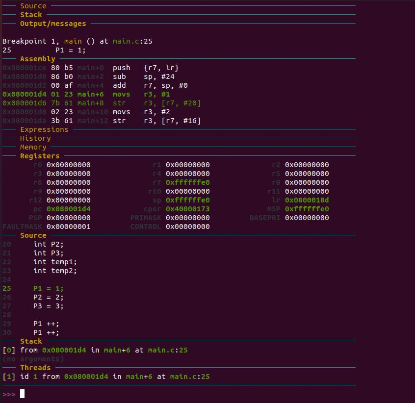

gdb를 이용하여 프로그램을 분석해보자.  

int 변수를 생성하여 그 값을 1,2,3으로 넣고 있다.

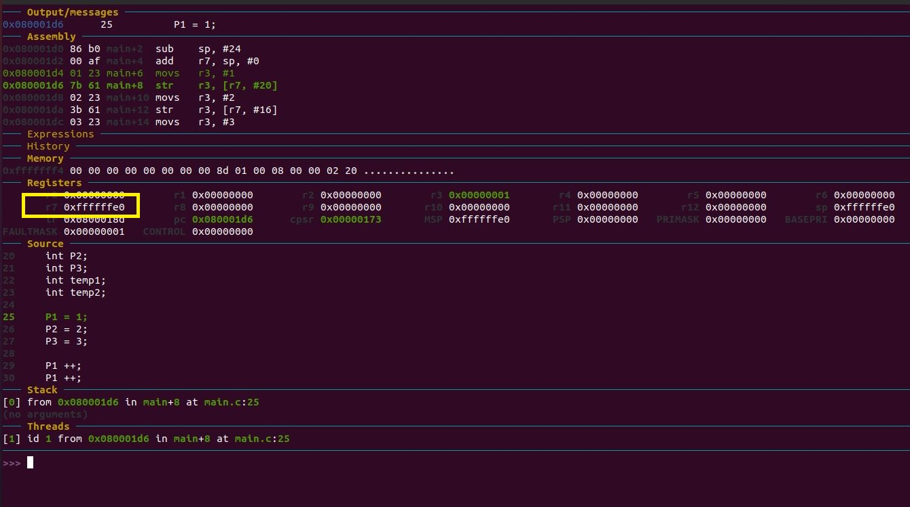

`movs r3, #1`이 실행되었고 r3에 1을 저장했다. 

다음 명령어줄을 보면 r7에 20만큼 떨어진곳에 r3를 저장하라는 store명령어가 보인다. 

현재 r7의 주소가 0xffffffe0이고 여기서 20만큼 떨어진곳은 헥사로 0xfffffff4 이다. 

```
db memory watch 0xfffffff4
```

를 입력하여 메모리주소를 입력해서 직접 store되는지 확인해보자.

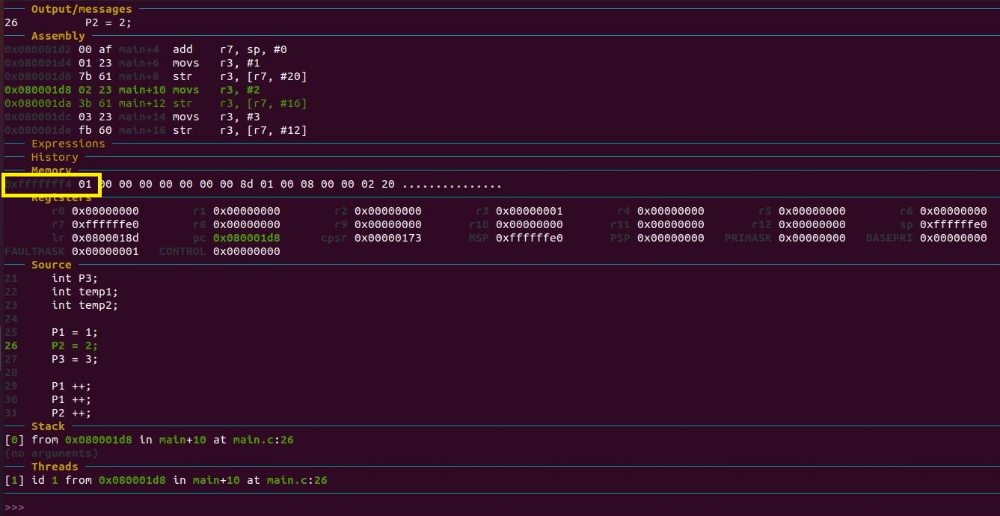

`str r3, [r7, #20]`이 실행되었고 직접 r7에서 20만큼 떨어진곳에 메모리를 확인하여 store됨을 보인다.

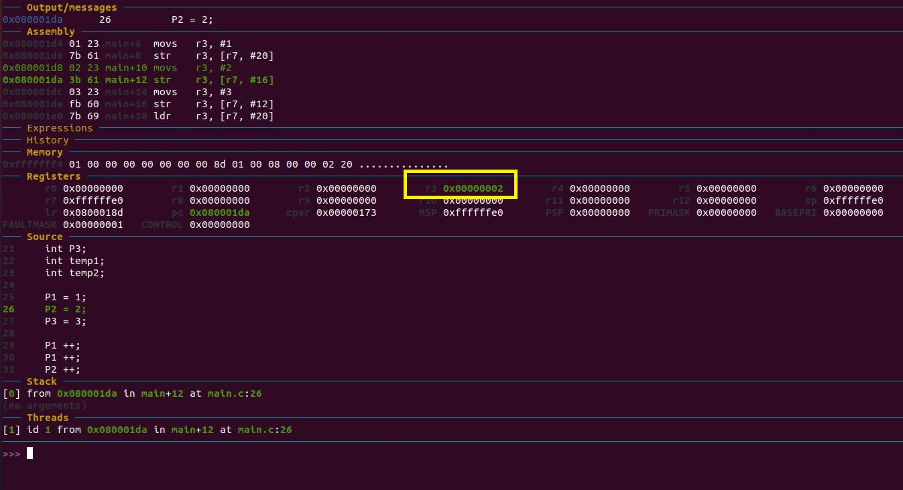

`P2=2;` 명령을 수행하고 있는 모습이다. 

r3에 2를 저장했으며 이번에도 똑같이 r7에 16만큼 떨어진곳을 확인하여 직접 store되는지 확인해보자.

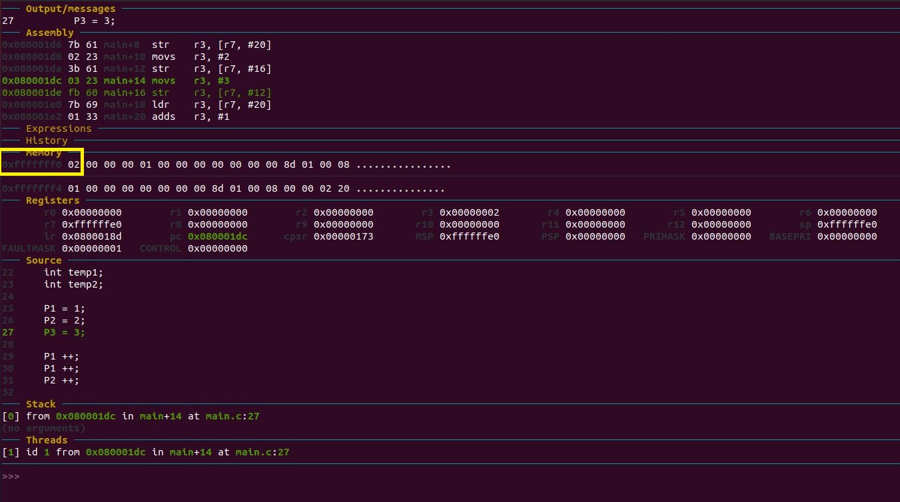

`0xfffffff0`에 직접 2가 저장되어 있음을 보인다. 

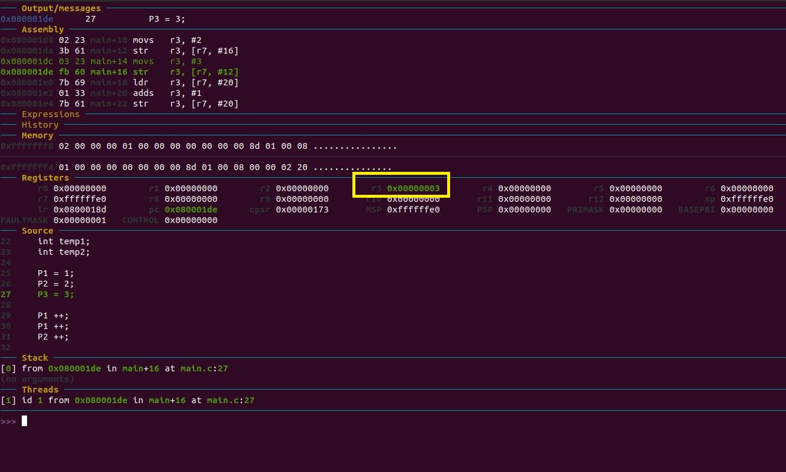

r3에 3을 저장했다, 다음 명령어가 r7에서 12만큼 떨어진곳에 메모리를 확인해보자.

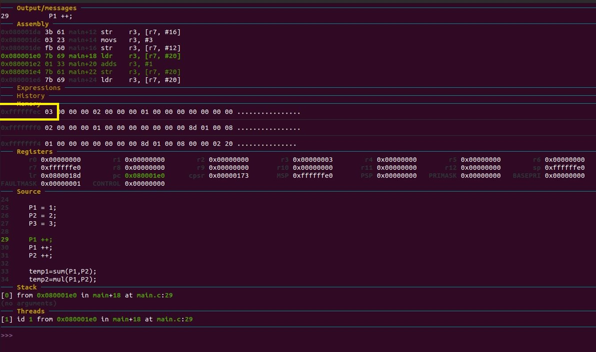

`0xffffffec`에 3이 store됨을 보인다. 

`0xffffffec` 메모리 를 자세히 살펴보자

03 00 00 00 / 02 00 00 00 / 01 00 00 00 으로 나타나지 않는가 ?

우리가 앞서 변수에 지정했던 1,2,3 변수값들이 int(4바이트)로 Little Endian 방식으로 저장되고 있다.

LSB가 가장 앞에 저장되어 있으니 쉽게 Little Endian 구조임을 파악할 수 있다.

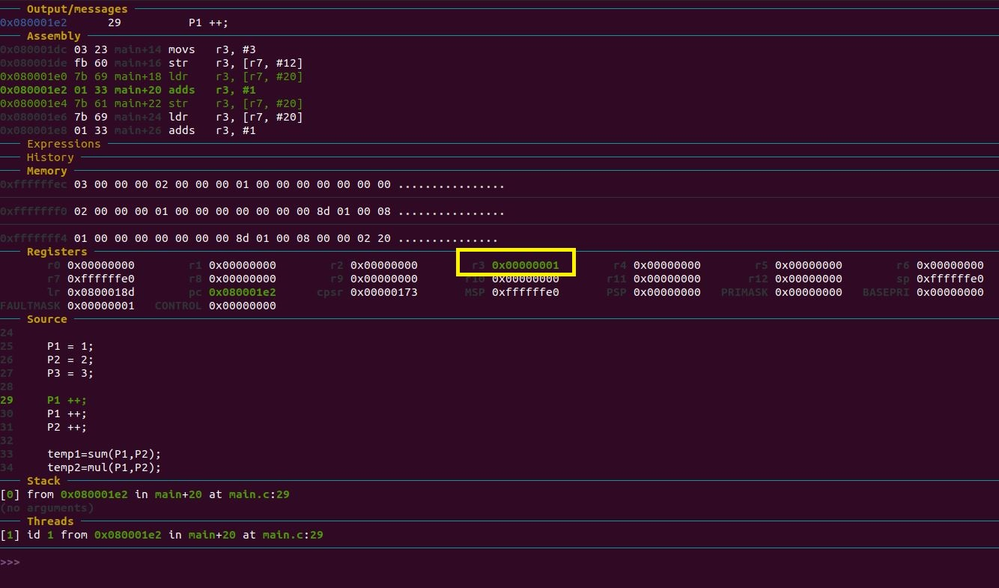

r7에서 20만큼 떨어진곳의 값을 r3에 다시 불러오는 `load` 명령을 수행하고, r3에 다시 1이 저장됨을 보인다. 

+1 연산을 하고 다시 `store`하는 과정을 보자.

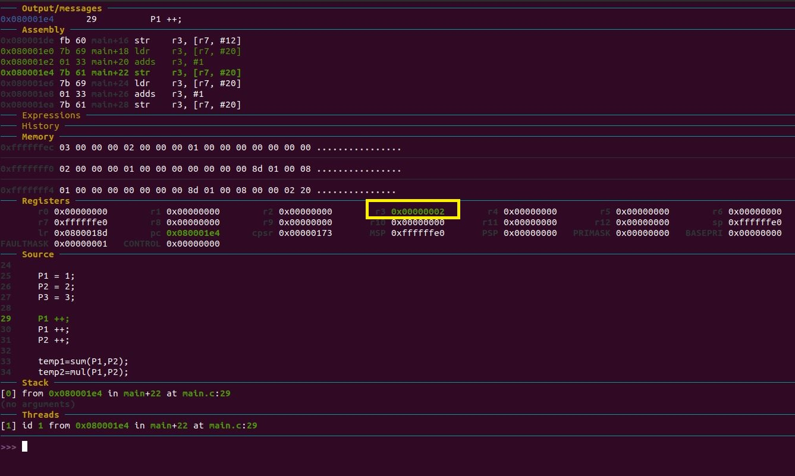

`adds r3, #1` 연산을 수행하고나서 r3값이 2가 됨을 보인다. 

우리가 할일이었던 ++연산을 수행했으니 다시 r7에서 20만큼떨어진 제자리로 돌려놓자. 

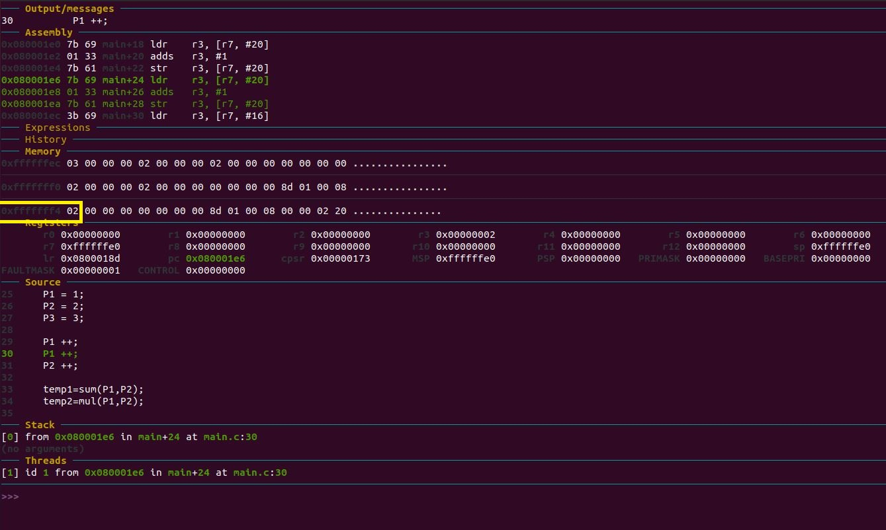

`str r3, [r7, #20]` 연산을 수행하여 2를 보관했음을 보인다. 

다른 연산도 이렇게 마찬가지로 수행이된다. load하여 다시 레지스터로 불러들이고 이것을 연산(CPU)한 다음 제자리로 갖다놓는(store)

작업의 연속이다. CPU<->레지스터 <->메모리 사이에서 유기적으로 일이 일어남을 직접 확인했다.

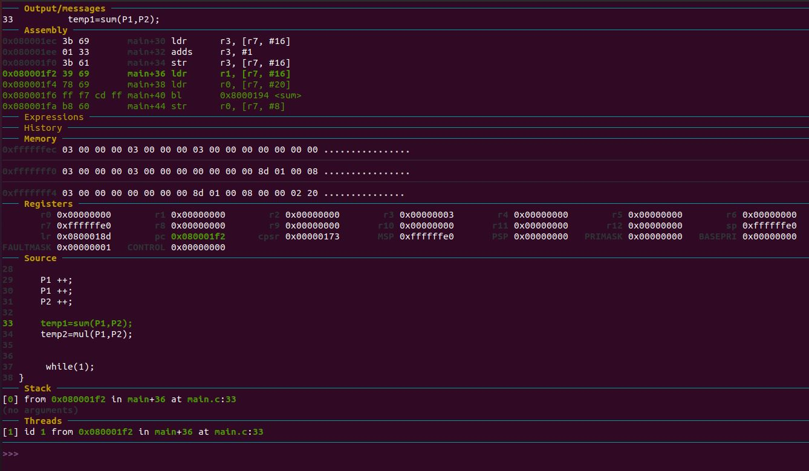

이제 sum함수를 호출하는 과정을 알아보자.

r1, r0에 P1,P2변수를 load하고 있다. 그 다음 sum함수가 있는 주소로 branch 한다. 

sum 함수의 주소는 `0x8000194` 돌아올 주소는 `0x80001fa` 이다. 

정확히 `0x66`만큼 차이나며 낮은 주소로 가야하니 -0x66만큼 돌아가야한다. 

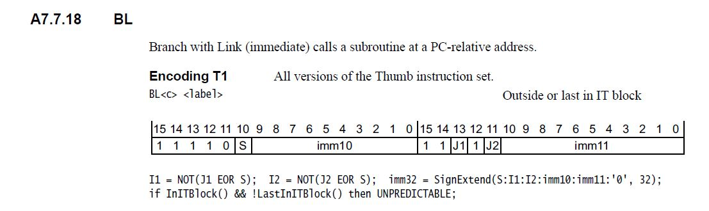

ARM의 아키텍처에서 BL은 다음과 같이 정의하고 있다. 

리틀 엔디안 방식으로 `f7ff ffcd` 으로 해석해야 하며 이것을 이진수로 풀어보면

```
1111 0111 1111 1111 1111 1111 1100 1101 
```

으로 바꿀수 있다. 이것을 OPCODE에 대입하여 계산해보자. 

S = 1

imm10 = 11 1111 1111

J1 = 1

J2 = 1

imm11 = 111 1100 1101 

I1 = NOT (J1 EOR S) = NOT(0) = 1

I2 = NOT(J2 EOR S)= NOT(0) = 1

imm32 = SignExtend(S:I1:I2:imm10:imm11:0, 32) = 1 1 1 11 1111 1111 111 1100 1101 0 

으로 나타나며 SignExtend 하여 부호확장을해서 32비트를 맞추면 

 1111 1111 1111 1111 1111 1111 1001 1010 으로 확장이된다. 

MSB가 1이니 음수임을 나타낸다. 2의 보수를 취해 값을 알아보자.

0000 0000 0000 0000 0000 0000 0110 0101 +1 = 0000 0000 0000 0000 0000 0000 0110 0110 으로 

16진수로 66이 나온다. 음수이므로 - 0x66으로 나타나며 sum함수의 주소로 돌아갈수 있게 명령어가 구성이 되어있다.

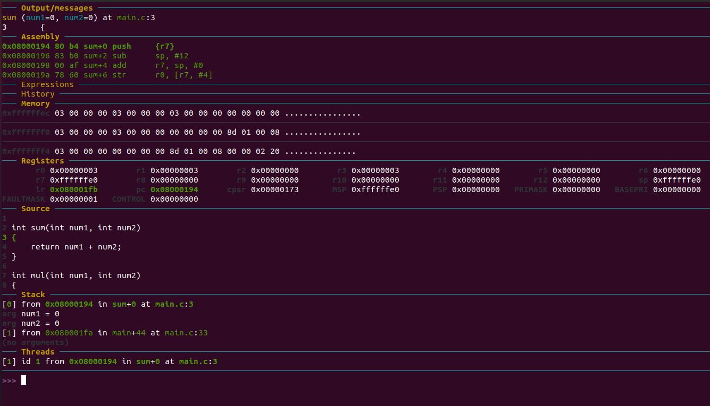

sum함수가 호출되서 시작하고 있다. r7을 `push` 하고 있으며 스택포인터를 12만큼 내린다. (추후에 다시 보정)

그리고 난 다음 r7에 스택포인터를 저장하며 연산을 시작한다.

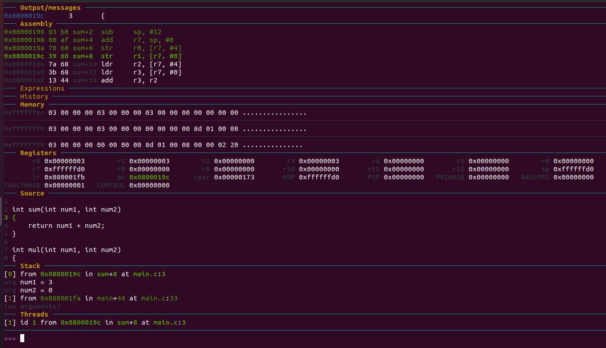

r0, r1에서 저장되어 있던값을 r7에서 4만큼 떨어진곳이랑 0만큼 떨어진곳에 직접 `store` 한다. 

그런 다음 r2, r3에 다시 `load` 하여 연산을 시작한다. 

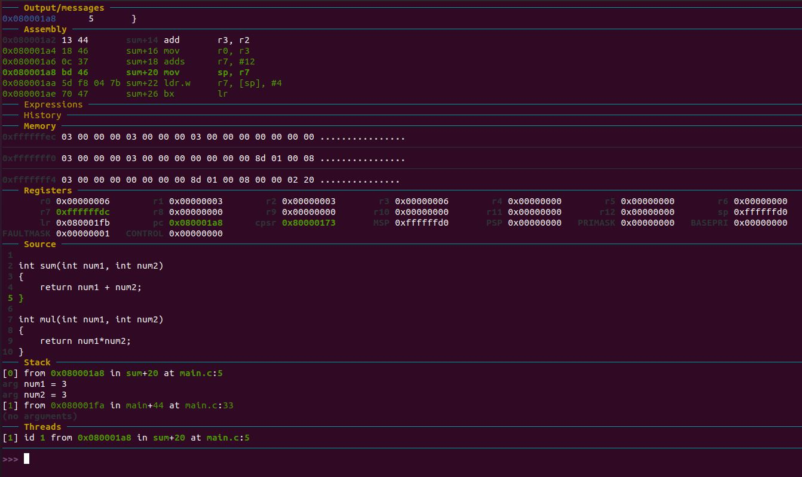

더한값을 r0에 mov 하고, r7에 12를 더해 아까 뺀만큼 다시 더했다. (복구과정)

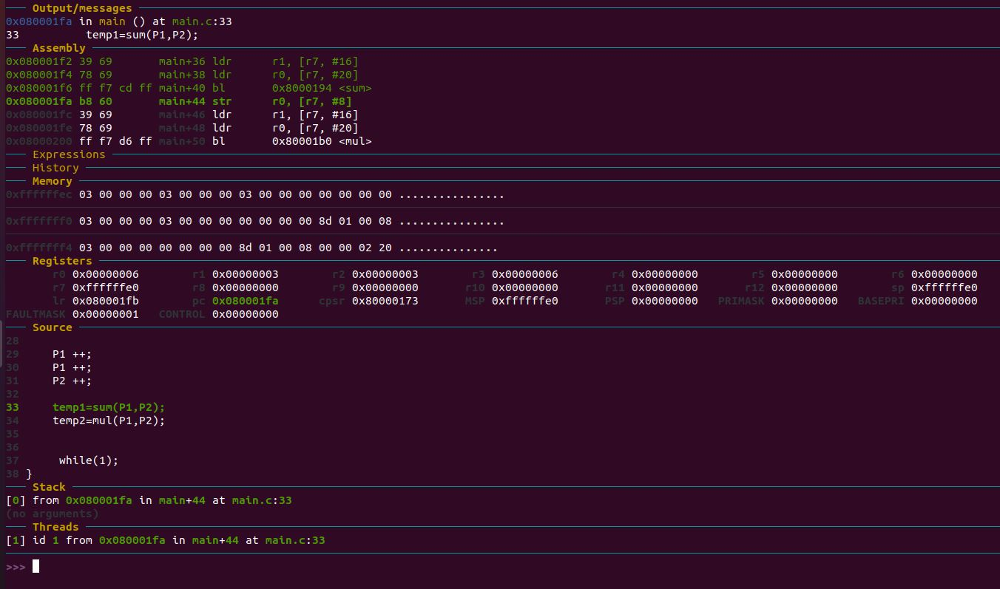

정상적으로 함수호출이 종료되어 main으로 복귀하였다.

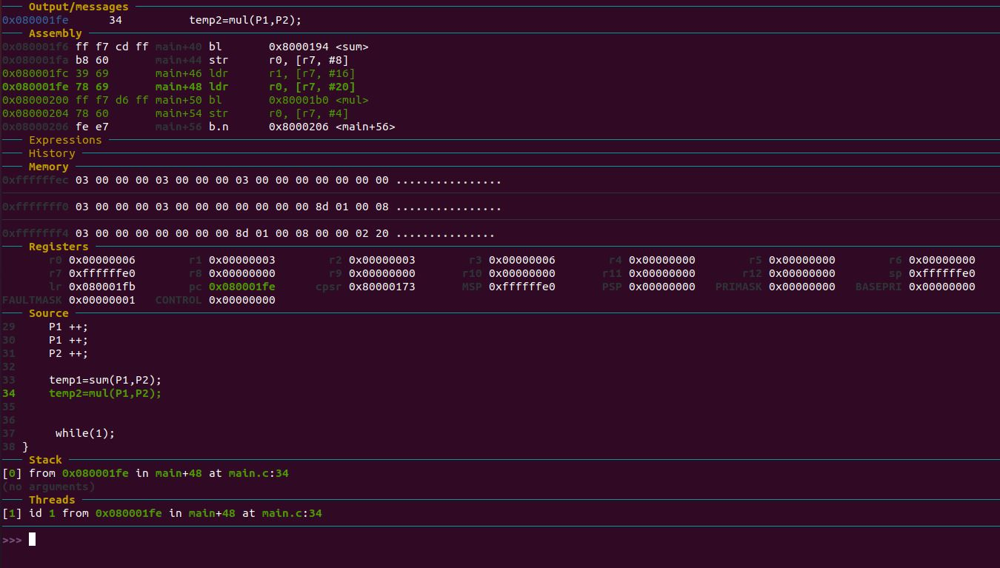

P1과P2변수를 r1, r0에 `load` 하고 있으며 mul함수를 호출한다.

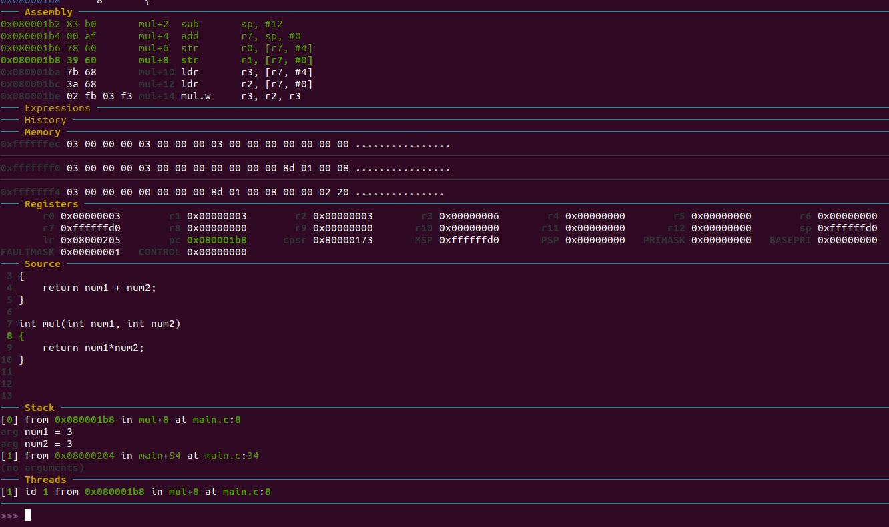

스택포인터를 빼고 시작하고 있다. 이전과 마찬가지로 r7에서 4만큼, 0만큼 떨어진곳에 `store`하여 연산하기전에 세팅을

미리하고있다.

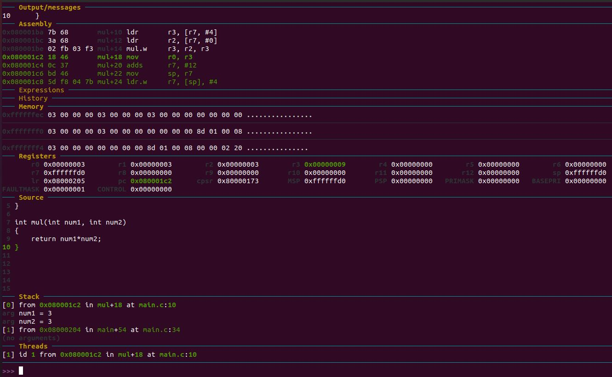

`mul.w`명령어로 곱셈연산을 수행하여 r3에 저장된 모습이다.

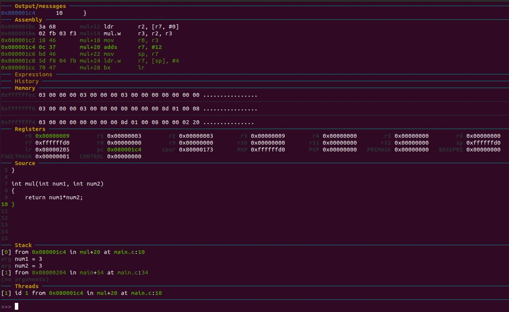

r0에 다시 move하여 저장했으며, 빼준 스택포인터 만큼 다시 더해서 복구해주는 모습이다.

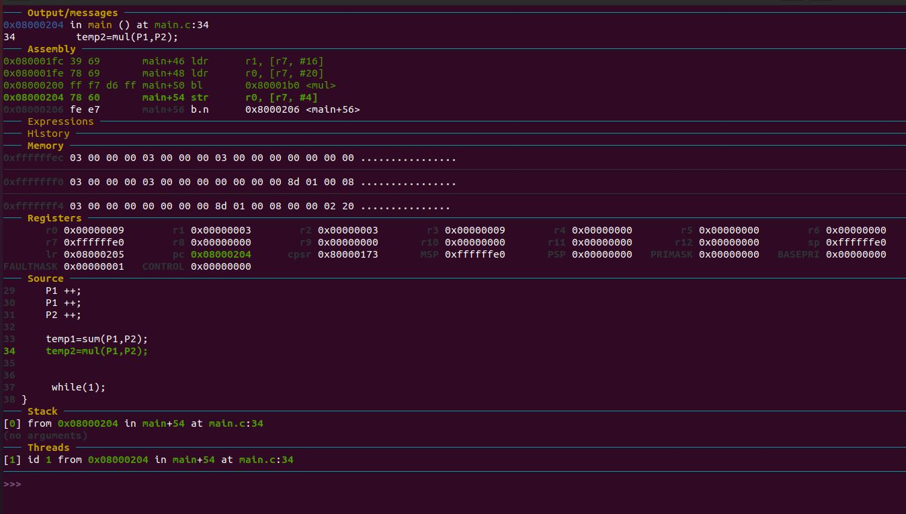

정상적으로 함수호출이 종료되었다.

이로서 CPU와 레지스터, 메모리간의 연산과정을 직접 확인하면서 main함수의 흐름을 볼 수 있었다. 

스택포인터를 빼주고 다시 더해주고 복구하는 과정을 확인했으며, 레지스터 연산으로 프로그램을 실행하였다.

---

## 2. MCU Datasheet 분석(by using GPIO_Blink)

### 2.1 Datasheet 레지스터 설명

- 20-2학기에 배웠던 마이크로프로세서 이론 및 설계 수업에서 사용한 **NXP사의 Board 레퍼런스를 참고하여** 

  **이번에 새로 배울 STM사의 Board 레퍼런스를 상호비교할 예정이다.** 

- **clock register**

  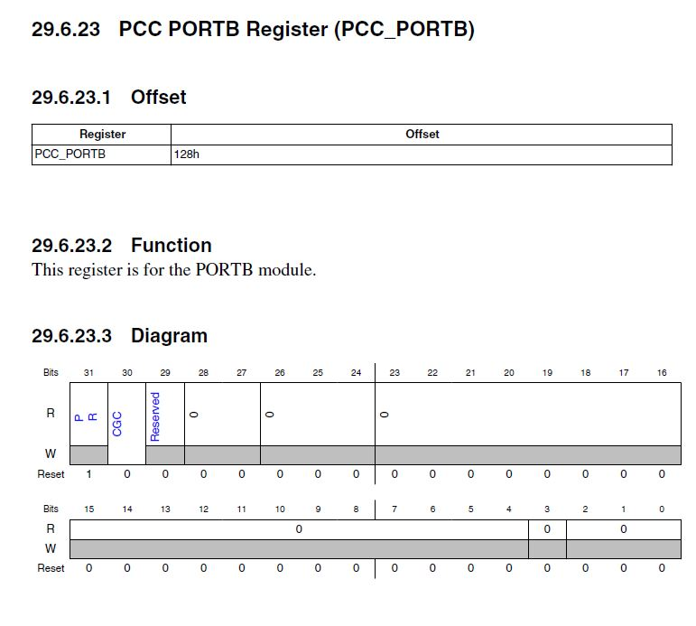

  NXP사의 CLOCK 레지스터이다. 포트별로 레지스터가 다 있다. 

  CGC 부분을 세팅하여 disable과 enable 설정을 할 수 있다.

  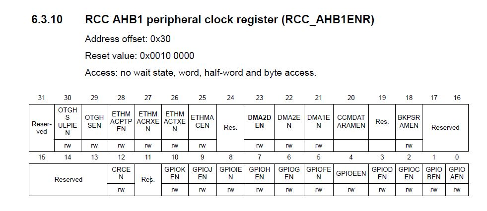

  STM사의 CLOCK 레지스터이다. 10번 비트부터 0번비트를 세팅하여 포트별로 설정 할 수 있다.

- **Input mode**

  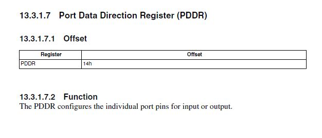

  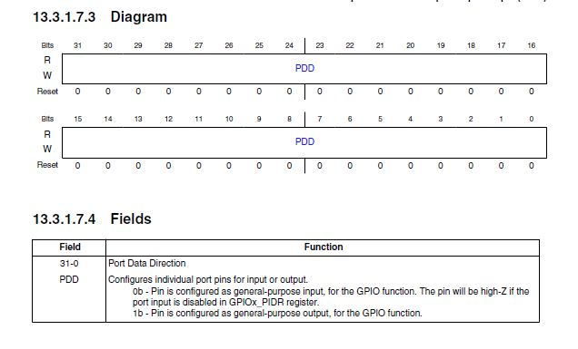

  NXP사의 Port Data Direction Register(PDDR)레지스터이다.  각 포트마다 갖고 있으며 비트를 0으로 넣으면 Input

  1로 넣으면 Output이 된다.

  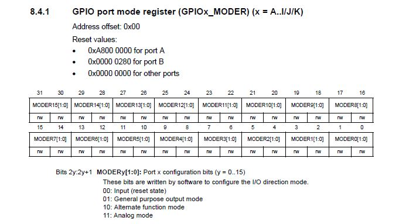

  STM사의 GPIO port mode 레지스터이다. MODER비트에 00을 넣으면 input이 된다.

- **output type register**

  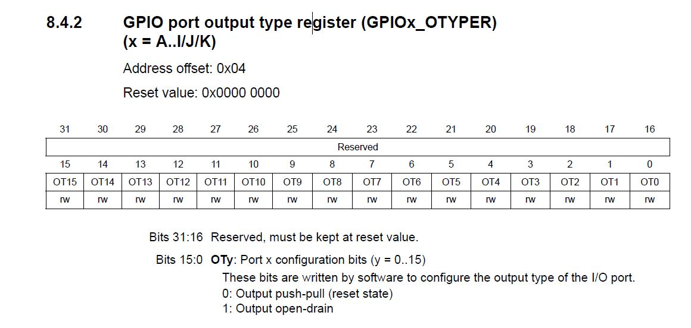

  STM의 Output type 레지스터이다. NXP는 해당 레지스터가 없는거 같다.

  0으로 설정하며 푸시풀 구조로 설정이 가능하다. 

- **pull-up/pull-down register**

  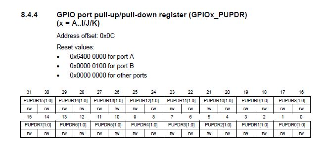

  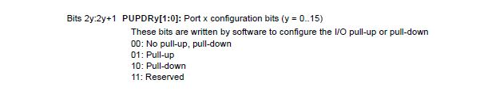

  STM의 pull-up/pull-down 레지스터이다. 0으로 설정하면 No pull-up, pull-down으로 설정이 가능하다.

  STM은 이렇게 스위치에 풀다운/풀업 등 설정을 직접 할수 있는거 같다.

- **output data register**

  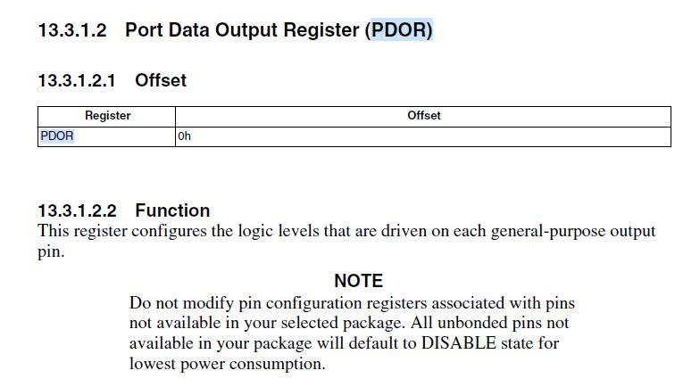

  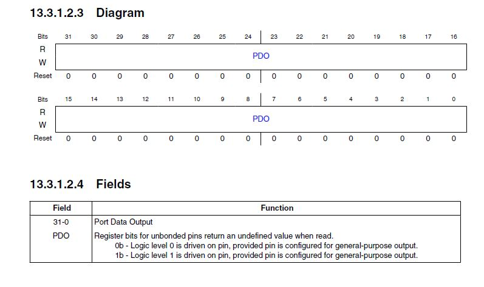

  NXP의 Data Output 레지스터이다. 0을 넣으면 low, 1을 넣으면 high로 동작한다.

  NXP의 보드(S32K144보드 )에서 LED를 ON시키려면 0을 넣어야하는데 이는 회로가 Active LOW방식이기 때문이다. 

  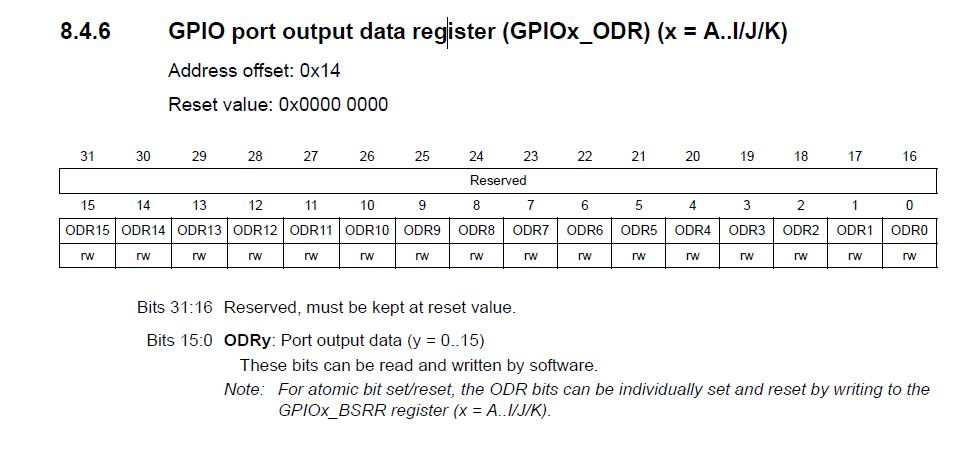

  STM의 Output data register이다. 여기서 원하는 비트를 선택하여 1을 넣으면 high가 입력된다.

- **input data register**

  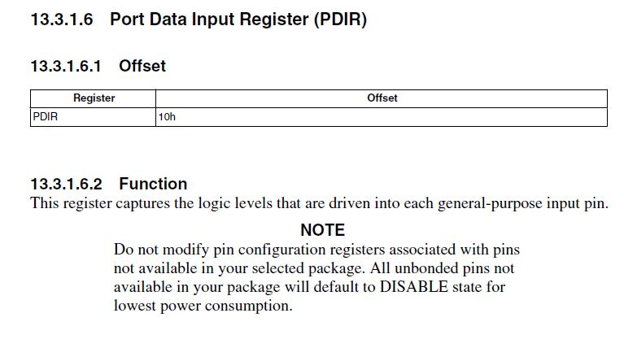

  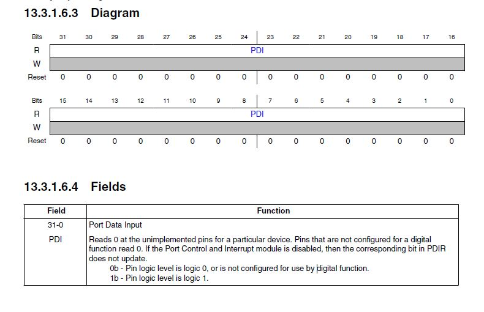

  NXP의 input data 레지스터이다. 해석해보면 GPIO핀에 로직레벨을 캡쳐한다고 되어있다. 현재 input값을

  읽어오는 레지스터이다.

  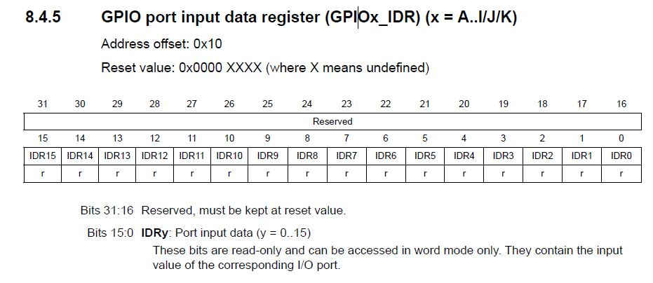

  STM의 input data 레지스터이다. 0에서 15번핀까지 읽을수 있게 되어 있다.

---

### 2.2 메모리 영역

- STM32FDiscovery.h

  ```c
  typedef volatile struct{
       unsigned int rRCC_CR;
       unsigned int rRCC_PLLCFGR;
       unsigned int rRCC_CFGR;
       unsigned int rRCC_CIR;
       unsigned int rRCC_AHB1RSTR;
       unsigned int reserved1;
       unsigned int reserved2;
       unsigned int reserved3;
       unsigned int reserved4;
       unsigned int reserved5;
       unsigned int reserved6;
       unsigned int reserved7;
       unsigned int rRCC_AHB1ENR;
       unsigned int reserved8;
       unsigned int reserved9;
       unsigned int reserved10;
       unsigned int rRCC_APB1ENR;
  }tREG_RCC;
  
  typedef volatile struct{
  	unsigned int rMODER;
  	unsigned int rOTYPER;
  	unsigned int rOSPEEDR;
  	unsigned int rPUPDR;
  	unsigned int rIDR;
  	unsigned int rODR;
  	unsigned int reserved1;
  	unsigned int reserved2;
  	unsigned int rAFRL;
  	unsigned int rAFRH;
  }REG_GPIO;
  
  typedef volatile struct{
  	unsigned int rSR;
  	unsigned int rDR;
  	unsigned int rBRR;
  	unsigned int rCR1;
  	unsigned int rCR2;
  	unsigned int rCR3;
  	unsigned int reserved;
  }REG_USART;
  
  typedef volatile struct{
  	unsigned int rCR1;
  	unsigned int rCR2;
  	unsigned int reserved1;
  	unsigned int rDIER;
  	unsigned int rSR;
  	unsigned int rEGR;
  	unsigned int rCCMR1;
  	unsigned int rCCMR2;
  	unsigned int rCCER;
  	unsigned int rCNT;
  	unsigned int rPSC;
  	unsigned int rARR;
  	unsigned int reserved2;
  	unsigned int rCCR1;
  	unsigned int rCCR2;
  	unsigned int rCCR3;
  	unsigned int rCCR4;
  	unsigned int reserved3;
  	unsigned int rDCR;
  	unsigned int rDMAR;
  }TIM2to5;
  
  // RCC register //
  #define RCC_BASE 0x40023800
  #define RCC ((tREG_RCC*)RCC_BASE)
  
  #define RCC_CR          (RCC->rRCC_CR)
  #define RCC_PLLCFGR     (RCC->rRCC_PLLCFGR)
  #define RCC_CFGR        (RCC->rRCC_CFGR)
  #define RCC_CIR         (RCC->rRCC_CIR)
  #define RCC_AHB1RSTR    (RCC->rRCC_AHB1RSTR)
  #define RCC_AHB1ENR     (RCC->rRCC_AHB1ENR)
  #define RCC_APB1ENR     (RCC->rRCC_APB1ENR)
  
  
  // GPIO A //
  #define GPIOA_BASE 0x40020000
  #define GPIOA ((REG_GPIO*)GPIOA_BASE)
  
  #define GPIOA_MODER		(GPIOA->rMODER) 
  #define GPIOA_OTYPER  	(GPIOA->rOTYPER)
  #define GPIOA_OSPEEDR 	(GPIOA->rOSPEEDR) 
  #define GPIOA_PUPDR  	(GPIOA->rPUPDR)
  #define GPIOA_IDR    	(GPIOA->rIDR)  
  #define GPIOA_ODR		(GPIOA->rODR) 
  #define GPIOA_AFRL		(GPIOA->rAFRL) 
  #define GPIOA_AFRH		(GPIOA->rAFRH)  
  
  // GPIO D //
  #define GPIOD_BASE 0x40020C00
  #define GPIOD ((REG_GPIO*)GPIOD_BASE)
  
  #define GPIOD_MODER		(GPIOD->rMODER) 
  #define GPIOD_OTYPER  	(GPIOD->rOTYPER)
  #define GPIOD_OSPEEDR 	(GPIOD->rOSPEEDR) 
  #define GPIOD_PUPDR  	(GPIOD->rPUPDR)
  #define GPIOD_ODR		(GPIOD->rODR) 
  #define GPIOD_AFRL		(GPIOD->rAFRL) 
  #define GPIOD_AFRH		(GPIOD->rAFRH)  
  
  // USART 2 //
  #define USART2_BASE 0x40004400
  #define USART2 ((REG_USART*)USART2_BASE)
  
  #define USART2_SR		(USART2->rSR)
  #define USART2_DR		(USART2->rDR)
  #define USART2_BRR		(USART2->rBRR)
  #define USART2_CR1		(USART2->rCR1)
  #define USART2_CR2		(USART2->rCR2)
  #define USART2_CR3		(USART2->rCR3)
  
  
  // Timer 2 //
  #define TIM2_BASE 0x40000000
  #define TIM2 ((TIM2to5*)TIM2_BASE)
  
  #define TIM2_CR1		(TIM2->rCR1)
  #define TIM2_DIER		(TIM2->rDIER)
  #define TIM2_SR			(TIM2->rSR)
  #define TIM2_EGR		(TIM2->rEGR)
  #define TIM2_CNT		(TIM2->rCNT)
  #define TIM2_PSC		(TIM2->rPSC)
  #define TIM2_ARR		(TIM2->rARR)
  
  
  
  #define FLASH_ACR *(volatile unsigned *)0x40023C00
  #define NVIC_ISER0 *(volatile unsigned *)0xE000E100
  
  ```

- startup.s

  ```assembly
  /**
    ******************************************************************************
    * @file      startup_stm32.s
    * @author    Ac6
    * @version   V1.0.0
    * @date      12-June-2014
    ******************************************************************************
    */
  
    .syntax unified
    .cpu cortex-m4
    .thumb
  
  .global	g_pfnVectors
  
  /* start address for the initialization values of the .data section.
  defined in linker script */
  .word	_sidata
  /* start address for the .data section. defined in linker script */
  .word	_sdata
  /* end address for the .data section. defined in linker script */
  .word	_edata
  /* start address for the .bss section. defined in linker script */
  .word	_sbss
  /* end address for the .bss section. defined in linker script */
  .word	_ebss
  
  .equ  BootRAM,        0xF1E0F85F
  /**
   * @brief  This is the code that gets called when the processor first
   *          starts execution following a reset event. Only the absolutely
   *          necessary set is performed, after which the application
   *          supplied main() routine is called.
   * @param  None
   * @retval : None
  */
  
      .section	.text.Reset_Handler
  	.weak	Reset_Handler
  	.type	Reset_Handler, %function
  Reset_Handler:
  
  /* Copy the data segment initializers from flash to SRAM */
    movs	r1, #0
    b	LoopCopyDataInit
  
  CopyDataInit:
  	ldr	r3, =_sidata
  	ldr	r3, [r3, r1]
  	str	r3, [r0, r1]
  	adds	r1, r1, #4
  
  LoopCopyDataInit:
  	ldr	r0, =_sdata
  	ldr	r3, =_edata
  	adds	r2, r0, r1
  	cmp	r2, r3
  	bcc	CopyDataInit
  	ldr	r2, =_sbss
  	b	LoopFillZerobss
  
  /* Zero fill the bss segment. */
  FillZerobss:
  	movs r3, #0
   	str  r3, [r2]
  	adds r2, r2, #4
  
  LoopFillZerobss:
  	ldr	r3, = _ebss
  	cmp	r2, r3
  	bcc	FillZerobss
  
  /* Call the application's entry point.*/
  	bl	main
  
  .size	Reset_Handler, .-Reset_Handler
  
  /**
   * @brief  This is the code that gets called when the processor receives an
   *         unexpected interrupt.  This simply enters an infinite loop, preserving
   *         the system state for examination by a debugger.
   *
   * @param  None
   * @retval : None
  */
  
  /******************************************************************************
  *
  * The minimal vector table for a Cortex-M.  Note that the proper constructs
  * must be placed on this to ensure that it ends up at physical address
  * 0x0000.0000.
  *
  ******************************************************************************/
   	.section	.isr_vector,"a",%progbits
  	.type	g_pfnVectors, %object
  	.size	g_pfnVectors, .-g_pfnVectors
  
  	.weak	SysTick_Handler
  
  g_pfnVectors:
  	.word	_estack
  	.word	Reset_Handler
  	.word	0 // NMI_Handler
  	.word	0 // HardFault_Handler
  	.word	0 // MemManage_Handler
  	.word	0 // BusFault_Handler
  	.word	0 // UsageFault_Handler
  	.word	0
  	.word	0
  	.word	0
  	.word	0
  	.word	0 // SVC_Handler
  	.word	0 // DebugMon_Handler
  	.word	0
  	.word	0 // PendSV_Handler
  	.word	SysTick_Handler
  	.word	0
  	.word	0
  	.word	0
  	.word	0
  	.word	0
  	.word	0
  	.word	0
  	.word	0
  	.word	0
  	.word	0
  	.word	0
  	.word	0
  	.word	0
  	.word	0
  	.word	0
  	.word	0
  	.word	0
  	.word	0
  	.word	0
  	.word	0
  	.word	0
  	.word	0
  	.word	0
  	.word	0
  	.word	0
  	.word	0
  	.word	0
  	.word	0
  	.word	TIM2_IRQHandler
  	.word	0
  	.word	0
  	.word	0
  	.word	0
  	.word	0
  	.word	0
  	.word	0
  	.word	0
  	.word	0
  	.word	0
  	.word	0
  	.word	0
  	.word	0
  	.word	0
  	.word	0
  	.word	0
  	.word	0
  	.word	0
  	.word	0
  	.word	0
  	.word	0
  	.word	0
  	.word	0
  	.word	0
  	.word	0
  	.word	0
  	.word	0
  	.word	0
  	.word	0
  	.word	0
  	.word	0
  	.word	0
  	.word	0
  	.word	0
  	.word	0
  	.word	0
  	.word	0
  	.word	0
  	.word	0
  	.word	0
  	.word	0
  	.word	0
  	.word	0
  	.word	0
  	.word	0
  	.word	0
  	.word	0
  	.word	0
  	.word	0
  	.word	0
  	.word	0
  	.word	0
  	.word	0
  
  
  /************************ (C) COPYRIGHT Ac6 *****END OF FILE****/
  
  ```

- LinkerScript.ld

  ```assembly
  /*
  ******************************************************************************
  **
  **  File        : LinkerScript.ld
  **
  **  Author		: Auto-generated by Ac6 System Workbench
  **
  **  Abstract    : Linker script for STM32F411VETx Device from STM32F4 series
  **                128Kbytes RAM
  **                512Kbytes ROM
  **
  **                Set heap size, stack size and stack location according
  **                to application requirements.
  **
  **                Set memory bank area and size if external memory is used.
  **
  **  Target      : STMicroelectronics STM32
  **
  **  Distribution: The file is distributed 밶s is,?without any warranty
  **                of any kind.
  **
  *****************************************************************************
  ** @attention
  **
  ** <h2><center>&copy; COPYRIGHT(c) 2017 Ac6</center></h2>
  **
  ** Redistribution and use in source and binary forms, with or without modification,
  ** are permitted provided that the following conditions are met:
  **   1. Redistributions of source code must retain the above copyright notice,
  **      this list of conditions and the following disclaimer.
  **   2. Redistributions in binary form must reproduce the above copyright notice,
  **      this list of conditions and the following disclaimer in the documentation
  **      and/or other materials provided with the distribution.
  **   3. Neither the name of Ac6 nor the names of its contributors
  **      may be used to endorse or promote products derived from this software
  **      without specific prior written permission.
  **
  ** THIS SOFTWARE IS PROVIDED BY THE COPYRIGHT HOLDERS AND CONTRIBUTORS "AS IS"
  ** AND ANY EXPRESS OR IMPLIED WARRANTIES, INCLUDING, BUT NOT LIMITED TO, THE
  ** IMPLIED WARRANTIES OF MERCHANTABILITY AND FITNESS FOR A PARTICULAR PURPOSE ARE
  ** DISCLAIMED. IN NO EVENT SHALL THE COPYRIGHT HOLDER OR CONTRIBUTORS BE LIABLE
  ** FOR ANY DIRECT, INDIRECT, INCIDENTAL, SPECIAL, EXEMPLARY, OR CONSEQUENTIAL
  ** DAMAGES (INCLUDING, BUT NOT LIMITED TO, PROCUREMENT OF SUBSTITUTE GOODS OR
  ** SERVICES; LOSS OF USE, DATA, OR PROFITS; OR BUSINESS INTERRUPTION) HOWEVER
  ** CAUSED AND ON ANY THEORY OF LIABILITY, WHETHER IN CONTRACT, STRICT LIABILITY,
  ** OR TORT (INCLUDING NEGLIGENCE OR OTHERWISE) ARISING IN ANY WAY OUT OF THE USE
  ** OF THIS SOFTWARE, EVEN IF ADVISED OF THE POSSIBILITY OF SUCH DAMAGE.
  **
  *****************************************************************************
  */
  
  /* Entry Point */
  ENTRY(Reset_Handler)
  
  /* Highest address of the user mode stack */
  _estack = 0x20020000;    /* end of RAM */
  
  /* Memories definition */
  MEMORY
  {
    RAM (xrw)		: ORIGIN = 0x20000000, LENGTH = 128K
    ROM (rx)		: ORIGIN = 0x8000000, LENGTH = 512K
  }
  
  /* Sections */
  SECTIONS
  {
    /* The startup code into ROM memory */
    .isr_vector :
    {
      . = ALIGN(4);
      KEEP(*(.isr_vector)) /* Startup code */
      . = ALIGN(4);
    } >ROM
  
    /* The program code and other data into ROM memory */
    .text :
    {
      . = ALIGN(4);
      *(.text)           /* .text sections (code) */
      *(.text*)          /* .text* sections (code) */
      *(.glue_7)         /* glue arm to thumb code */
      *(.glue_7t)        /* glue thumb to arm code */
      *(.eh_frame)
  
      KEEP (*(.init))
      KEEP (*(.fini))
  
      . = ALIGN(4);
      _etext = .;        /* define a global symbols at end of code */
    } >ROM
  
    /* Constant data into ROM memory*/
    .rodata :
    {
      . = ALIGN(4);
      *(.rodata)         /* .rodata sections (constants, strings, etc.) */
      *(.rodata*)        /* .rodata* sections (constants, strings, etc.) */
      . = ALIGN(4);
    } >ROM
  
    /* Used by the startup to initialize data */
    _sidata = LOADADDR(.data);
  
    /* Initialized data sections into RAM memory */
    .data : 
    {
      . = ALIGN(4);
      _sdata = .;        /* create a global symbol at data start */
      *(.data)           /* .data sections */
      *(.data*)          /* .data* sections */
  
      . = ALIGN(4);
      _edata = .;        /* define a global symbol at data end */
    } >RAM AT> ROM
  
    
    /* Uninitialized data section into RAM memory */
    . = ALIGN(4);
    .bss :
    {
      /* This is used by the startup in order to initialize the .bss secion */
      _sbss = .;         /* define a global symbol at bss start */
      __bss_start__ = _sbss;
      *(.bss)
      *(.bss*)
      *(COMMON)
  
      . = ALIGN(4);
      _ebss = .;         /* define a global symbol at bss end */
      __bss_end__ = _ebss;
    } >RAM
  }
  ```

- main.c

  ```c
  #include "STM32FDiscovery.h"
  	
  void clk(void)
  {
  	RCC_CR = 0;
  	RCC_PLLCFGR = 0;
  	RCC_CFGR = 0;
  		
  	RCC_CR |= (1<<16); // HSE set
  	while( (RCC_CR & ( 1<<17) ) == 0 ); // wait until HSE ready
  	
  	RCC_PLLCFGR |= 8;//0x00000008; // set PLLM
  	RCC_PLLCFGR |= (336<<6);//|= (336<<6); // 		set PLLN
  	RCC_PLLCFGR |= (0<<16); // set PLLP
  	RCC_PLLCFGR |= (7<<24);//0x07000000; // set PLLQ
  
  	RCC_PLLCFGR |= (1<<22); // set PLL src HSE
  	
  
  	RCC_CR |= (1<<24); // PLL ON
  	while( (RCC_CR & (1<<25)) == 0); // wait until PLL ready
  	
  	FLASH_ACR |= 5;
  	RCC_CFGR |= 2; // set PLL to system clock
  	
  		
  	while( (RCC_CFGR & (12) ) != 8); // wait until PLL ready
  	
  	RCC_CFGR |= (1<<12) | (1<<10); // set APB1 div 4
  	RCC_CFGR |= (1<<15); // set APB2 div2	
  }
  
  void TIM2_IRQHandler() {
  
  }
  
  int main (void)
  {
  	
  	clk();
  	
  	RCC_CFGR |= 0x04600000;
  
      /* PORT A */
  	RCC_AHB1ENR  |= 1<<0; //RCC clock enable register	
      GPIOA_MODER  |= 0<<0; // input mode
      GPIOA_OTYPER |= 0<<0; // output push-pull
      GPIOA_PUPDR  |= 0<<0; // no pull-up, pull-down
  	
  	/* PORT D */
  	RCC_AHB1ENR  |= 1<<3;		// PORTD enable
  	GPIOD_MODER  |= 1<<24;		// PORTD 12 general output mode
  	GPIOD_MODER  |= 1<<26;		// PORTD 13 general output mode
  	GPIOD_MODER  |= 1<<28;		// PORTD 14 general output mode
  	GPIOD_MODER  |= 1<<30;		// PORTD 15 general output mode
  	GPIOD_OTYPER |= 0x00000000;
  	GPIOD_PUPDR	 |= 0x00000000;
  	
  	GPIOD_ODR |= 1<<12;
  
  	while(1) {
          if( GPIOA_IDR & 0x00000001 ) {
              GPIOD_ODR ^= 1 << 13;
              GPIOD_ODR ^= 1 << 14;
              GPIOD_ODR ^= 1 << 15;
          }
  	}
  }
  
  ```

- Makefile

  ```makefile
  ## Cross-compilation commands 
  CC      = arm-none-eabi-gcc
  LD      = arm-none-eabi-gcc
  AS      = arm-none-eabi-as
  OBJCOPY = arm-none-eabi-objcopy
  SIZE    = arm-none-eabi-size
  
  OBJS  = main.o startup.o
  
  ## Platform and optimization options
  CFLAGS = -mcpu=cortex-m4 -mthumb -mfloat-abi=hard -mfpu=fpv4-sp-d16 -DSTM32 -DSTM32F4 -DSTM32F411VETx -DSTM32F411E_DISCO 
  CFLAGS += -DDEBUG -DSTM32F411xE -DUSE_STDPERIPH_DRIVER -O0 -g3 -Wall -fmessage-length=0 -ffunction-sections -c -MMD -MP
  LFLAGS = -mcpu=cortex-m4 -mthumb -mfloat-abi=hard -mfpu=fpv4-sp-d16 -T"LinkerScript.ld" -Wl,-Map=out.map -Wl,--gc-sections
  
  ## Rules
  all: out.elf out.bin size 
  
  out.elf: $(OBJS) LinkerScript.ld
  	$(LD) $(LFLAGS) -o out.elf $(OBJS)
  
  out.bin: out.elf
  	$(OBJCOPY) -O binary "out.elf" "out.bin"
  
  size: out.elf
  	$(SIZE) $< 
  
  qemu: 
  	qemu-system-gnuarmeclipse -cpu cortex-m4 -machine STM32F4-Discovery -gdb tcp::3333 -kernel out.elf
  
  gdb:
  	./run_gdb.sh
  
  clean:
  	rm *.o *.d *.elf *.bin *.map
  
  ```

  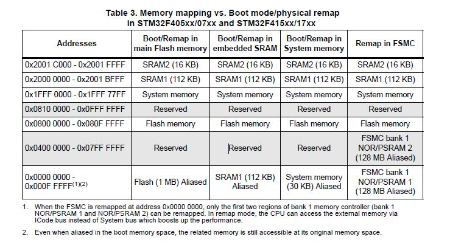

  STM32F 칩의 메모리 매핑은 다음과 같다. 

  RAM과 ROM을 LinkerScript.ld파일에서 다음과 같이 정의했다. k는 1024 바이트를 의미한다.

  ```
  MEMORY
  {
    RAM (xrw)		: ORIGIN = 0x20000000, LENGTH = 128K
    ROM (rx)		: ORIGIN = 0x8000000, LENGTH = 512K
  }
  ```

  위의 메모리 매핑 표를 참고하면 SRAM과 플래시에 주소가 지정되어 있음을 보인다.

  우리가 눈여겨 봐야할 곳은 `STM32FDiscovery.h`파일이다.

  GPIOA랑 D를 사용하니 딱 두개만 정의해놨다. 

  A부터 B,C,D,E 등등 전부다 선언 된것이 아니라 필요한 부분만 정의 해놨다는것이다.

  ```c
  #define RCC_BASE 0x40023800
  #define RCC ((tREG_RCC*)RCC_BASE)
  ```

  메모리 주소 정의 하는 부분을 가장 중요시해야한다. 

  `0x40023800` 의 주소에서 RCC_BASE가 시작됨을 선언하고 

  tREG_RCC포인터 형태로 RCC_BASE를 지정하는데 그 이름은 RCC다 라고 말해주고 있다. 

  이렇게 RCC로 이름만 딱 정해주어서 편안하게 사용할수 있으며

  ```c
  #define RCC_CR          (RCC->rRCC_CR)
  #define RCC_PLLCFGR     (RCC->rRCC_PLLCFGR)
  #define RCC_CFGR        (RCC->rRCC_CFGR)
  #define RCC_CIR         (RCC->rRCC_CIR)
  #define RCC_AHB1RSTR    (RCC->rRCC_AHB1RSTR)
  #define RCC_AHB1ENR     (RCC->rRCC_AHB1ENR)
  #define RCC_APB1ENR     (RCC->rRCC_APB1ENR)
  ```

  각 레지스터마다 이름을 새로 디파인 해주어서 편하게 헤더를 쓰게 만들어주고 있다.

  ```c
  typedef volatile struct{
       unsigned int rRCC_CR;
       unsigned int rRCC_PLLCFGR;
       unsigned int rRCC_CFGR;
       unsigned int rRCC_CIR;
       unsigned int rRCC_AHB1RSTR;
       unsigned int reserved1;
       unsigned int reserved2;
       unsigned int reserved3;
       unsigned int reserved4;
       unsigned int reserved5;
       unsigned int reserved6;
       unsigned int reserved7;
       unsigned int rRCC_AHB1ENR;
       unsigned int reserved8;
       unsigned int reserved9;
       unsigned int reserved10;
       unsigned int rRCC_APB1ENR;
  }tREG_RCC;
  ```

  tREG_RCC는 구조체의 모음이고 `unsigned int`가 4바이트니 총 17*4=68바이트를 가지고있다. 

  `#define RCC ((tREG_RCC*)RCC_BASE)` 에서 선언함으로서 0x40023800+0x44 만큼 

  메모리를 사용하고 있음을 암시한다. 
  
  ```c
          if( GPIOA_IDR & 0x00000001 ) {
              GPIOD_ODR ^= 1 << 13;
              GPIOD_ODR ^= 1 << 14;
              GPIOD_ODR ^= 1 << 15;
          }
  ```
  
  Schemetic을 보면 GPIOA에 스위치가 있고 D에 LED가 있다. 
  
  해당 input/output을 사전에 정의하였으며 
  
  `^=` 연산은 XOR 연산이며 토글기능을 가진다. 
  
  LED가 순차적으로 토글된다.

---

